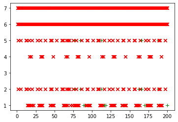
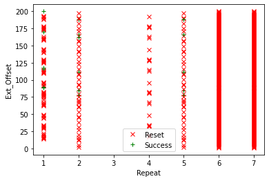

Part 2, Topic 2: Introduction to Voltage Glitching (MAIN)
=========================================================

**SUMMARY:** *While it’s not as sophisticated as the ChipWhisperer Lite
or ChipWhisperer Pro’s glitch hardware, the ChipWhisperer Nano is also
capable of glitching. In this lab, we’ll do some simple glitch tests on
the Nano’s target board, showing how to scan through glitch settings and
seeing what effect it has on the hardware.*

**LEARNING OUTCOMES:**

-  Understanding how voltage glitching can be used to disrupt a target’s
   operation
-  Scanning glitch settings to determine successful ones

Digital hardware devices have certain voltage and clock requirements to
function properly. If these requirements are not met, the device can
fail to function, or even be damage. By shorting the voltage pins of a
microcontroller for controlled, short periods of time, we can cause it
to behave erratically, clearning registers and skipping instructions.
Such attacks can be immensely powerful in practice. Consider for example
the following code from ``linux-util-2.24``:

.. code:: c

   /*
    *   auth.c -- PAM authorization code, common between chsh and chfn
    *   (c) 2012 by Cody Maloney <cmaloney@theoreticalchaos.com>
    *
    *   this program is free software.  you can redistribute it and
    *   modify it under the terms of the gnu general public license.
    *   there is no warranty.
    *
    */

   #include "auth.h"
   #include "pamfail.h"

   int auth_pam(const char *service_name, uid_t uid, const char *username)
   {
       if (uid != 0) {
           pam_handle_t *pamh = NULL;
           struct pam_conv conv = { misc_conv, NULL };
           int retcode;

           retcode = pam_start(service_name, username, &conv, &pamh);
           if (pam_fail_check(pamh, retcode))
               return FALSE;

           retcode = pam_authenticate(pamh, 0);
           if (pam_fail_check(pamh, retcode))
               return FALSE;

           retcode = pam_acct_mgmt(pamh, 0);
           if (retcode == PAM_NEW_AUTHTOK_REQD)
               retcode =
                   pam_chauthtok(pamh, PAM_CHANGE_EXPIRED_AUTHTOK);
           if (pam_fail_check(pamh, retcode))
               return FALSE;

           retcode = pam_setcred(pamh, 0);
           if (pam_fail_check(pamh, retcode))
               return FALSE;

           pam_end(pamh, 0);
           /* no need to establish a session; this isn't a
            * session-oriented activity...  */
       }
       return TRUE;
   }

This is the login code for the Linux OS. Note that if we could skip the
check of ``if (uid != 0)`` and simply branch to the end, we could avoid
having to enter a password. This is the power of glitch attacks - not
that we are breaking encryption, but simply bypassing the entire
authentication module!

Glitch Hardware
~~~~~~~~~~~~~~~

The ChipWhisperer Nano’s glitch setup is pretty simple. Like its bigger
brothers, the Lite and the Pro, it uses a MOSFET to short the
microcontroller’s voltage supply to ground:

|image1|

For the Nano, ``Glitch In`` is controlled by 2 parameters:

1. ``scope.glitch.ext_offset`` - The glitch will be inserted roughly
   ``8.3ns * scope.glitch.ext_offset``
2. ``scope.glitch.repeat`` - The glitch will be inserted for roughly
   ``8.3ns * scope.glitch.repeat``

During this lab, we’ll be varying these parameters to see if we can get
the target to mess up a calculation that it’s doing.

.. |image1| image:: https://wiki.newae.com/images/8/82/Glitch-vccglitcher.png

**In [1]:**

.. code:: ipython3

    SCOPETYPE = 'CWNANO'
    PLATFORM = 'CWNANO'

**In [2]:**

.. code:: bash

    %%bash -s "$PLATFORM"
    cd ../../../hardware/victims/firmware/simpleserial-glitch
    make PLATFORM=$1 CRYPTO_TARGET=NONE

**Out [2]:**

.. parsed-literal::

    SS\_VER set to SS\_VER\_1\_1
    rm -f -- simpleserial-glitch-CWNANO.hex
    rm -f -- simpleserial-glitch-CWNANO.eep
    rm -f -- simpleserial-glitch-CWNANO.cof
    rm -f -- simpleserial-glitch-CWNANO.elf
    rm -f -- simpleserial-glitch-CWNANO.map
    rm -f -- simpleserial-glitch-CWNANO.sym
    rm -f -- simpleserial-glitch-CWNANO.lss
    rm -f -- objdir/\*.o
    rm -f -- objdir/\*.lst
    rm -f -- simpleserial-glitch.s simpleserial.s stm32f0\_hal\_nano.s stm32f0\_hal\_lowlevel.s
    rm -f -- simpleserial-glitch.d simpleserial.d stm32f0\_hal\_nano.d stm32f0\_hal\_lowlevel.d
    rm -f -- simpleserial-glitch.i simpleserial.i stm32f0\_hal\_nano.i stm32f0\_hal\_lowlevel.i
    .
    Welcome to another exciting ChipWhisperer target build!!
    arm-none-eabi-gcc.exe (GNU Arm Embedded Toolchain 9-2020-q2-update) 9.3.1 20200408 (release)
    Copyright (C) 2019 Free Software Foundation, Inc.
    This is free software; see the source for copying conditions.  There is NO
    warranty; not even for MERCHANTABILITY or FITNESS FOR A PARTICULAR PURPOSE.
    
    .
    Compiling C: simpleserial-glitch.c
    arm-none-eabi-gcc -c -mcpu=cortex-m0 -I. -mthumb -mfloat-abi=soft -ffunction-sections -gdwarf-2 -DSS\_VER=SS\_VER\_1\_1 -DSTM32F030x6 -DSTM32F0 -DSTM32 -DDEBUG -DHAL\_TYPE=HAL\_stm32f0\_nano -DPLATFORM=CWNANO -DF\_CPU=7372800UL -Os -funsigned-char -funsigned-bitfields -fshort-enums -Wall -Wstrict-prototypes -Wa,-adhlns=objdir/simpleserial-glitch.lst -I.././simpleserial/ -I.././hal -I.././hal/stm32f0 -I.././hal/stm32f0/CMSIS -I.././hal/stm32f0/CMSIS/core -I.././hal/stm32f0/CMSIS/device -I.././hal/stm32f0/Legacy -I.././crypto/ -std=gnu99  -MMD -MP -MF .dep/simpleserial-glitch.o.d simpleserial-glitch.c -o objdir/simpleserial-glitch.o 
    .
    Compiling C: .././simpleserial/simpleserial.c
    arm-none-eabi-gcc -c -mcpu=cortex-m0 -I. -mthumb -mfloat-abi=soft -ffunction-sections -gdwarf-2 -DSS\_VER=SS\_VER\_1\_1 -DSTM32F030x6 -DSTM32F0 -DSTM32 -DDEBUG -DHAL\_TYPE=HAL\_stm32f0\_nano -DPLATFORM=CWNANO -DF\_CPU=7372800UL -Os -funsigned-char -funsigned-bitfields -fshort-enums -Wall -Wstrict-prototypes -Wa,-adhlns=objdir/simpleserial.lst -I.././simpleserial/ -I.././hal -I.././hal/stm32f0 -I.././hal/stm32f0/CMSIS -I.././hal/stm32f0/CMSIS/core -I.././hal/stm32f0/CMSIS/device -I.././hal/stm32f0/Legacy -I.././crypto/ -std=gnu99  -MMD -MP -MF .dep/simpleserial.o.d .././simpleserial/simpleserial.c -o objdir/simpleserial.o 
    .
    Compiling C: .././hal/stm32f0\_nano/stm32f0\_hal\_nano.c
    arm-none-eabi-gcc -c -mcpu=cortex-m0 -I. -mthumb -mfloat-abi=soft -ffunction-sections -gdwarf-2 -DSS\_VER=SS\_VER\_1\_1 -DSTM32F030x6 -DSTM32F0 -DSTM32 -DDEBUG -DHAL\_TYPE=HAL\_stm32f0\_nano -DPLATFORM=CWNANO -DF\_CPU=7372800UL -Os -funsigned-char -funsigned-bitfields -fshort-enums -Wall -Wstrict-prototypes -Wa,-adhlns=objdir/stm32f0\_hal\_nano.lst -I.././simpleserial/ -I.././hal -I.././hal/stm32f0 -I.././hal/stm32f0/CMSIS -I.././hal/stm32f0/CMSIS/core -I.././hal/stm32f0/CMSIS/device -I.././hal/stm32f0/Legacy -I.././crypto/ -std=gnu99  -MMD -MP -MF .dep/stm32f0\_hal\_nano.o.d .././hal/stm32f0\_nano/stm32f0\_hal\_nano.c -o objdir/stm32f0\_hal\_nano.o 
    .
    Compiling C: .././hal/stm32f0/stm32f0\_hal\_lowlevel.c
    arm-none-eabi-gcc -c -mcpu=cortex-m0 -I. -mthumb -mfloat-abi=soft -ffunction-sections -gdwarf-2 -DSS\_VER=SS\_VER\_1\_1 -DSTM32F030x6 -DSTM32F0 -DSTM32 -DDEBUG -DHAL\_TYPE=HAL\_stm32f0\_nano -DPLATFORM=CWNANO -DF\_CPU=7372800UL -Os -funsigned-char -funsigned-bitfields -fshort-enums -Wall -Wstrict-prototypes -Wa,-adhlns=objdir/stm32f0\_hal\_lowlevel.lst -I.././simpleserial/ -I.././hal -I.././hal/stm32f0 -I.././hal/stm32f0/CMSIS -I.././hal/stm32f0/CMSIS/core -I.././hal/stm32f0/CMSIS/device -I.././hal/stm32f0/Legacy -I.././crypto/ -std=gnu99  -MMD -MP -MF .dep/stm32f0\_hal\_lowlevel.o.d .././hal/stm32f0/stm32f0\_hal\_lowlevel.c -o objdir/stm32f0\_hal\_lowlevel.o 
    .
    Assembling: .././hal/stm32f0/stm32f0\_startup.S
    arm-none-eabi-gcc -c -mcpu=cortex-m0 -I. -x assembler-with-cpp -mthumb -mfloat-abi=soft -ffunction-sections -DF\_CPU=7372800 -Wa,-gstabs,-adhlns=objdir/stm32f0\_startup.lst -I.././simpleserial/ -I.././hal -I.././hal/stm32f0 -I.././hal/stm32f0/CMSIS -I.././hal/stm32f0/CMSIS/core -I.././hal/stm32f0/CMSIS/device -I.././hal/stm32f0/Legacy -I.././crypto/ .././hal/stm32f0/stm32f0\_startup.S -o objdir/stm32f0\_startup.o
    .
    Linking: simpleserial-glitch-CWNANO.elf
    arm-none-eabi-gcc -mcpu=cortex-m0 -I. -mthumb -mfloat-abi=soft -ffunction-sections -gdwarf-2 -DSS\_VER=SS\_VER\_1\_1 -DSTM32F030x6 -DSTM32F0 -DSTM32 -DDEBUG -DHAL\_TYPE=HAL\_stm32f0\_nano -DPLATFORM=CWNANO -DF\_CPU=7372800UL -Os -funsigned-char -funsigned-bitfields -fshort-enums -Wall -Wstrict-prototypes -Wa,-adhlns=objdir/simpleserial-glitch.o -I.././simpleserial/ -I.././hal -I.././hal/stm32f0 -I.././hal/stm32f0/CMSIS -I.././hal/stm32f0/CMSIS/core -I.././hal/stm32f0/CMSIS/device -I.././hal/stm32f0/Legacy -I.././crypto/ -std=gnu99  -MMD -MP -MF .dep/simpleserial-glitch-CWNANO.elf.d objdir/simpleserial-glitch.o objdir/simpleserial.o objdir/stm32f0\_hal\_nano.o objdir/stm32f0\_hal\_lowlevel.o objdir/stm32f0\_startup.o --output simpleserial-glitch-CWNANO.elf --specs=nano.specs --specs=nosys.specs -T .././hal/stm32f0\_nano/LinkerScript.ld -Wl,--gc-sections -lm -mthumb -mcpu=cortex-m0  -Wl,-Map=simpleserial-glitch-CWNANO.map,--cref   -lm  
    .
    Creating load file for Flash: simpleserial-glitch-CWNANO.hex
    arm-none-eabi-objcopy -O ihex -R .eeprom -R .fuse -R .lock -R .signature simpleserial-glitch-CWNANO.elf simpleserial-glitch-CWNANO.hex
    .
    Creating load file for EEPROM: simpleserial-glitch-CWNANO.eep
    arm-none-eabi-objcopy -j .eeprom --set-section-flags=.eeprom="alloc,load" \
    --change-section-lma .eeprom=0 --no-change-warnings -O ihex simpleserial-glitch-CWNANO.elf simpleserial-glitch-CWNANO.eep \|\| exit 0
    .
    Creating Extended Listing: simpleserial-glitch-CWNANO.lss
    arm-none-eabi-objdump -h -S -z simpleserial-glitch-CWNANO.elf > simpleserial-glitch-CWNANO.lss
    .
    Creating Symbol Table: simpleserial-glitch-CWNANO.sym
    arm-none-eabi-nm -n simpleserial-glitch-CWNANO.elf > simpleserial-glitch-CWNANO.sym
    Size after:
       text	   data	    bss	    dec	    hex	filename
       4740	     12	   1292	   6044	   179c	simpleserial-glitch-CWNANO.elf
    +--------------------------------------------------------
    + Default target does full rebuild each time.
    + Specify buildtarget == allquick == to avoid full rebuild
    +--------------------------------------------------------
    +--------------------------------------------------------
    + Built for platform CWNANO Built-in Target (STM32F030) with:
    + CRYPTO\_TARGET = NONE
    + CRYPTO\_OPTIONS = 
    +--------------------------------------------------------
    

**In [3]:**

.. code:: ipython3

    %run "../../Setup_Scripts/Setup_Generic.ipynb"

**Out [3]:**

.. parsed-literal::

    Serial baud rate = 38400
    INFO: Found ChipWhisperer😍
    

**In [4]:**

.. code:: ipython3

    fw_path = "../../../hardware/victims/firmware/simpleserial-glitch/simpleserial-glitch-{}.hex".format(PLATFORM)
    cw.program_target(scope, prog, fw_path)

**Out [4]:**

.. parsed-literal::

    Serial baud rate = 115200
    Detected known STMF32: STM32F03xx4/03xx6
    Extended erase (0x44), this can take ten seconds or more
    Attempting to program 4751 bytes at 0x8000000
    STM32F Programming flash...
    STM32F Reading flash...
    Verified flash OK, 4751 bytes
    Serial baud rate = 38400
    

**In [5]:**

.. code:: ipython3

    scope.io.clkout = 7.5E6
    target.baud = 38400*7.5/7.37
    def reboot_flush():            
        scope.io.nrst = False
        time.sleep(0.05)
        scope.io.nrst = "high_z"
        time.sleep(0.05)
        #Flush garbage too
        target.flush()

**Out [5]:**

.. parsed-literal::

    Serial baud rate = 39077.34056987788
    

**In [6]:**

.. code:: ipython3

    scope

**Out [6]:**

.. parsed-literal::

    ChipWhisperer Nano Device
    fw_version = 
        major = 0
        minor = 11
        debug = 0
    io = 
        tio1   = None
        tio2   = None
        tio3   = None
        tio4   = None
        pdid   = True
        pdic   = False
        nrst   = True
        clkout = 7500000.0
    adc = 
        clk_src  = int
        clk_freq = 7500000.0
        samples  = 5000
    glitch = 
        repeat     = 0
        ext_offset = 0

**In [7]:**

.. code:: ipython3

    reboot_flush()
    scope.arm()
    target.write("g\n")
    scope.capture()
    val = target.simpleserial_read_witherrors('r', 4, glitch_timeout=10)#For loop check
    valid = val['valid']
    if valid:
        response = val['payload']
        raw_serial = val['full_response']
        error_code = val['rv']
    print(val)

**Out [7]:**

.. parsed-literal::

    {'valid': True, 'payload': CWbytearray(b'c4 09 00 00'), 'full\_response': 'rC4090000\n', 'rv': 0}
    

**In [8]:**

.. code:: ipython3

    import chipwhisperer.common.results.glitch as glitch
    gc = glitch.GlitchController(groups=["success", "reset", "normal"], parameters=["repeat", "ext_offset"])
    gc.display_stats()

**Out [8]:**

Some tips for finding good glitches:

1. This is a VCC line that we’re shorting, so there’s going to be stuff
   fighting against us. If your glitch is too short, it might not have
   any effect
2. Likewise, if your glitch is too long, the target will always crash.
   There’s typically a small band where you’re able to affect the
   target, but it won’t always crash it.
3. Be patient. Glitching can be somewhat inconsistant, so don’t be
   discouraged if it takes a while to see some success!

**In [9]:**

.. code:: ipython3

    %matplotlib inline
    import matplotlib.pylab as plt
    fig = plt.figure()

**Out [9]:**

.. parsed-literal::

    <Figure size 432x288 with 0 Axes>

**In [10]:**

.. code:: ipython3

    from importlib import reload
    import chipwhisperer.common.results.glitch as glitch
    from tqdm.notebook import trange
    import struct
    
    g_step = 1
    
    gc.set_global_step(g_step)
    gc.set_range("repeat", 1, 7)
    gc.set_range("ext_offset", 1, 200)
    scope.glitch.repeat = 0
    
    reboot_flush()
    sample_size = 1
    for glitch_setting in gc.glitch_values():
        scope.glitch.repeat = glitch_setting[0]
        scope.glitch.ext_offset = glitch_setting[1]
        successes = 0
        resets = 0
        for i in range(5):
            target.flush()
                
            scope.arm()
            
            #Do glitch loop
            target.write("g\n")
            
            ret = scope.capture()
            
            val = target.simpleserial_read_witherrors('r', 4, glitch_timeout=10)#For loop check
            
            if ret:
                print('Timeout - no trigger')
                gc.add("reset", (scope.glitch.repeat, scope.glitch.ext_offset))
                plt.plot(scope.glitch.ext_offset, scope.glitch.repeat, 'xr', alpha=1)
                fig.canvas.draw()
                resets += 1
    
                #Device is slow to boot?
                reboot_flush()
    
            else:
                if val['valid'] is False:
                    reboot_flush()
                    gc.add("reset", (scope.glitch.repeat, scope.glitch.ext_offset))
                    plt.plot(scope.glitch.ext_offset, scope.glitch.repeat, 'xr', alpha=1)
                    fig.canvas.draw()
                    resets += 1
                else:
                    gcnt = struct.unpack("<I", val['payload'])[0]
                    
                    if gcnt != 2500: #for loop check
                        gc.add("success", (scope.glitch.repeat, scope.glitch.ext_offset))
                        print(gcnt)
                        plt.plot(scope.glitch.ext_offset, scope.glitch.repeat, '+g', alpha=1)
                        fig.canvas.draw()
                        successes += 1
                    else:
                        gc.add("normal", (scope.glitch.repeat, scope.glitch.ext_offset))
        if successes > 0:                
            print("successes = {}, resets = {}, repeat = {}, ext_offset = {}".format(successes, resets, scope.glitch.repeat, scope.glitch.ext_offset))
    print("Done glitching")

**Out [10]:**

.. parsed-literal::

    2451
    2451
    2451
    2451
    2451
    successes = 5, resets = 0, repeat = 1, ext\_offset = 89
    2451
    2451
    2451
    2451
    2451
    successes = 5, resets = 0, repeat = 1, ext\_offset = 90
    2451
    2451
    2451
    2451
    2451
    successes = 5, resets = 0, repeat = 1, ext\_offset = 116
    2451
    2451
    2451
    2451
    2451
    successes = 5, resets = 0, repeat = 1, ext\_offset = 118
    2498
    2498
    2498
    2498
    2498
    successes = 5, resets = 0, repeat = 1, ext\_offset = 170
    2498
    2498
    2498
    2498
    2498
    successes = 5, resets = 0, repeat = 1, ext\_offset = 172
    2498
    2498
    2498
    2498
    2498
    successes = 5, resets = 0, repeat = 1, ext\_offset = 200
    2451
    2451
    2451
    2451
    2451
    successes = 5, resets = 0, repeat = 2, ext\_offset = 77
    2451
    2451
    2451
    2451
    2451
    successes = 5, resets = 0, repeat = 2, ext\_offset = 84
    2451
    2451
    2451
    2451
    2451
    successes = 5, resets = 0, repeat = 2, ext\_offset = 112
    2498
    2498
    2498
    2498
    successes = 4, resets = 0, repeat = 2, ext\_offset = 162
    2498
    2498
    2498
    2498
    2498
    successes = 5, resets = 0, repeat = 2, ext\_offset = 166
    2498
    2498
    2498
    2498
    2498
    successes = 5, resets = 0, repeat = 2, ext\_offset = 188
    2451
    2451
    2451
    2451
    2451
    successes = 5, resets = 0, repeat = 5, ext\_offset = 77
    2451
    2451
    2451
    2451
    2451
    successes = 5, resets = 0, repeat = 5, ext\_offset = 84
    2451
    2451
    2451
    2451
    2451
    successes = 5, resets = 0, repeat = 5, ext\_offset = 112
    2498
    2498
    2498
    2498
    2498
    successes = 5, resets = 0, repeat = 5, ext\_offset = 166
    Done glitching
    

**In [11]:**

.. code:: ipython3

    %matplotlib inline
    gc.results.plot_2d(plotdots={"success":"+g", "reset":"xr", "normal":None})

**Out [11]:**

**In [12]:**

.. code:: ipython3

    scope.dis()
    target.dis()

Unlike the other ChipWhisperers, the Nano doesn’t have sychronous
glitching. This means that ``ext_offset`` is a mixture of both the
offset within the clock cycle, which affects glitch success, and
ext_offset, which affects which instruction is being glitched. As such,
ext_offset settings you find in this lab won’t be directly applicable to
other labs. That being said, good ranges for repeat and the success rate
of glitches still gives valuable information that you can apply to other
labs.

**In [ ]:**

