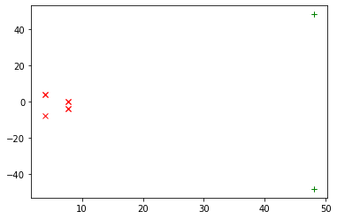
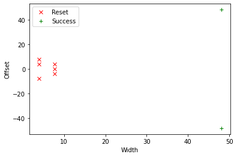

Part 1, Topic 2: Clock Glitching to Dump Memory (MAIN)
======================================================

**SUMMARY:** *Microcontrollers and FPGAs have a number of operating
conditions that must be met in order for the device to work properly.
Outside of these conditions, devices will begin to malfunction, with
more extreme violations causing the device to stop entirely or even
become damaged. By going outside these operating conditions for very
small amounts of time, we can cause a varitey of temporary malfunctions*

*In this lab, we’ll explore clock glitching, which inserts short
glitches into a device’s clock.*

**LEARNING OUTCOMES:**

-  Understand effects of clock glitching
-  Exploring ChipWhisperer’s glitch module
-  Using clock glitching to disrupt a target’s algorithm

Clock Glitching Theory
----------------------

Digital hardware devices almost always expect some form of reliable
clock. We can manipulate the clock being presented to the device to
cause unintended behaviour. We’ll be concentrating on microcontrollers
here, however other digital devices (e.g. hardware encryption
accelerators) can also have faults injected using this technique.

Consider a microcontroller first. The following figure is an excerpt
from the Atmel AVR ATMega328P datasheet:

.. figure:: https://wiki.newae.com/images/2/20/Mcu-unglitched.png
   :alt: A2_1

   A2_1

Rather than loading each instruction from FLASH and performing the
entire execution, the system has a pipeline to speed up the execution
process. This means that an instruction is being decoded while the next
one is being retrieved, as the following diagram shows:

.. figure:: https://wiki.newae.com/images/a/a5/Clock-normal.png
   :alt: A2_2

   A2_2

But if we modify the clock, we could have a situation where the system
doesn’t have enough time to actually perform an instruction. Consider
the following, where Execute #1 is effectively skipped. Before the
system has time to actually execute it another clock edge comes, causing
the microcontroller to start execution of the next instruction:

.. figure:: https://wiki.newae.com/images/1/1e/Clock-glitched.png
   :alt: A2_3

   A2_3

This causes the microcontroller to skip an instruction. Such attacks can
be immensely powerful in practice. Consider for example the following
code from ``linux-util-2.24``:

.. code:: c

   /*
    *   auth.c -- PAM authorization code, common between chsh and chfn
    *   (c) 2012 by Cody Maloney <cmaloney@theoreticalchaos.com>
    *
    *   this program is free software.  you can redistribute it and
    *   modify it under the terms of the gnu general public license.
    *   there is no warranty.
    *
    */

   #include "auth.h"
   #include "pamfail.h"

   int auth_pam(const char *service_name, uid_t uid, const char *username)
   {
       if (uid != 0) {
           pam_handle_t *pamh = NULL;
           struct pam_conv conv = { misc_conv, NULL };
           int retcode;

           retcode = pam_start(service_name, username, &conv, &pamh);
           if (pam_fail_check(pamh, retcode))
               return FALSE;

           retcode = pam_authenticate(pamh, 0);
           if (pam_fail_check(pamh, retcode))
               return FALSE;

           retcode = pam_acct_mgmt(pamh, 0);
           if (retcode == PAM_NEW_AUTHTOK_REQD)
               retcode =
                   pam_chauthtok(pamh, PAM_CHANGE_EXPIRED_AUTHTOK);
           if (pam_fail_check(pamh, retcode))
               return FALSE;

           retcode = pam_setcred(pamh, 0);
           if (pam_fail_check(pamh, retcode))
               return FALSE;

           pam_end(pamh, 0);
           /* no need to establish a session; this isn't a
            * session-oriented activity...  */
       }
       return TRUE;
   }

This is the login code for the Linux OS. Note that if we could skip the
check of ``if (uid != 0)`` and simply branch to the end, we could avoid
having to enter a password. This is the power of glitch attacks - not
that we are breaking encryption, but simply bypassing the entire
authentication module!

Glitch Hardware
~~~~~~~~~~~~~~~

The ChipWhisperer Glitch system uses the same synchronous methodology as
its Side Channel Analysis (SCA) capture. A system clock (which can come
from either the ChipWhisperer or the Device Under Test (DUT)) is used to
generate the glitches. These glitches are then inserted back into the
clock, although it’s possible to use the glitches alone for other
purposes (i.e. for voltage glitching, EM glitching).

The generation of glitches is done with two variable phase shift
modules, configured as follows:

.. figure:: https://wiki.newae.com/images/6/65/Glitchgen-phaseshift.png
   :alt: A2_4

   A2_4

The enable line is used to determine when glitches are inserted.
Glitches can be inserted continuously (useful for development) or
triggered by some event. The following figure shows how the glitch can
be muxd to output to the Device Under Test (DUT).

.. figure:: https://wiki.newae.com/images/c/c0/Glitchgen-mux.png
   :alt: A2_5

   A2_5

Hardware Support
~~~~~~~~~~~~~~~~

The phase shift blocks use the Digital Clock Manager (DCM) blocks within
the FPGA. These blocks have limited support for run-time configuration
of parameters such as phase delay and frequency generation, and for
maximum performance the configuration must be fixed at design time. The
Xilinx-provided run-time adjustment can shift the phase only by about
+/- 5nS in 30pS increments (exact values vary with operating
conditions).

For most operating conditions this is insufficient - if attacking a
target at 7.37MHz the clock cycle would have a period of 136nS. In order
to provide a larger adjustment range, an advanced FPGA feature called
Partial Reconfiguration (PR) is used. The PR system requires special
partial bitstreams which contain modifications to the FPGA bitstream.
These are stored as two files inside a “firmware” zip which contains
both the FPGA bitstream along with a file called ``glitchwidth.p`` and a
file called ``glitchoffset.p``. If a lone bitstream is being loaded into
the FPGA (i.e. not from the zip-file), the partial reconfiguration
system is disabled, as loading incorrect partial reconfiguration files
could damage the FPGA. This damage is mostly theoretical, more likely
the FPGA will fail to function correctly.

If in the course of following this tutorial you find the FPGA appears to
stop responding (i.e. certain features no longer work correctly), it
could be the partial reconfiguration data is incorrect.

We’ll look at how to interface with these features later in the
tutorial.

**In [1]:**

.. code:: ipython3

    SCOPETYPE = 'OPENADC'
    PLATFORM = 'CWLITEXMEGA'

**In [2]:**

.. code:: bash

    %%bash -s "$PLATFORM"
    cd ../../../hardware/victims/firmware/simpleserial-glitch
    make PLATFORM=$1 CRYPTO_TARGET=NONE

**Out [2]:**

.. parsed-literal::

    SS\_VER set to SS\_VER\_1\_1
    rm -f -- simpleserial-glitch-CWLITEXMEGA.hex
    rm -f -- simpleserial-glitch-CWLITEXMEGA.eep
    rm -f -- simpleserial-glitch-CWLITEXMEGA.cof
    rm -f -- simpleserial-glitch-CWLITEXMEGA.elf
    rm -f -- simpleserial-glitch-CWLITEXMEGA.map
    rm -f -- simpleserial-glitch-CWLITEXMEGA.sym
    rm -f -- simpleserial-glitch-CWLITEXMEGA.lss
    rm -f -- objdir/\*.o
    rm -f -- objdir/\*.lst
    rm -f -- simpleserial-glitch.s simpleserial.s XMEGA\_AES\_driver.s uart.s usart\_driver.s xmega\_hal.s
    rm -f -- simpleserial-glitch.d simpleserial.d XMEGA\_AES\_driver.d uart.d usart\_driver.d xmega\_hal.d
    rm -f -- simpleserial-glitch.i simpleserial.i XMEGA\_AES\_driver.i uart.i usart\_driver.i xmega\_hal.i
    .
    Welcome to another exciting ChipWhisperer target build!!
    avr-gcc.exe (WinAVR 20100110) 4.3.3
    Copyright (C) 2008 Free Software Foundation, Inc.
    This is free software; see the source for copying conditions.  There is NO
    warranty; not even for MERCHANTABILITY or FITNESS FOR A PARTICULAR PURPOSE.
    
    .
    Compiling C: simpleserial-glitch.c
    avr-gcc -c -mmcu=atxmega128d3 -I. -fpack-struct -gdwarf-2 -DSS\_VER=SS\_VER\_1\_1 -DHAL\_TYPE=HAL\_xmega -DPLATFORM=CWLITEXMEGA -DF\_CPU=7372800UL -Os -funsigned-char -funsigned-bitfields -fshort-enums -Wall -Wstrict-prototypes -Wa,-adhlns=objdir/simpleserial-glitch.lst -I.././simpleserial/ -I.././hal -I.././hal/xmega -I.././crypto/ -std=gnu99  -MMD -MP -MF .dep/simpleserial-glitch.o.d simpleserial-glitch.c -o objdir/simpleserial-glitch.o 
    .
    Compiling C: .././simpleserial/simpleserial.c
    avr-gcc -c -mmcu=atxmega128d3 -I. -fpack-struct -gdwarf-2 -DSS\_VER=SS\_VER\_1\_1 -DHAL\_TYPE=HAL\_xmega -DPLATFORM=CWLITEXMEGA -DF\_CPU=7372800UL -Os -funsigned-char -funsigned-bitfields -fshort-enums -Wall -Wstrict-prototypes -Wa,-adhlns=objdir/simpleserial.lst -I.././simpleserial/ -I.././hal -I.././hal/xmega -I.././crypto/ -std=gnu99  -MMD -MP -MF .dep/simpleserial.o.d .././simpleserial/simpleserial.c -o objdir/simpleserial.o 
    .
    Compiling C: .././hal/xmega/XMEGA\_AES\_driver.c
    avr-gcc -c -mmcu=atxmega128d3 -I. -fpack-struct -gdwarf-2 -DSS\_VER=SS\_VER\_1\_1 -DHAL\_TYPE=HAL\_xmega -DPLATFORM=CWLITEXMEGA -DF\_CPU=7372800UL -Os -funsigned-char -funsigned-bitfields -fshort-enums -Wall -Wstrict-prototypes -Wa,-adhlns=objdir/XMEGA\_AES\_driver.lst -I.././simpleserial/ -I.././hal -I.././hal/xmega -I.././crypto/ -std=gnu99  -MMD -MP -MF .dep/XMEGA\_AES\_driver.o.d .././hal/xmega/XMEGA\_AES\_driver.c -o objdir/XMEGA\_AES\_driver.o 
    .
    Compiling C: .././hal/xmega/uart.c
    avr-gcc -c -mmcu=atxmega128d3 -I. -fpack-struct -gdwarf-2 -DSS\_VER=SS\_VER\_1\_1 -DHAL\_TYPE=HAL\_xmega -DPLATFORM=CWLITEXMEGA -DF\_CPU=7372800UL -Os -funsigned-char -funsigned-bitfields -fshort-enums -Wall -Wstrict-prototypes -Wa,-adhlns=objdir/uart.lst -I.././simpleserial/ -I.././hal -I.././hal/xmega -I.././crypto/ -std=gnu99  -MMD -MP -MF .dep/uart.o.d .././hal/xmega/uart.c -o objdir/uart.o 
    .
    Compiling C: .././hal/xmega/usart\_driver.c
    avr-gcc -c -mmcu=atxmega128d3 -I. -fpack-struct -gdwarf-2 -DSS\_VER=SS\_VER\_1\_1 -DHAL\_TYPE=HAL\_xmega -DPLATFORM=CWLITEXMEGA -DF\_CPU=7372800UL -Os -funsigned-char -funsigned-bitfields -fshort-enums -Wall -Wstrict-prototypes -Wa,-adhlns=objdir/usart\_driver.lst -I.././simpleserial/ -I.././hal -I.././hal/xmega -I.././crypto/ -std=gnu99  -MMD -MP -MF .dep/usart\_driver.o.d .././hal/xmega/usart\_driver.c -o objdir/usart\_driver.o 
    .
    Compiling C: .././hal/xmega/xmega\_hal.c
    avr-gcc -c -mmcu=atxmega128d3 -I. -fpack-struct -gdwarf-2 -DSS\_VER=SS\_VER\_1\_1 -DHAL\_TYPE=HAL\_xmega -DPLATFORM=CWLITEXMEGA -DF\_CPU=7372800UL -Os -funsigned-char -funsigned-bitfields -fshort-enums -Wall -Wstrict-prototypes -Wa,-adhlns=objdir/xmega\_hal.lst -I.././simpleserial/ -I.././hal -I.././hal/xmega -I.././crypto/ -std=gnu99  -MMD -MP -MF .dep/xmega\_hal.o.d .././hal/xmega/xmega\_hal.c -o objdir/xmega\_hal.o 
    .
    Linking: simpleserial-glitch-CWLITEXMEGA.elf
    avr-gcc -mmcu=atxmega128d3 -I. -fpack-struct -gdwarf-2 -DSS\_VER=SS\_VER\_1\_1 -DHAL\_TYPE=HAL\_xmega -DPLATFORM=CWLITEXMEGA -DF\_CPU=7372800UL -Os -funsigned-char -funsigned-bitfields -fshort-enums -Wall -Wstrict-prototypes -Wa,-adhlns=objdir/simpleserial-glitch.o -I.././simpleserial/ -I.././hal -I.././hal/xmega -I.././crypto/ -std=gnu99  -MMD -MP -MF .dep/simpleserial-glitch-CWLITEXMEGA.elf.d objdir/simpleserial-glitch.o objdir/simpleserial.o objdir/XMEGA\_AES\_driver.o objdir/uart.o objdir/usart\_driver.o objdir/xmega\_hal.o --output simpleserial-glitch-CWLITEXMEGA.elf -Wl,-Map=simpleserial-glitch-CWLITEXMEGA.map,--cref   -lm  
    .
    Creating load file for Flash: simpleserial-glitch-CWLITEXMEGA.hex
    avr-objcopy -O ihex -R .eeprom -R .fuse -R .lock -R .signature simpleserial-glitch-CWLITEXMEGA.elf simpleserial-glitch-CWLITEXMEGA.hex
    .
    Creating load file for EEPROM: simpleserial-glitch-CWLITEXMEGA.eep
    avr-objcopy -j .eeprom --set-section-flags=.eeprom="alloc,load" \
    --change-section-lma .eeprom=0 --no-change-warnings -O ihex simpleserial-glitch-CWLITEXMEGA.elf simpleserial-glitch-CWLITEXMEGA.eep \|\| exit 0
    .
    Creating Extended Listing: simpleserial-glitch-CWLITEXMEGA.lss
    avr-objdump -h -S -z simpleserial-glitch-CWLITEXMEGA.elf > simpleserial-glitch-CWLITEXMEGA.lss
    .
    Creating Symbol Table: simpleserial-glitch-CWLITEXMEGA.sym
    avr-nm -n simpleserial-glitch-CWLITEXMEGA.elf > simpleserial-glitch-CWLITEXMEGA.sym
    Size after:
       text	   data	    bss	    dec	    hex	filename
       2288	     22	     52	   2362	    93a	simpleserial-glitch-CWLITEXMEGA.elf
    +--------------------------------------------------------
    + Default target does full rebuild each time.
    + Specify buildtarget == allquick == to avoid full rebuild
    +--------------------------------------------------------
    +--------------------------------------------------------
    + Built for platform CW-Lite XMEGA with:
    + CRYPTO\_TARGET = NONE
    + CRYPTO\_OPTIONS = 
    +--------------------------------------------------------
    

**In [3]:**

.. code:: ipython3

    %run "../../Setup_Scripts/Setup_Generic.ipynb"

**Out [3]:**

.. parsed-literal::

    Serial baud rate = 38400
    INFO: Found ChipWhisperer😍
    

**In [4]:**

.. code:: ipython3

    fw_path = "../../../hardware/victims/firmware/simpleserial-glitch/simpleserial-glitch-{}.hex".format(PLATFORM)
    cw.program_target(scope, prog, fw_path)

**Out [4]:**

.. parsed-literal::

    XMEGA Programming flash...
    XMEGA Reading flash...
    Verified flash OK, 2309 bytes
    

We’ll probably crash the target a few times while we’re trying some
glitching. Create a function to reset the target:

**In [5]:**

.. code:: ipython3

    if PLATFORM == "CWLITEXMEGA":
        def reboot_flush():            
            scope.io.pdic = False
            time.sleep(0.1)
            scope.io.pdic = "high_z"
            time.sleep(0.1)
            #Flush garbage too
            target.flush()
    else:
        def reboot_flush():            
            scope.io.nrst = False
            time.sleep(0.05)
            scope.io.nrst = "high_z"
            time.sleep(0.05)
            #Flush garbage too
            target.flush()

Communication
-------------

For this lab, we’ll be introducing a new method:
``target.simpleserial_read_witherrors()``. We’re expecting a
simpleserial response back; however, glitch will often cause the target
to crash and return an invalid string. This method will handle all that
for us. It’ll also tell us whether the response was valid and what the
error return code was. Use as follows:

**In [6]:**

.. code:: ipython3

    #Do glitch loop
    target.write("g\n")
    
    val = target.simpleserial_read_witherrors('r', 4, glitch_timeout=10)#For loop check
    valid = val['valid']
    if valid:
        response = val['payload']
        raw_serial = val['full_response']
        error_code = val['rv']
    
    print(val)

**Out [6]:**

.. parsed-literal::

    {'valid': False, 'payload': None, 'full\_response': '\x00v4Ûá\x00rRESET   \n', 'rv': None}
    

Target Firmware
---------------

For this lab, our goal is to get the following code to preduce an
incorrect result:

.. code:: c

   uint8_t glitch_loop(uint8_t* in)
   {
       volatile uint16_t i, j;
       volatile uint32_t cnt;
       cnt = 0;
       trigger_high();
       for(i=0; i<50; i++){
           for(j=0; j<50; j++){
               cnt++;
           }
       }
       trigger_low();
       simpleserial_put('r', 4, (uint8_t*)&cnt);
       return (cnt != 2500);
   }

As you can see, we’ve got a simple loop. This is a really good place to
start glitching for 2 reasons:

1. We’ve got a really long portion of time with a lot of instructions to
   glitch. In contrast, with the Linux example we’re be trying to target
   a single instruction.

2. For some glitching scenarios, we’re looking for a pretty specific
   glitch effect. In the Linux example, we might be banking on the
   glitch causing the target to skip an instruction instead of
   corrupting the comparison since that’s a lot more likely to get us
   where we want in the code path. For this simple loop calculation,
   pretty much any malfunction will show up in the result.

Glitch Module
-------------

All the settings/methods for the glitch module can be accessed under
``scope.glitch``. As usual, documentation for the settings and methods
can be accessed on
`ReadtheDocs <https://chipwhisperer.readthedocs.io/en/latest/api.html>`__
or with the python ``help`` command:

**In [7]:**

.. code:: ipython3

    help(scope.glitch)

**Out [7]:**

.. parsed-literal::

    Help on GlitchSettings in module chipwhisperer.capture.scopes.cwhardware.ChipWhispererGlitch object:
    
    class GlitchSettings(chipwhisperer.common.utils.util.DisableNewAttr)
     \|  GlitchSettings(cwglitch)
     \|  
     \|  Provides an ability to disable setting new attributes in a class, useful to prevent typos.
     \|  
     \|  Usage:
     \|  1. Make a class that inherits this class:
     \|  >>> class MyClass(DisableNewAttr):
     \|  >>>     # Your class definition here
     \|  
     \|  2. After setting up all attributes that your object needs, call disable\_newattr():
     \|  >>>     def \_\_init\_\_(self):
     \|  >>>         self.my\_attr = 123
     \|  >>>         self.disable\_newattr()
     \|  
     \|  3. Subclasses raise an AttributeError when trying to make a new attribute:
     \|  >>> obj = MyClass()
     \|  >>> #obj.my\_new\_attr = 456   <-- Raises AttributeError
     \|  
     \|  Method resolution order:
     \|      GlitchSettings
     \|      chipwhisperer.common.utils.util.DisableNewAttr
     \|      builtins.object
     \|  
     \|  Methods defined here:
     \|  
     \|  \_\_init\_\_(self, cwglitch)
     \|      Initialize self.  See help(type(self)) for accurate signature.
     \|  
     \|  \_\_repr\_\_(self)
     \|      Return repr(self).
     \|  
     \|  \_\_str\_\_(self)
     \|      Return str(self).
     \|  
     \|  manualTrigger(self)
     \|  
     \|  manual\_trigger(self)
     \|      Manually trigger the glitch output.
     \|      
     \|      This trigger is most useful in Manual trigger mode, where this is the
     \|      only way to cause a glitch.
     \|  
     \|  readStatus(self)
     \|      Read the status of the two glitch DCMs.
     \|      
     \|      Returns:
     \|          A tuple with 4 elements::
     \|      
     \|           \* phase1: Phase shift of DCM1,
     \|           \* phase2: Phase shift of DCM2,
     \|           \* lock1: Whether DCM1 is locked,
     \|           \* lock2: Whether DCM2 is locked
     \|  
     \|  resetDcms(self)
     \|      Reset the two glitch DCMs.
     \|      
     \|      This is automatically run after changing the glitch width or offset,
     \|      so this function is typically not necessary.
     \|  
     \|  ----------------------------------------------------------------------
     \|  Data descriptors defined here:
     \|  
     \|  arm\_timing
     \|      When to arm the glitch in single-shot mode.
     \|      
     \|      If the glitch module is in "ext\_single" trigger mode, it must be armed
     \|      when the scope is armed. There are two timings for this event:
     \|      
     \|       \* "before\_scope": The glitch module is armed first.
     \|       \* "after\_scope": The scope is armed first. This is the default.
     \|      
     \|      This setting may be helpful if trigger events are happening very early.
     \|      
     \|      If the glitch module is not in external trigger single-shot mode, this
     \|      setting has no effect.
     \|      
     \|      :Getter: Return the current arm timing ("before\_scope" or "after\_scope")
     \|      
     \|      :Setter: Change the arm timing
     \|      
     \|      Raises:
     \|         ValueError: if value not listed above
     \|  
     \|  clk\_src
     \|      The clock signal that the glitch DCM is using as input.
     \|      
     \|      This DCM can be clocked from two different sources:
     \|       \* "target": The HS1 clock from the target device
     \|       \* "clkgen": The CLKGEN DCM output
     \|      
     \|      :Getter:
     \|         Return the clock signal currently in use
     \|      
     \|      :Setter:
     \|         Change the glitch clock source
     \|      
     \|      Raises:
     \|         ValueError: New value not one of "target" or "clkgen"
     \|  
     \|  ext\_offset
     \|      How long the glitch module waits between a trigger and a glitch.
     \|      
     \|      After the glitch module is triggered, it waits for a number of clock
     \|      cycles before generating glitch pulses. This delay allows the glitch to
     \|      be inserted at a precise moment during the target's execution to glitch
     \|      specific instructions.
     \|      
     \|      .. note::
     \|          It is possible to get more precise offsets by clocking the
     \|          glitch module faster than the target board.
     \|      
     \|      This offset must be in the range [0, 2\*\*32).
     \|      
     \|      :Getter: Return the current external trigger offset.
     \|      
     \|      :Setter: Set the external trigger offset.
     \|      
     \|      Raises:
     \|         TypeError: if offset not an integer
     \|         ValueError: if offset outside of range [0, 2\*\*32)
     \|  
     \|  offset
     \|      The offset from a rising clock edge to a glitch pulse rising edge,
     \|      as a percentage of one period.
     \|      
     \|      A pulse may begin anywhere from -49.8% to 49.8% away from a rising
     \|      edge, allowing glitches to be swept over the entire clock cycle.
     \|      
     \|      .. warning:: very large negative offset <-45 may result in double glitches
     \|      
     \|      :Getter: Return a float with the current glitch offset.
     \|      
     \|      :Setter: Set the glitch offset. The new value is rounded to the nearest
     \|          possible offset.
     \|      
     \|      
     \|      Raises:
     \|         TypeError: offset not an integer
     \|         UserWarning: value outside range [-50, 50] (value is rounded)
     \|  
     \|  offset\_fine
     \|      The fine adjustment value on the glitch offset.
     \|      
     \|      This is a dimensionless number that makes small adjustments to the
     \|      glitch pulses' offset. Valid range is [-255, 255].
     \|      
     \|      .. warning:: This value is write-only. Reads will always return 0.
     \|      
     \|      :Getter: Returns 0
     \|      
     \|      :Setter: Update the glitch fine offset
     \|      
     \|      Raises:
     \|         TypeError: if offset not an integer
     \|         ValueError: if offset is outside of [-255, 255]
     \|  
     \|  output
     \|      The type of output produced by the glitch module.
     \|      
     \|      There are 5 ways that the glitch module can combine the clock with its
     \|      glitch pulses:
     \|      
     \|       \* "clock\_only": Output only the original input clock.
     \|       \* "glitch\_only": Output only the glitch pulses - do not use the clock.
     \|       \* "clock\_or": Output is high if either the clock or glitch are high.
     \|       \* "clock\_xor": Output is high if clock and glitch are different.
     \|       \* "enable\_only": Output is high for glitch.repeat cycles.
     \|      
     \|      Some of these settings are only useful in certain scenarios:
     \|       \* Clock glitching: "clock\_or" or "clock\_xor"
     \|       \* Voltage glitching: "glitch\_only" or "enable\_only"
     \|      
     \|      :Getter: Return the current glitch output mode (one of above strings)
     \|      
     \|      :Setter: Change the glitch output mode.
     \|      
     \|      Raises:
     \|         ValueError: if value not in above strings
     \|  
     \|  repeat
     \|      The number of glitch pulses to generate per trigger.
     \|      
     \|      When the glitch module is triggered, it produces a number of pulses
     \|      that can be combined with the clock signal. This setting allows for
     \|      the glitch module to produce stronger glitches (especially during
     \|      voltage glitching).
     \|      
     \|      Repeat counter must be in the range [1, 8192].
     \|      
     \|      :Getter: Return the current repeat value (integer)
     \|      
     \|      :Setter: Set the repeat counter
     \|      
     \|      Raises:
     \|         TypeError: if value not an integer
     \|         ValueError: if value outside [1, 8192]
     \|  
     \|  trigger\_src
     \|      The trigger signal for the glitch pulses.
     \|      
     \|      The glitch module can use four different types of triggers:
     \|       \* "continuous": Constantly trigger glitches
     \|       \* "manual": Only trigger glitches through API calls/GUI actions
     \|       \* "ext\_single": Use the trigger module. One glitch per scope arm.
     \|       \* "ext\_continuous": Use the trigger module. Many glitches per arm.
     \|      
     \|      :Getter: Return the current trigger source.
     \|      
     \|      :Setter: Change the trigger source.
     \|      
     \|      Raises:
     \|         ValueError: value not listed above.
     \|  
     \|  width
     \|      The width of a single glitch pulse, as a percentage of one period.
     \|      
     \|      One pulse can range from -49.8% to roughly 49.8% of a period. The
     \|      system may not be reliable at 0%. Note that negative widths are allowed;
     \|      these act as if they are positive widths on the other half of the
     \|      clock cycle.
     \|      
     \|      :Getter: Return a float with the current glitch width.
     \|      
     \|      :Setter: Update the glitch pulse width. The value will be adjusted to
     \|          the closest possible glitch width.
     \|      
     \|      Raises:
     \|         UserWarning: Width outside of [-49.8, 49.8]. The value is rounded
     \|             to one of these
     \|  
     \|  width\_fine
     \|      The fine adjustment value on the glitch width.
     \|      
     \|      This is a dimensionless number that makes small adjustments to the
     \|      glitch pulses' width. Valid range is [-255, 255].
     \|      
     \|      .. warning:: This value is write-only. Reads will always return 0.
     \|      
     \|      :Getter: Returns 0
     \|      
     \|      :Setter: Update the glitch fine width
     \|      
     \|      Raises:
     \|         TypeError: offset not an integer
     \|         ValueError: offset is outside of [-255, 255]
     \|  
     \|  ----------------------------------------------------------------------
     \|  Methods inherited from chipwhisperer.common.utils.util.DisableNewAttr:
     \|  
     \|  \_\_setattr\_\_(self, name, value)
     \|      Implement setattr(self, name, value).
     \|  
     \|  disable\_newattr(self)
     \|  
     \|  enable\_newattr(self)
     \|  
     \|  ----------------------------------------------------------------------
     \|  Data descriptors inherited from chipwhisperer.common.utils.util.DisableNewAttr:
     \|  
     \|  \_\_dict\_\_
     \|      dictionary for instance variables (if defined)
     \|  
     \|  \_\_weakref\_\_
     \|      list of weak references to the object (if defined)
    
    

Some of the important settings we’ll want to look at here are:

-  clk_src > The clock signal that the glitch DCM is using as input. Can
   be set to “target” or “clkgen” In this case, we’ll be providing the
   clock to the target, so we’ll want this set to “clkgen”
-  offset > Where in the output clock to place the glitch. Can be in the
   range ``[-50, 50]``. Often, we’ll want to try many offsets when
   trying to glitch a target.
-  width > How wide to make the glitch. Can be in the range
   ``[-50, 50]``, though there is no reason to use widths < 0. Wider
   glitches more easily cause glitches, but are also more likely to
   crash the target, meaning we’ll often want to try a range of widths
   when attacking a target.
-  output > The output produced by the glitch module. For clock
   glitching, clock_xor is often the most useful option.
-  ext_offset > The number of clock cycles after the trigger to put the
   glitch.
-  repeat > The number of clock cycles to repeat the glitch for. Higher
   values increase the number of instructions that can be glitched, but
   often increase the risk of crashing the target.
-  trigger_src > How to trigger the glitch. For this tutorial, we want
   to automatically trigger the glitch from the trigger pin only after
   arming the ChipWhipserer, so we’ll use ``ext_single``

In addition, we’ll need to tell ChipWhipserer to use the glitch module’s
output as a clock source for the target by setting
``scope.io.hs2 = "glitch"``. We’ll also setup a large ``repeat`` to make
glitching easier. Finally, we’ll also use a ``namedtuple`` to make
looping through parameters simpler.

CW Glitch Controller
--------------------

To make creating a glitch loop easier, ChipWhisperer includes a glitch
controller. We’ll start of by initializing with with different potential
results of the attack. You define these to be whatever you want, but
typically “success”, “reset”, and “normal” will be sufficient. We also
need to tell it what glitch parameters we want to scan through, in this
case width and offset:

**In [8]:**

.. code:: ipython3

    import chipwhisperer.common.results.glitch as glitch
    gc = glitch.GlitchController(groups=["success", "reset", "normal"], parameters=["width", "offset"])

One of the nicities of the glitch controller is that it can display our
current settings. This will update in real time as we use the glitch
controller!

**In [9]:**

.. code:: ipython3

    gc.display_stats()

**Out [9]:**

We can also make a settings map that can also update in realtime as
well:

**In [10]:**

.. code:: ipython3

    %matplotlib inline
    import matplotlib.pylab as plt
    fig = plt.figure()

**Out [10]:**

.. parsed-literal::

    <Figure size 432x288 with 0 Axes>

**In [11]:**

.. code:: ipython3

    ## to update the plot:
    plt.plot(-5, 5, '.')
    fig.canvas.draw()

**Out [11]:**

.. image:: img/OPENADC-CWLITEXMEGA-courses_fault101_SOLN_Fault1_1-IntroductiontoClockGlitching_20_0.png

You can set ranges for each glitch setting:

**In [12]:**

.. code:: ipython3

    gc.set_range("width", -5, 5)
    gc.set_range("offset", -5, 5)

Each setting moves from min to max based on the global step:

**In [13]:**

.. code:: ipython3

    gc.set_global_step([5.0, 2.5])

We can print out all the glitch settings to see how this looks:

**In [14]:**

.. code:: ipython3

    for glitch_setting in gc.glitch_values():
        print("Offset: {}", glitch_setting[1])
        print("Width: {}", glitch_setting[0])

**Out [14]:**

.. parsed-literal::

    Offset: {} -5
    Width: {} -5
    Offset: {} 0.0
    Width: {} -5
    Offset: {} 5.0
    Width: {} -5
    Offset: {} -5
    Width: {} 0.0
    Offset: {} 0.0
    Width: {} 0.0
    Offset: {} 5.0
    Width: {} 0.0
    Offset: {} -5
    Width: {} 5.0
    Offset: {} 0.0
    Width: {} 5.0
    Offset: {} 5.0
    Width: {} 5.0
    Offset: {} -5
    Width: {} -5
    Offset: {} -2.5
    Width: {} -5
    Offset: {} 0.0
    Width: {} -5
    Offset: {} 2.5
    Width: {} -5
    Offset: {} 5.0
    Width: {} -5
    Offset: {} -5
    Width: {} -2.5
    Offset: {} -2.5
    Width: {} -2.5
    Offset: {} 0.0
    Width: {} -2.5
    Offset: {} 2.5
    Width: {} -2.5
    Offset: {} 5.0
    Width: {} -2.5
    Offset: {} -5
    Width: {} 0.0
    Offset: {} -2.5
    Width: {} 0.0
    Offset: {} 0.0
    Width: {} 0.0
    Offset: {} 2.5
    Width: {} 0.0
    Offset: {} 5.0
    Width: {} 0.0
    Offset: {} -5
    Width: {} 2.5
    Offset: {} -2.5
    Width: {} 2.5
    Offset: {} 0.0
    Width: {} 2.5
    Offset: {} 2.5
    Width: {} 2.5
    Offset: {} 5.0
    Width: {} 2.5
    Offset: {} -5
    Width: {} 5.0
    Offset: {} -2.5
    Width: {} 5.0
    Offset: {} 0.0
    Width: {} 5.0
    Offset: {} 2.5
    Width: {} 5.0
    Offset: {} 5.0
    Width: {} 5.0
    

You can tell the glitch controller when you’ve reached a particular
result state like so:

**In [15]:**

.. code:: ipython3

    #gc.add("reset", (scope.glitch.width, scope.glitch.offset))
    #gc.add("success", (scope.glitch.width, scope.glitch.offset))

We’ll start off with the following settings. It’s usually best to use
“clock_xor” with clock glitching, which will insert a glitch if the
clock is high or the clock is low.

**In [16]:**

.. code:: ipython3

    #Basic setup
    scope.glitch.clk_src = "clkgen" # set glitch input clock
    scope.glitch.output = "clock_xor" # glitch_out = clk ^ glitch
    scope.glitch.trigger_src = "ext_single" # glitch only after scope.arm() called
    
    scope.io.hs2 = "glitch"  # output glitch_out on the clock line
    print(scope.glitch)

**Out [16]:**

.. parsed-literal::

    clk\_src     = clkgen
    width       = 10.15625
    width\_fine  = 0
    offset      = 10.15625
    offset\_fine = 0
    trigger\_src = ext\_single
    arm\_timing  = after\_scope
    ext\_offset  = 0
    repeat      = 1
    output      = clock\_xor
    
    

Unless you don’t mind your computer being occupied for a few days,
you’ll want to break this into two glitch campaigns. The first will be
with wide ranges and large steps. Then, once you’ve found some
interesting locations, narrow down your ranges and step size to more
precisely map out what the best settings are.

We’ll get you started, but it’s up to you to finish the loop.

**In [17]:**

.. code:: ipython3

    import chipwhisperer.common.results.glitch as glitch
    from tqdm.notebook import trange
    import struct
    
    scope.glitch.ext_offset = 2
    
    gc.set_range("width", 0, 48)
    gc.set_range("offset", -48, 48)
    gc.set_global_step([8, 4])
    scope.glitch.repeat = 10
    
    scope.adc.timeout = 0.1
    
    reboot_flush()
    broken = False
    for glitch_setting in gc.glitch_values():
        scope.glitch.offset = glitch_setting[1]
        scope.glitch.width = glitch_setting[0]
        # ###################
        # Add your code here
        # ###################
        #raise NotImplementedError("Add your code here, and delete this.")
    
        # ###################
        # START SOLUTION
        # ###################
        if scope.adc.state:
            # can detect crash here (fast) before timing out (slow)
            print("Trigger still high!")
            gc.add("reset", (scope.glitch.width, scope.glitch.offset))
            plt.plot(lwid, loff, 'xr', alpha=1)
            fig.canvas.draw()
    
            #Device is slow to boot?
            reboot_flush()
    
        scope.arm()
    
        #Do glitch loop
        target.write("g\n")
    
        ret = scope.capture()
    
    
        val = target.simpleserial_read_witherrors('r', 4, glitch_timeout=10)#For loop check
        loff = scope.glitch.offset
        lwid = scope.glitch.width
    
        if ret:
            print('Timeout - no trigger')
            gc.add("reset", (scope.glitch.width, scope.glitch.offset))
            plt.plot(scope.glitch.width, scope.glitch.offset, 'xr', alpha=1)
            fig.canvas.draw()
    
            #Device is slow to boot?
            reboot_flush()
    
        else:
            if val['valid'] is False:
                gc.add("reset", (scope.glitch.width, scope.glitch.offset))
                plt.plot(scope.glitch.width, scope.glitch.offset, 'xr', alpha=1)
                fig.canvas.draw()
            else:
    
                #print(val['payload'])
                if val['payload'] is None:
                    print(val['payload'])
                    continue #what
                #gcnt = struct.unpack("<b", val['payload'])[0] #for code-flow check
                gcnt = struct.unpack("<I", val['payload'])[0]
    
                #print(gcnt)                
                # for table display purposes
                #if gnt != 0: #for code-flow check
                if gcnt != 2500: #for loop check
                    broken = True
                    gc.add("success", (scope.glitch.width, scope.glitch.offset))
                    plt.plot(scope.glitch.width, scope.glitch.offset, '+g')
                    fig.canvas.draw()
                    print(val['payload'])
                    print("🐙", end="")
                else:
                    gc.add("normal", (scope.glitch.width, scope.glitch.offset))
        # ###################
        # END SOLUTION
        # ###################
    
    print("Done glitching")

**Out [17]:**

.. parsed-literal::

    WARNING:root:Negative offsets <-45 may result in double glitches!
    WARNING:root:Partial reconfiguration for width = 0 may not work
    WARNING:root:Partial reconfiguration for width = 0 may not work
    WARNING:root:Partial reconfiguration for width = 0 may not work
    WARNING:root:Partial reconfiguration for width = 0 may not work
    WARNING:root:Partial reconfiguration for width = 0 may not work
    WARNING:root:Partial reconfiguration for width = 0 may not work
    WARNING:root:Partial reconfiguration for width = 0 may not work
    WARNING:root:Partial reconfiguration for width = 0 may not work
    WARNING:root:Partial reconfiguration for width = 0 may not work
    WARNING:root:Partial reconfiguration for width = 0 may not work
    WARNING:root:Partial reconfiguration for width = 0 may not work
    WARNING:root:Partial reconfiguration for width = 0 may not work
    WARNING:root:Partial reconfiguration for offset = 0 may not work
    WARNING:root:Partial reconfiguration for width = 0 may not work
    WARNING:root:Partial reconfiguration for offset = 0 may not work
    WARNING:root:Partial reconfiguration for width = 0 may not work
    WARNING:root:Partial reconfiguration for width = 0 may not work
    WARNING:root:Partial reconfiguration for width = 0 may not work
    WARNING:root:Partial reconfiguration for width = 0 may not work
    WARNING:root:Partial reconfiguration for width = 0 may not work
    WARNING:root:Partial reconfiguration for width = 0 may not work
    WARNING:root:Partial reconfiguration for width = 0 may not work
    WARNING:root:Partial reconfiguration for width = 0 may not work
    WARNING:root:Partial reconfiguration for width = 0 may not work
    WARNING:root:Partial reconfiguration for width = 0 may not work
    WARNING:root:Partial reconfiguration for width = 0 may not work
    WARNING:root:Partial reconfiguration for width = 0 may not work
    WARNING:root:Negative offsets <-45 may result in double glitches!
    WARNING:root:Partial reconfiguration for width = 0 may not work
    WARNING:root:Partial reconfiguration for offset = 0 may not work
    WARNING:root:Partial reconfiguration for offset = 0 may not work
    WARNING:root:Negative offsets <-45 may result in double glitches!
    WARNING:root:Partial reconfiguration for offset = 0 may not work
    WARNING:root:Partial reconfiguration for offset = 0 may not work
    WARNING:root:Negative offsets <-45 may result in double glitches!
    WARNING:root:Partial reconfiguration for offset = 0 may not work
    WARNING:root:Partial reconfiguration for offset = 0 may not work
    WARNING:root:Negative offsets <-45 may result in double glitches!
    WARNING:root:Partial reconfiguration for offset = 0 may not work
    WARNING:root:Partial reconfiguration for offset = 0 may not work
    WARNING:root:Negative offsets <-45 may result in double glitches!
    WARNING:root:Partial reconfiguration for offset = 0 may not work
    WARNING:root:Partial reconfiguration for offset = 0 may not work
    WARNING:root:Negative offsets <-45 may result in double glitches!
    WARNING:root:Partial reconfiguration for offset = 0 may not work
    WARNING:root:Partial reconfiguration for offset = 0 may not work
    

.. parsed-literal::

    CWbytearray(b'00 00 00 00')
    🐙

.. parsed-literal::

    WARNING:root:Negative offsets <-45 may result in double glitches!
    WARNING:root:Partial reconfiguration for width = 0 may not work
    WARNING:root:Partial reconfiguration for width = 0 may not work
    WARNING:root:Partial reconfiguration for width = 0 may not work
    WARNING:root:Partial reconfiguration for width = 0 may not work
    WARNING:root:Partial reconfiguration for width = 0 may not work
    WARNING:root:Partial reconfiguration for width = 0 may not work
    WARNING:root:Partial reconfiguration for width = 0 may not work
    WARNING:root:Partial reconfiguration for width = 0 may not work
    WARNING:root:Partial reconfiguration for width = 0 may not work
    WARNING:root:Partial reconfiguration for width = 0 may not work
    WARNING:root:Partial reconfiguration for width = 0 may not work
    WARNING:root:Partial reconfiguration for width = 0 may not work
    WARNING:root:Partial reconfiguration for width = 0 may not work
    WARNING:root:Partial reconfiguration for width = 0 may not work
    

.. parsed-literal::

    CWbytearray(b'c2 09 00 00')
    🐙

.. parsed-literal::

    WARNING:root:Partial reconfiguration for width = 0 may not work
    WARNING:root:Partial reconfiguration for width = 0 may not work
    WARNING:root:Partial reconfiguration for width = 0 may not work
    WARNING:root:Partial reconfiguration for width = 0 may not work
    WARNING:root:Partial reconfiguration for width = 0 may not work
    WARNING:root:Partial reconfiguration for width = 0 may not work
    WARNING:root:Partial reconfiguration for width = 0 may not work
    WARNING:root:Partial reconfiguration for width = 0 may not work
    WARNING:root:Partial reconfiguration for width = 0 may not work
    WARNING:root:Partial reconfiguration for width = 0 may not work
    WARNING:root:Partial reconfiguration for offset = 0 may not work
    WARNING:root:Partial reconfiguration for width = 0 may not work
    WARNING:root:Partial reconfiguration for offset = 0 may not work
    WARNING:root:Partial reconfiguration for width = 0 may not work
    WARNING:root:Partial reconfiguration for width = 0 may not work
    WARNING:root:Partial reconfiguration for width = 0 may not work
    WARNING:root:Partial reconfiguration for width = 0 may not work
    WARNING:root:Partial reconfiguration for width = 0 may not work
    WARNING:root:Partial reconfiguration for width = 0 may not work
    WARNING:root:Partial reconfiguration for width = 0 may not work
    WARNING:root:Partial reconfiguration for width = 0 may not work
    WARNING:root:Partial reconfiguration for width = 0 may not work
    WARNING:root:Partial reconfiguration for width = 0 may not work
    WARNING:root:Partial reconfiguration for width = 0 may not work
    WARNING:root:Partial reconfiguration for width = 0 may not work
    WARNING:root:Partial reconfiguration for width = 0 may not work
    WARNING:root:Partial reconfiguration for width = 0 may not work
    WARNING:root:Partial reconfiguration for width = 0 may not work
    WARNING:root:Partial reconfiguration for width = 0 may not work
    WARNING:root:Partial reconfiguration for width = 0 may not work
    WARNING:root:Partial reconfiguration for width = 0 may not work
    WARNING:root:Partial reconfiguration for width = 0 may not work
    WARNING:root:Partial reconfiguration for width = 0 may not work
    WARNING:root:Partial reconfiguration for width = 0 may not work
    WARNING:root:Partial reconfiguration for width = 0 may not work
    WARNING:root:Partial reconfiguration for width = 0 may not work
    WARNING:root:Partial reconfiguration for width = 0 may not work
    WARNING:root:Negative offsets <-45 may result in double glitches!
    WARNING:root:Partial reconfiguration for width = 0 may not work
    WARNING:root:Partial reconfiguration for offset = 0 may not work
    WARNING:root:Partial reconfiguration for offset = 0 may not work
    

.. parsed-literal::

    Trigger still high!
    

.. parsed-literal::

    WARNING:root:Negative offsets <-45 may result in double glitches!
    WARNING:root:Partial reconfiguration for offset = 0 may not work
    WARNING:root:Partial reconfiguration for offset = 0 may not work
    

.. parsed-literal::

    Trigger still high!
    Trigger still high!
    

.. parsed-literal::

    WARNING:root:Negative offsets <-45 may result in double glitches!
    WARNING:root:Partial reconfiguration for offset = 0 may not work
    WARNING:root:Partial reconfiguration for offset = 0 may not work
    WARNING:root:Negative offsets <-45 may result in double glitches!
    WARNING:root:Partial reconfiguration for offset = 0 may not work
    WARNING:root:Partial reconfiguration for offset = 0 may not work
    WARNING:root:Negative offsets <-45 may result in double glitches!
    WARNING:root:Partial reconfiguration for offset = 0 may not work
    WARNING:root:Partial reconfiguration for offset = 0 may not work
    WARNING:root:Negative offsets <-45 may result in double glitches!
    WARNING:root:Partial reconfiguration for offset = 0 may not work
    WARNING:root:Partial reconfiguration for offset = 0 may not work
    WARNING:root:Negative offsets <-45 may result in double glitches!
    WARNING:root:Partial reconfiguration for offset = 0 may not work
    WARNING:root:Partial reconfiguration for offset = 0 may not work
    WARNING:root:Negative offsets <-45 may result in double glitches!
    WARNING:root:Partial reconfiguration for offset = 0 may not work
    WARNING:root:Partial reconfiguration for offset = 0 may not work
    WARNING:root:Negative offsets <-45 may result in double glitches!
    WARNING:root:Partial reconfiguration for offset = 0 may not work
    WARNING:root:Partial reconfiguration for offset = 0 may not work
    WARNING:root:Negative offsets <-45 may result in double glitches!
    WARNING:root:Partial reconfiguration for offset = 0 may not work
    WARNING:root:Partial reconfiguration for offset = 0 may not work
    WARNING:root:Negative offsets <-45 may result in double glitches!
    WARNING:root:Partial reconfiguration for offset = 0 may not work
    WARNING:root:Partial reconfiguration for offset = 0 may not work
    WARNING:root:Negative offsets <-45 may result in double glitches!
    

.. parsed-literal::

    CWbytearray(b'00 00 00 00')
    🐙

.. parsed-literal::

    WARNING:root:Partial reconfiguration for offset = 0 may not work
    WARNING:root:Partial reconfiguration for offset = 0 may not work
    

.. parsed-literal::

    CWbytearray(b'93 09 00 00')
    🐙Done glitching
    

Plotting Glitch Results
~~~~~~~~~~~~~~~~~~~~~~~

One thing you can do to speed up your glitch acquisition is avoid
plotting glitch results while you’re trying to glitch the target. That
being said, it’s still often helpful to plot this data at some point to
get a visual reference for good glitch spots. ChipWhisperer has built in
functionality for plotting the results of a glitch campagin. Simply call
the the following:

**In [18]:**

.. code:: ipython3

    %matplotlib inline
    gc.results.plot_2d(plotdots={"success":"+g", "reset":"xr", "normal":None})

**Out [18]:**

Make sure you write down those glitch settings, since we’ll be using for
the rest of the glitching labs! In fact, we’ll be using a lot of the
general code structure here for the rest of the labs, with the only big
changes being:

Repeat
~~~~~~

This lab used a pretty large repeat value. Like the name suggests, this
setting controls how many times the glitch is repeated (i.e. a repeat
value of 5 will place glitches in 5 consecutive clock cycles). Consider
that each glitch inserted has a chance to both cause a glitch or crash
the device. This was pretty advantageous for this lab since we had a lot
of different spots we wanted to place a glitch - using a high repeat
value increased our chance for a crash, but also increased our chance
for a successful glitch. For an attack where we’re targeting a single
instruction, we don’t really increase our glitch chance at all, but
still have the increased crash risk. Worse yet, a successful glitch in a
wrong spot may also cause a crash! It is for that reason that it’s often
better to use a low repeat value when targeting a single instruction.

Ext Offset
~~~~~~~~~~

The ext offset setting controls a delay between the trigger firing and
the glitch being inserted. Like repeat, it’s base on whole clock cycles,
meaning an ext offset of 10 will insert a glitch 10 cycles after the
trigger fires. We didn’t have to worry about this setting for this lab
since the large repeat value was able to take us into the area we
wanted. This won’t be true for many applications, where you’ll have to
try glitches at a large variety of ext_offsets.

Success, Reset, and Normal
~~~~~~~~~~~~~~~~~~~~~~~~~~

These three result states are usually enough to describe most glitch
results. What constitues a success, however, will change based on what
firmware you’re attacking. For example, if we were attacking the Linux
authentication, we might base success on a check to see whether or not
we’re root.

**In [19]:**

.. code:: ipython3

    scope.dis()
    target.dis()

**In [20]:**

.. code:: ipython3

    assert broken is True
