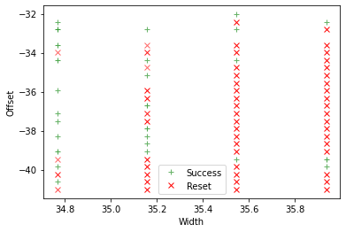

Part 2, Topic 1: Introduction to Voltage Glitching (MAIN)
=========================================================

**SUMMARY:** *Similarly to clock glitching, inserting brief glitches
into the power line of an embedded device can result in skipped
instructions and corrupted results. Besides providing a more reliable
glitch on some targets when compared to clock glitching, voltage
glitching also has the advanatage that the Vcc pins on chips are always
accessable. This won’t be covered in this course, but it can also be
used to glitch a device asynchronous to its clock.*

**LEARNING OUTCOMES:**

-  Understanding voltage glitch settings
-  Building a voltage glitch and crash map.
-  Modifying glitch circuit to increase glitch success

Voltage Glitch Hardware
-----------------------

The ChipWhisperer uses the same hardware block for both voltage and
clock glitching, with the only difference being where the glitch output
is routed to. Instead of routing to HS2, voltage glitching is performed
by routing the glitch to either the ``glitch_hp`` transistor or the
``glitch_lp`` transistor. This can be done via the following API calls:

.. code:: python

   scope.io.glitch_hp = True #enable HP glitch
   scope.io.glitch_hp = False #disable LP glitch
   scope.io.glitch_lp = True #enable LP glitch
   scope.io.glitch_lp = False #disable LP glitch

While the hardware block are the same, you’ll need to change how it’s
configued. You wouldn’t want to try routing ``"clock_xor"`` to the
glitch transistor and oscillate Vcc like the device’s clock! Instead,
the following two output settings are best suited to voltage glitching:

1. ``"glitch_only"`` - insert a glitch for a portion of a clock cycle
   based on ``scope.glitch.width`` and ``scope.glitch.offset``
2. ``"enable_only"`` - insert a glitch for an entire clock cycle

Typically, the ``"enable_only"`` setting will be too powerful for most
devices. One situation where it outshines ``"glitch_only"`` is in
glitching asychronous to the target’s clock. An example of this is
glitching a target with an internal clock. In this case, the
ChipWhisperer’s clock can be boosted far above the target’s to insert a
precise glitch, with ``repeat`` functioning as ``width`` and
``ext_offset`` functioning as ``offset``.

Voltage Glitching vs. Clock Glitching
~~~~~~~~~~~~~~~~~~~~~~~~~~~~~~~~~~~~~

Voltage glitching has some obvious benefits over clock glitching, such
as working for a wider varitey of targets, but its downsides are less
obvious. One of the biggest is how much it depends on the actual glitch
circuit itself. With clock glitching, it’s relatively easy to insert a
glitch - there’s nothing external trying to keep the clock at a certain
voltage level. This is very different for a target’s power pins. When we
try to drop the power pin to ground, there’s a lot of stuff fighting us
to keep the power pin at the correct voltage, such as decoupling
capacitors, bulk supply capacitors, and the voltage regulator supplying
the voltage. This means when we make small changes to the glitch
circuit, the glitch settings and even our ability to insert a glitch at
all completely change! Consider glitching a target on the CW308 UFO
board. If you switch your coaxial cable length from 20cm to 40 cm,
you’ll need to find entirely new glitch settings to repeat the attack
(if it’s still even possible). This is quite easy to see on an
oscilloscope or using the ChipWhisperer’s ADC: longer cables and lower
valued shunt resistors will make the glitch less sharp and increase
ringing.

While your first thought might be to go for as sharp a glitch as
possible, this often won’t result in a high glitch success rate. If
you’re unable to find any working glitches with your current setup, it
might be worth changing you hardware setup a bit. For example, on the
ChipWhisperer Lite 1 part, you can desolder SJ5 and solder header pins
to JP6. Even just connecting these pins with a jumper will have
different glitch behaviour than with a soldered SJ5.

You can refer to the training slides for more information about finding
good glitch settings, as well as more on the theory side of voltage
glitching.

The Lab
~~~~~~~

To introduce you to volatge glitching and find some settings, we’re
going to walk back through the clock glitching loop lab. You may want to
capture some power traces while you’re first experimenting with glitches
to see what effects different glitch widths have on the power trace.
Another thing to keep in mind is that targets often won’t tolerate the
Vcc pin dropping for an extended period of time without crashing - once
you see the target start to crash, you won’t see much else with larger
widths.

One thing you might have to change is the glitch repeat value. Depending
on how wide your glitch is, the voltage at the power pin may not recover
by the time the next glitch is inserted. This can have to effect of
increasing subsequent glitches’ strength, which may or may not be
desirable. Since glitches inserted with repeat > 1 have different
strength, it’s a good idea to scan through ext_offset as well.

Higher Frequency Glitching
~~~~~~~~~~~~~~~~~~~~~~~~~~

The XMEGA target, and to a lesser extent the STM32F3, is very difficult
to glitch with the default ChipWhisperer settings. Try bumping the clock
frequency to 24MHz for the STM32 or 32MHz for the XMEGA and use a repeat
5-10 with both the high power and low power glitches active. You’ll need
to adjust the baud rate by the same proportion as the clock.

Another setup that seems to work with the XMEGA is SJ5 unsoldered, JP6
jumpered, high+low power glitch, 32MHz, and repeat=5.

**In [1]:**

.. code:: ipython3

    SCOPETYPE = 'OPENADC'
    PLATFORM = 'CWLITEARM'

**In [2]:**

.. code:: bash

    %%bash -s "$PLATFORM"
    cd ../../../hardware/victims/firmware/simpleserial-glitch
    make PLATFORM=$1 CRYPTO_TARGET=NONE

**Out [2]:**

.. parsed-literal::

    SS_VER set to SS_VER_1_1
    rm -f -- simpleserial-glitch-CWLITEARM.hex
    rm -f -- simpleserial-glitch-CWLITEARM.eep
    rm -f -- simpleserial-glitch-CWLITEARM.cof
    rm -f -- simpleserial-glitch-CWLITEARM.elf
    rm -f -- simpleserial-glitch-CWLITEARM.map
    rm -f -- simpleserial-glitch-CWLITEARM.sym
    rm -f -- simpleserial-glitch-CWLITEARM.lss
    rm -f -- objdir/\*.o
    rm -f -- objdir/\*.lst
    rm -f -- simpleserial-glitch.s simpleserial.s stm32f3_hal.s stm32f3_hal_lowlevel.s stm32f3_sysmem.s
    rm -f -- simpleserial-glitch.d simpleserial.d stm32f3_hal.d stm32f3_hal_lowlevel.d stm32f3_sysmem.d
    rm -f -- simpleserial-glitch.i simpleserial.i stm32f3_hal.i stm32f3_hal_lowlevel.i stm32f3_sysmem.i
    .
    Welcome to another exciting ChipWhisperer target build!!
    arm-none-eabi-gcc.exe (GNU Arm Embedded Toolchain 9-2020-q2-update) 9.3.1 20200408 (release)
    Copyright (C) 2019 Free Software Foundation, Inc.
    This is free software; see the source for copying conditions.  There is NO
    warranty; not even for MERCHANTABILITY or FITNESS FOR A PARTICULAR PURPOSE.
    
    .
    Compiling C: simpleserial-glitch.c
    arm-none-eabi-gcc -c -mcpu=cortex-m4 -I. -mthumb -mfloat-abi=soft -fmessage-length=0 -ffunction-sections -gdwarf-2 -DSS_VER=SS_VER_1_1 -DSTM32F303xC -DSTM32F3 -DSTM32 -DDEBUG -DHAL_TYPE=HAL_stm32f3 -DPLATFORM=CWLITEARM -DF_CPU=7372800UL -Os -funsigned-char -funsigned-bitfields -fshort-enums -Wall -Wstrict-prototypes -Wa,-adhlns=objdir/simpleserial-glitch.lst -I.././simpleserial/ -I.././hal -I.././hal/stm32f3 -I.././hal/stm32f3/CMSIS -I.././hal/stm32f3/CMSIS/core -I.././hal/stm32f3/CMSIS/device -I.././hal/stm32f4/Legacy -I.././crypto/ -std=gnu99  -MMD -MP -MF .dep/simpleserial-glitch.o.d simpleserial-glitch.c -o objdir/simpleserial-glitch.o 
    .
    Compiling C: .././simpleserial/simpleserial.c
    arm-none-eabi-gcc -c -mcpu=cortex-m4 -I. -mthumb -mfloat-abi=soft -fmessage-length=0 -ffunction-sections -gdwarf-2 -DSS_VER=SS_VER_1_1 -DSTM32F303xC -DSTM32F3 -DSTM32 -DDEBUG -DHAL_TYPE=HAL_stm32f3 -DPLATFORM=CWLITEARM -DF_CPU=7372800UL -Os -funsigned-char -funsigned-bitfields -fshort-enums -Wall -Wstrict-prototypes -Wa,-adhlns=objdir/simpleserial.lst -I.././simpleserial/ -I.././hal -I.././hal/stm32f3 -I.././hal/stm32f3/CMSIS -I.././hal/stm32f3/CMSIS/core -I.././hal/stm32f3/CMSIS/device -I.././hal/stm32f4/Legacy -I.././crypto/ -std=gnu99  -MMD -MP -MF .dep/simpleserial.o.d .././simpleserial/simpleserial.c -o objdir/simpleserial.o 
    .
    Compiling C: .././hal/stm32f3/stm32f3_hal.c
    arm-none-eabi-gcc -c -mcpu=cortex-m4 -I. -mthumb -mfloat-abi=soft -fmessage-length=0 -ffunction-sections -gdwarf-2 -DSS_VER=SS_VER_1_1 -DSTM32F303xC -DSTM32F3 -DSTM32 -DDEBUG -DHAL_TYPE=HAL_stm32f3 -DPLATFORM=CWLITEARM -DF_CPU=7372800UL -Os -funsigned-char -funsigned-bitfields -fshort-enums -Wall -Wstrict-prototypes -Wa,-adhlns=objdir/stm32f3_hal.lst -I.././simpleserial/ -I.././hal -I.././hal/stm32f3 -I.././hal/stm32f3/CMSIS -I.././hal/stm32f3/CMSIS/core -I.././hal/stm32f3/CMSIS/device -I.././hal/stm32f4/Legacy -I.././crypto/ -std=gnu99  -MMD -MP -MF .dep/stm32f3_hal.o.d .././hal/stm32f3/stm32f3_hal.c -o objdir/stm32f3_hal.o 
    .
    Compiling C: .././hal/stm32f3/stm32f3_hal_lowlevel.c
    arm-none-eabi-gcc -c -mcpu=cortex-m4 -I. -mthumb -mfloat-abi=soft -fmessage-length=0 -ffunction-sections -gdwarf-2 -DSS_VER=SS_VER_1_1 -DSTM32F303xC -DSTM32F3 -DSTM32 -DDEBUG -DHAL_TYPE=HAL_stm32f3 -DPLATFORM=CWLITEARM -DF_CPU=7372800UL -Os -funsigned-char -funsigned-bitfields -fshort-enums -Wall -Wstrict-prototypes -Wa,-adhlns=objdir/stm32f3_hal_lowlevel.lst -I.././simpleserial/ -I.././hal -I.././hal/stm32f3 -I.././hal/stm32f3/CMSIS -I.././hal/stm32f3/CMSIS/core -I.././hal/stm32f3/CMSIS/device -I.././hal/stm32f4/Legacy -I.././crypto/ -std=gnu99  -MMD -MP -MF .dep/stm32f3_hal_lowlevel.o.d .././hal/stm32f3/stm32f3_hal_lowlevel.c -o objdir/stm32f3_hal_lowlevel.o 
    .
    Compiling C: .././hal/stm32f3/stm32f3_sysmem.c
    arm-none-eabi-gcc -c -mcpu=cortex-m4 -I. -mthumb -mfloat-abi=soft -fmessage-length=0 -ffunction-sections -gdwarf-2 -DSS_VER=SS_VER_1_1 -DSTM32F303xC -DSTM32F3 -DSTM32 -DDEBUG -DHAL_TYPE=HAL_stm32f3 -DPLATFORM=CWLITEARM -DF_CPU=7372800UL -Os -funsigned-char -funsigned-bitfields -fshort-enums -Wall -Wstrict-prototypes -Wa,-adhlns=objdir/stm32f3_sysmem.lst -I.././simpleserial/ -I.././hal -I.././hal/stm32f3 -I.././hal/stm32f3/CMSIS -I.././hal/stm32f3/CMSIS/core -I.././hal/stm32f3/CMSIS/device -I.././hal/stm32f4/Legacy -I.././crypto/ -std=gnu99  -MMD -MP -MF .dep/stm32f3_sysmem.o.d .././hal/stm32f3/stm32f3_sysmem.c -o objdir/stm32f3_sysmem.o 
    .
    Assembling: .././hal/stm32f3/stm32f3_startup.S
    arm-none-eabi-gcc -c -mcpu=cortex-m4 -I. -x assembler-with-cpp -mthumb -mfloat-abi=soft -fmessage-length=0 -ffunction-sections -DF_CPU=7372800 -Wa,-gstabs,-adhlns=objdir/stm32f3_startup.lst -I.././simpleserial/ -I.././hal -I.././hal/stm32f3 -I.././hal/stm32f3/CMSIS -I.././hal/stm32f3/CMSIS/core -I.././hal/stm32f3/CMSIS/device -I.././hal/stm32f4/Legacy -I.././crypto/ .././hal/stm32f3/stm32f3_startup.S -o objdir/stm32f3_startup.o
    .
    Linking: simpleserial-glitch-CWLITEARM.elf
    arm-none-eabi-gcc -mcpu=cortex-m4 -I. -mthumb -mfloat-abi=soft -fmessage-length=0 -ffunction-sections -gdwarf-2 -DSS_VER=SS_VER_1_1 -DSTM32F303xC -DSTM32F3 -DSTM32 -DDEBUG -DHAL_TYPE=HAL_stm32f3 -DPLATFORM=CWLITEARM -DF_CPU=7372800UL -Os -funsigned-char -funsigned-bitfields -fshort-enums -Wall -Wstrict-prototypes -Wa,-adhlns=objdir/simpleserial-glitch.o -I.././simpleserial/ -I.././hal -I.././hal/stm32f3 -I.././hal/stm32f3/CMSIS -I.././hal/stm32f3/CMSIS/core -I.././hal/stm32f3/CMSIS/device -I.././hal/stm32f4/Legacy -I.././crypto/ -std=gnu99  -MMD -MP -MF .dep/simpleserial-glitch-CWLITEARM.elf.d objdir/simpleserial-glitch.o objdir/simpleserial.o objdir/stm32f3_hal.o objdir/stm32f3_hal_lowlevel.o objdir/stm32f3_sysmem.o objdir/stm32f3_startup.o --output simpleserial-glitch-CWLITEARM.elf --specs=nano.specs --specs=nosys.specs -T .././hal/stm32f3/LinkerScript.ld -Wl,--gc-sections -lm -Wl,-Map=simpleserial-glitch-CWLITEARM.map,--cref   -lm  
    .
    Creating load file for Flash: simpleserial-glitch-CWLITEARM.hex
    arm-none-eabi-objcopy -O ihex -R .eeprom -R .fuse -R .lock -R .signature simpleserial-glitch-CWLITEARM.elf simpleserial-glitch-CWLITEARM.hex
    .
    Creating load file for EEPROM: simpleserial-glitch-CWLITEARM.eep
    arm-none-eabi-objcopy -j .eeprom --set-section-flags=.eeprom="alloc,load" \
    --change-section-lma .eeprom=0 --no-change-warnings -O ihex simpleserial-glitch-CWLITEARM.elf simpleserial-glitch-CWLITEARM.eep \|\| exit 0
    .
    Creating Extended Listing: simpleserial-glitch-CWLITEARM.lss
    arm-none-eabi-objdump -h -S -z simpleserial-glitch-CWLITEARM.elf > simpleserial-glitch-CWLITEARM.lss
    .
    Creating Symbol Table: simpleserial-glitch-CWLITEARM.sym
    arm-none-eabi-nm -n simpleserial-glitch-CWLITEARM.elf > simpleserial-glitch-CWLITEARM.sym
    Size after:
       text	   data	    bss	    dec	    hex	filename
       5232	      8	   1296	   6536	   1988	simpleserial-glitch-CWLITEARM.elf
    +--------------------------------------------------------
    + Default target does full rebuild each time.
    + Specify buildtarget == allquick == to avoid full rebuild
    +--------------------------------------------------------
    +--------------------------------------------------------
    + Built for platform CW-Lite Arm \(STM32F3\) with:
    + CRYPTO_TARGET = NONE
    + CRYPTO_OPTIONS = 
    +--------------------------------------------------------
    

**In [3]:**

.. code:: ipython3

    %run "../../Setup_Scripts/Setup_Generic.ipynb"

**Out [3]:**

.. parsed-literal::

    Serial baud rate = 38400
    INFO: Found ChipWhisperer😍
    

**In [4]:**

.. code:: ipython3

    fw_path = "../../../hardware/victims/firmware/simpleserial-glitch/simpleserial-glitch-{}.hex".format(PLATFORM)
    cw.program_target(scope, prog, fw_path)

**Out [4]:**

.. parsed-literal::

    Serial baud rate = 115200
    Detected known STMF32: STM32F302xB(C)/303xB(C)
    Extended erase (0x44), this can take ten seconds or more
    Attempting to program 5239 bytes at 0x8000000
    STM32F Programming flash...
    STM32F Reading flash...
    Verified flash OK, 5239 bytes
    Serial baud rate = 38400
    

**In [5]:**

.. code:: ipython3

    
    if PLATFORM == "CWLITEXMEGA":
        scope.clock.clkgen_freq = 32E6
        target.baud = 38400*32/7.37
        def reboot_flush():            
            scope.io.pdic = False
            time.sleep(0.1)
            scope.io.pdic = "high_z"
            time.sleep(0.1)
            #Flush garbage too
            target.flush()
    else:
        scope.clock.clkgen_freq = 24E6
        target.baud = 38400*24/7.37
        time.sleep(0.1)
        def reboot_flush():            
            scope.io.nrst = False
            time.sleep(0.05)
            scope.io.nrst = "high_z"
            time.sleep(0.05)
            #Flush garbage too
            target.flush()

**Out [5]:**

.. parsed-literal::

    Serial baud rate = 125047.48982360923
    

**In [6]:**

.. code:: ipython3

    reboot_flush()
    scope.arm()
    target.write("g\n")
    scope.capture()
    val = target.simpleserial_read_witherrors('r', 4, glitch_timeout=10)#For loop check
    valid = val['valid']
    if valid:
        response = val['payload']
        raw_serial = val['full_response']
        error_code = val['rv']
    
    print(val)

**Out [6]:**

.. parsed-literal::

    {'valid': True, 'payload': CWbytearray(b'c4 09 00 00'), 'full_response': 'rC4090000\n', 'rv': 0}
    

**In [7]:**

.. code:: ipython3

    import chipwhisperer.common.results.glitch as glitch
    gc = glitch.GlitchController(groups=["success", "reset", "normal"], parameters=["width", "offset", "ext_offset"])
    gc.display_stats()

**Out [7]:**

**In [8]:**

.. code:: ipython3

    scope.glitch.clk_src = "clkgen" # set glitch input clock
    scope.glitch.output = "glitch_only" # glitch_out = clk ^ glitch
    scope.glitch.trigger_src = "ext_single" # glitch only after scope.arm() called
    if PLATFORM == "CWLITEXMEGA":
        scope.io.glitch_lp = True
        scope.io.glitch_hp = True
    elif PLATFORM == "CWLITEARM":
        scope.io.glitch_lp = True
        scope.io.glitch_hp = True
    elif PLATFORM == "CW308_STM32F3":
        scope.io.glitch_hp = True
        scope.io.glitch_lp = True

Some tips for finding good glitches:

1. There’s a lot of stuff fighting our glitch this time - unlike the
   clock line, the Vcc rail isn’t supposed to oscillate! As such shorter
   glitches will have no effect. A good strategy can often to be to
   increase the minimum glitch width until you start seeing consistant
   crashes, then backing off on the width.
2. The repeat parameter behaves very differently than with voltage
   glitching - at the boosted clock rate, the Vcc often won’t recover
   before the next glitch. Try different repeat values as well.
3. We’ve built in a success/reset measurement into the glitch loop. Once
   you’ve found some glitch spots, this will help you evaluate which
   ones are best for your target.

**In [9]:**

.. code:: ipython3

    from importlib import reload
    import chipwhisperer.common.results.glitch as glitch
    from tqdm.notebook import trange
    import struct
    
    g_step = 0.4
    if PLATFORM=="CWLITEXMEGA":
        gc.set_range("width", 45.7, 47.8)
        gc.set_range("offset", 2.8, 10)
        gc.set_range("ext_offset", 2, 4)
        scope.glitch.repeat = 10
    elif PLATFORM == "CWLITEARM":
        #should also work for the bootloader memory dump
        gc.set_range("width", 34.7, 36)
        gc.set_range("offset", -41, -30)
        gc.set_range("ext_offset", 6, 6)
        scope.glitch.repeat = 7
    elif PLATFORM == "CW308_STM32F3":
        #these specific settings seem to work well for some reason
        #also works for the bootloader memory dump
        gc.set_range("ext_offset", 9, 12)
        gc.set_range("width", 47.6, 49.6)
        gc.set_range("offset", -19, -21.5)
        scope.glitch.repeat = 5
    
    gc.set_global_step(g_step)
    
    scope.adc.timeout = 0.1
    
    reboot_flush()
    sample_size = 1
    loff = scope.glitch.offset
    lwid = scope.glitch.width
    total_successes = 0
    for glitch_setting in gc.glitch_values():
        scope.glitch.offset = glitch_setting[1]
        scope.glitch.width = glitch_setting[0]
        scope.glitch.ext_offset = glitch_setting[2]
        #print(scope.glitch.ext_offset)
        successes = 0
        resets = 0
        for i in range(10):
            target.flush()
            if scope.adc.state:
                # can detect crash here (fast) before timing out (slow)
                print("Trigger still high!")
                gc.add("reset", (scope.glitch.width, scope.glitch.offset, scope.glitch.ext_offset))
    
                #Device is slow to boot?
                reboot_flush()
                resets += 1
                
            scope.arm()
            
            #Do glitch loop
            target.write("g\n")
            
            ret = scope.capture()
            
            
            val = target.simpleserial_read_witherrors('r', 4, glitch_timeout=10)#For loop check
            
            scope.io.glitch_hp = False
            scope.io.glitch_hp = True
            scope.io.glitch_lp = False
            scope.io.glitch_lp = True
            if ret:
                print('Timeout - no trigger')
                gc.add("reset", (scope.glitch.width, scope.glitch.offset, scope.glitch.ext_offset))
                resets += 1
    
                #Device is slow to boot?
                reboot_flush()
    
            else:
                if val['valid'] is False:
                    gc.add("reset", (scope.glitch.width, scope.glitch.offset, scope.glitch.ext_offset))
                    reboot_flush()
                    resets += 1
                else:
                    gcnt = struct.unpack("<I", val['payload'])[0]
                    
                    if gcnt != 2500: #for loop check
                        gc.add("success", (scope.glitch.width, scope.glitch.offset, scope.glitch.ext_offset))
                        successes += 1
                    else:
                        gc.add("normal", (scope.glitch.width, scope.glitch.offset, scope.glitch.ext_offset))
        if successes > 0:                
            print("successes = {}, resets = {}, offset = {}, width = {}, ext_offset = {}".format(successes, resets, scope.glitch.offset, scope.glitch.width, scope.glitch.ext_offset))
            total_successes += successes
    print("Done glitching")

**Out [9]:**

.. parsed-literal::

    successes = 1, resets = 4, offset = -40.625, width = 34.765625, ext_offset = 6
    

.. parsed-literal::

    ERROR:root:Target did not ack
    WARNING:root:Timeout in OpenADC capture(), trigger FORCED
    WARNING:root:Timeout in OpenADC capture(), trigger FORCED
    

.. parsed-literal::

    successes = 1, resets = 0, offset = -39.84375, width = 34.765625, ext_offset = 6
    Timeout - no trigger
    

.. parsed-literal::

    ERROR:root:Target did not ack
    WARNING:root:Timeout in OpenADC capture(), trigger FORCED
    WARNING:root:Timeout in OpenADC capture(), trigger FORCED
    

.. parsed-literal::

    Timeout - no trigger
    successes = 2, resets = 1, offset = -39.0625, width = 34.765625, ext_offset = 6
    

.. parsed-literal::

    ERROR:root:Target did not ack
    WARNING:root:Timeout in OpenADC capture(), trigger FORCED
    WARNING:root:Timeout in OpenADC capture(), trigger FORCED
    

.. parsed-literal::

    Timeout - no trigger
    successes = 1, resets = 1, offset = -38.28125, width = 34.765625, ext_offset = 6
    

.. parsed-literal::

    ERROR:root:Target did not ack
    WARNING:root:Timeout in OpenADC capture(), trigger FORCED
    WARNING:root:Timeout in OpenADC capture(), trigger FORCED
    

.. parsed-literal::

    Timeout - no trigger
    

.. parsed-literal::

    ERROR:root:Target did not ack
    

.. parsed-literal::

    successes = 1, resets = 1, offset = -37.5, width = 34.765625, ext_offset = 6
    

.. parsed-literal::

    WARNING:root:Timeout in OpenADC capture(), trigger FORCED
    WARNING:root:Timeout in OpenADC capture(), trigger FORCED
    

.. parsed-literal::

    Timeout - no trigger
    successes = 1, resets = 1, offset = -37.109375, width = 34.765625, ext_offset = 6
    

.. parsed-literal::

    ERROR:root:Target did not ack
    WARNING:root:Timeout in OpenADC capture(), trigger FORCED
    WARNING:root:Timeout in OpenADC capture(), trigger FORCED
    

.. parsed-literal::

    Timeout - no trigger
    successes = 1, resets = 1, offset = -35.9375, width = 34.765625, ext_offset = 6
    

.. parsed-literal::

    ERROR:root:Target did not ack
    WARNING:root:Timeout in OpenADC capture(), trigger FORCED
    WARNING:root:Timeout in OpenADC capture(), trigger FORCED
    ERROR:root:Target did not ack
    

.. parsed-literal::

    Timeout - no trigger
    successes = 2, resets = 1, offset = -34.375, width = 34.765625, ext_offset = 6
    

.. parsed-literal::

    WARNING:root:Timeout in OpenADC capture(), trigger FORCED
    WARNING:root:Timeout in OpenADC capture(), trigger FORCED
    

.. parsed-literal::

    Timeout - no trigger
    

.. parsed-literal::

    ERROR:root:Target did not ack
    WARNING:root:Timeout in OpenADC capture(), trigger FORCED
    WARNING:root:Timeout in OpenADC capture(), trigger FORCED
    ERROR:root:Target did not ack
    

.. parsed-literal::

    Timeout - no trigger
    

.. parsed-literal::

    WARNING:root:Timeout in OpenADC capture(), trigger FORCED
    WARNING:root:Timeout in OpenADC capture(), trigger FORCED
    

.. parsed-literal::

    Timeout - no trigger
    successes = 2, resets = 2, offset = -33.59375, width = 34.765625, ext_offset = 6
    

.. parsed-literal::

    ERROR:root:Target did not ack
    WARNING:root:Timeout in OpenADC capture(), trigger FORCED
    WARNING:root:Timeout in OpenADC capture(), trigger FORCED
    

.. parsed-literal::

    Timeout - no trigger
    successes = 3, resets = 1, offset = -32.8125, width = 34.765625, ext_offset = 6
    

.. parsed-literal::

    ERROR:root:Target did not ack
    WARNING:root:Timeout in OpenADC capture(), trigger FORCED
    WARNING:root:Timeout in OpenADC capture(), trigger FORCED
    

.. parsed-literal::

    Timeout - no trigger
    successes = 1, resets = 1, offset = -32.421875, width = 34.765625, ext_offset = 6
    successes = 1, resets = 2, offset = -39.0625, width = 35.15625, ext_offset = 6
    successes = 1, resets = 0, offset = -38.671875, width = 35.15625, ext_offset = 6
    successes = 1, resets = 1, offset = -38.28125, width = 35.15625, ext_offset = 6
    successes = 2, resets = 3, offset = -37.890625, width = 35.15625, ext_offset = 6
    successes = 2, resets = 1, offset = -36.71875, width = 35.15625, ext_offset = 6
    successes = 1, resets = 0, offset = -35.15625, width = 35.15625, ext_offset = 6
    successes = 1, resets = 3, offset = -34.375, width = 35.15625, ext_offset = 6
    successes = 1, resets = 0, offset = -32.8125, width = 35.15625, ext_offset = 6
    successes = 1, resets = 9, offset = -39.453125, width = 35.546875, ext_offset = 6
    successes = 1, resets = 9, offset = -34.375, width = 35.546875, ext_offset = 6
    successes = 1, resets = 9, offset = -32.8125, width = 35.546875, ext_offset = 6
    

.. parsed-literal::

    ERROR:root:Target did not ack
    WARNING:root:Timeout in OpenADC capture(), trigger FORCED
    WARNING:root:Timeout in OpenADC capture(), trigger FORCED
    

.. parsed-literal::

    Timeout - no trigger
    successes = 1, resets = 1, offset = -32.03125, width = 35.546875, ext_offset = 6
    successes = 1, resets = 6, offset = -39.84375, width = 35.9375, ext_offset = 6
    successes = 2, resets = 6, offset = -39.453125, width = 35.9375, ext_offset = 6
    

.. parsed-literal::

    ERROR:root:Target did not ack
    WARNING:root:Timeout in OpenADC capture(), trigger FORCED
    WARNING:root:Timeout in OpenADC capture(), trigger FORCED
    

.. parsed-literal::

    Timeout - no trigger
    successes = 1, resets = 6, offset = -32.421875, width = 35.9375, ext_offset = 6
    Done glitching
    

**In [10]:**

.. code:: ipython3

    %matplotlib inline
    gc.results.plot_2d(plotdots={"success":"+g", "reset":"xr", "normal":None})

**Out [10]:**

**In [11]:**

.. code:: ipython3

    scope.dis()
    target.dis()

**In [12]:**

.. code:: ipython3

    assert total_successes >= 1
