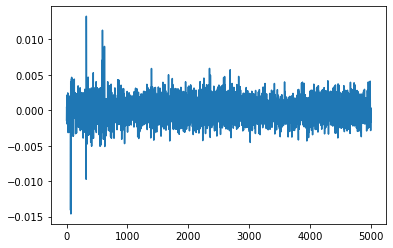

Part 3, Topic 1: Large Hamming Weight Swings (MAIN)
===================================================

**SUMMARY:** *In the previous part of the course, you saw that a
microcontroller’s power consumption changes based on what it’s doing. In
the case of a simple password check, this allowed us to see how many
characters of the password we had correct, eventually resulting in the
password being broken.*

*That attack was based on different code execution paths showing up
differently in power traces. In this next set of labs, we’ll posit that,
not only does different instructions affect power consumption, the data
being manipulated in the microcontroller also affects power
consumption.*

**LEARNING OUTCOMES:**

-  Using a power measurement to ‘validate’ a possible device model.
-  Detecting the value of a single bit using power measurement.
-  Breaking AES using the classic DPA attack.

Prerequisites
-------------

Hold up! Before you continue, check you’ve done the following tutorials:

-  ☑ Jupyter Notebook Intro (you should be OK with plotting & running
   blocks).
-  ☑ SCA101 Intro (you should have an idea of how to get
   hardware-specific versions running).
-  ☑ SCA101 Part 2 (you should understand how power consupmtion changes
   based on what code is being run)

Power Trace Gathering
---------------------

At this point you’ve got to insert code to perform the power trace
capture. There are two options here: \* Capture from physical device. \*
Read from a file.

You get to choose your adventure - see the two notebooks with the same
name of this, but called ``(SIMULATED)`` or ``(HARDWARE)`` to continue.
Inside those notebooks you should get some code to copy into the
following section, which will define the capture function.

Be sure you get the ``"✔️ OK to continue!"`` print once you run the next
cell, otherwise things will fail later on!

**In [1]:**

.. code:: ipython3

    SCOPETYPE = 'CWNANO'
    PLATFORM = 'CWNANO'
    CRYPTO_TARGET = 'TINYAES128C'
    VERSION = 'HARDWARE'

**In [2]:**

.. code:: ipython3

    if VERSION == 'HARDWARE':
        %run "Lab 3_1 - Large Hamming Weight Swings (HARDWARE).ipynb"
    elif VERSION == 'SIMULATED':
        %run "Lab 3_1 - Large Hamming Weight Swings (SIMULATED).ipynb"

**Out [2]:**

.. parsed-literal::

    Building for platform CWNANO with CRYPTO\_TARGET=TINYAES128C
    SS\_VER set to SS\_VER\_1\_1
    Blank crypto options, building for AES128
    rm -f -- simpleserial-aes-CWNANO.hex
    rm -f -- simpleserial-aes-CWNANO.eep
    rm -f -- simpleserial-aes-CWNANO.cof
    rm -f -- simpleserial-aes-CWNANO.elf
    rm -f -- simpleserial-aes-CWNANO.map
    rm -f -- simpleserial-aes-CWNANO.sym
    rm -f -- simpleserial-aes-CWNANO.lss
    rm -f -- objdir/\*.o
    rm -f -- objdir/\*.lst
    rm -f -- simpleserial-aes.s simpleserial.s stm32f0\_hal\_nano.s stm32f0\_hal\_lowlevel.s aes.s aes-independant.s
    rm -f -- simpleserial-aes.d simpleserial.d stm32f0\_hal\_nano.d stm32f0\_hal\_lowlevel.d aes.d aes-independant.d
    rm -f -- simpleserial-aes.i simpleserial.i stm32f0\_hal\_nano.i stm32f0\_hal\_lowlevel.i aes.i aes-independant.i
    .
    Welcome to another exciting ChipWhisperer target build!!
    arm-none-eabi-gcc.exe (GNU Arm Embedded Toolchain 9-2020-q2-update) 9.3.1 20200408 (release)
    Copyright (C) 2019 Free Software Foundation, Inc.
    This is free software; see the source for copying conditions.  There is NO
    warranty; not even for MERCHANTABILITY or FITNESS FOR A PARTICULAR PURPOSE.
    
    .
    Compiling C: simpleserial-aes.c
    arm-none-eabi-gcc -c -mcpu=cortex-m0 -I. -DNO\_EXTRA\_OPTS -mthumb -mfloat-abi=soft -ffunction-sections -gdwarf-2 -DSS\_VER=SS\_VER\_1\_1 -DSTM32F030x6 -DSTM32F0 -DSTM32 -DDEBUG -DHAL\_TYPE=HAL\_stm32f0\_nano -DPLATFORM=CWNANO -DTINYAES128C -DF\_CPU=7372800UL -Os -funsigned-char -funsigned-bitfields -fshort-enums -Wall -Wstrict-prototypes -Wa,-adhlns=objdir/simpleserial-aes.lst -I.././simpleserial/ -I.././hal -I.././hal/stm32f0 -I.././hal/stm32f0/CMSIS -I.././hal/stm32f0/CMSIS/core -I.././hal/stm32f0/CMSIS/device -I.././hal/stm32f0/Legacy -I.././crypto/ -I.././crypto/tiny-AES128-C -std=gnu99  -MMD -MP -MF .dep/simpleserial-aes.o.d simpleserial-aes.c -o objdir/simpleserial-aes.o 
    .
    Compiling C: .././simpleserial/simpleserial.c
    arm-none-eabi-gcc -c -mcpu=cortex-m0 -I. -DNO\_EXTRA\_OPTS -mthumb -mfloat-abi=soft -ffunction-sections -gdwarf-2 -DSS\_VER=SS\_VER\_1\_1 -DSTM32F030x6 -DSTM32F0 -DSTM32 -DDEBUG -DHAL\_TYPE=HAL\_stm32f0\_nano -DPLATFORM=CWNANO -DTINYAES128C -DF\_CPU=7372800UL -Os -funsigned-char -funsigned-bitfields -fshort-enums -Wall -Wstrict-prototypes -Wa,-adhlns=objdir/simpleserial.lst -I.././simpleserial/ -I.././hal -I.././hal/stm32f0 -I.././hal/stm32f0/CMSIS -I.././hal/stm32f0/CMSIS/core -I.././hal/stm32f0/CMSIS/device -I.././hal/stm32f0/Legacy -I.././crypto/ -I.././crypto/tiny-AES128-C -std=gnu99  -MMD -MP -MF .dep/simpleserial.o.d .././simpleserial/simpleserial.c -o objdir/simpleserial.o 
    .
    Compiling C: .././hal/stm32f0\_nano/stm32f0\_hal\_nano.c
    arm-none-eabi-gcc -c -mcpu=cortex-m0 -I. -DNO\_EXTRA\_OPTS -mthumb -mfloat-abi=soft -ffunction-sections -gdwarf-2 -DSS\_VER=SS\_VER\_1\_1 -DSTM32F030x6 -DSTM32F0 -DSTM32 -DDEBUG -DHAL\_TYPE=HAL\_stm32f0\_nano -DPLATFORM=CWNANO -DTINYAES128C -DF\_CPU=7372800UL -Os -funsigned-char -funsigned-bitfields -fshort-enums -Wall -Wstrict-prototypes -Wa,-adhlns=objdir/stm32f0\_hal\_nano.lst -I.././simpleserial/ -I.././hal -I.././hal/stm32f0 -I.././hal/stm32f0/CMSIS -I.././hal/stm32f0/CMSIS/core -I.././hal/stm32f0/CMSIS/device -I.././hal/stm32f0/Legacy -I.././crypto/ -I.././crypto/tiny-AES128-C -std=gnu99  -MMD -MP -MF .dep/stm32f0\_hal\_nano.o.d .././hal/stm32f0\_nano/stm32f0\_hal\_nano.c -o objdir/stm32f0\_hal\_nano.o 
    .
    Compiling C: .././hal/stm32f0/stm32f0\_hal\_lowlevel.c
    arm-none-eabi-gcc -c -mcpu=cortex-m0 -I. -DNO\_EXTRA\_OPTS -mthumb -mfloat-abi=soft -ffunction-sections -gdwarf-2 -DSS\_VER=SS\_VER\_1\_1 -DSTM32F030x6 -DSTM32F0 -DSTM32 -DDEBUG -DHAL\_TYPE=HAL\_stm32f0\_nano -DPLATFORM=CWNANO -DTINYAES128C -DF\_CPU=7372800UL -Os -funsigned-char -funsigned-bitfields -fshort-enums -Wall -Wstrict-prototypes -Wa,-adhlns=objdir/stm32f0\_hal\_lowlevel.lst -I.././simpleserial/ -I.././hal -I.././hal/stm32f0 -I.././hal/stm32f0/CMSIS -I.././hal/stm32f0/CMSIS/core -I.././hal/stm32f0/CMSIS/device -I.././hal/stm32f0/Legacy -I.././crypto/ -I.././crypto/tiny-AES128-C -std=gnu99  -MMD -MP -MF .dep/stm32f0\_hal\_lowlevel.o.d .././hal/stm32f0/stm32f0\_hal\_lowlevel.c -o objdir/stm32f0\_hal\_lowlevel.o 
    .
    Compiling C: .././crypto/tiny-AES128-C/aes.c
    arm-none-eabi-gcc -c -mcpu=cortex-m0 -I. -DNO\_EXTRA\_OPTS -mthumb -mfloat-abi=soft -ffunction-sections -gdwarf-2 -DSS\_VER=SS\_VER\_1\_1 -DSTM32F030x6 -DSTM32F0 -DSTM32 -DDEBUG -DHAL\_TYPE=HAL\_stm32f0\_nano -DPLATFORM=CWNANO -DTINYAES128C -DF\_CPU=7372800UL -Os -funsigned-char -funsigned-bitfields -fshort-enums -Wall -Wstrict-prototypes -Wa,-adhlns=objdir/aes.lst -I.././simpleserial/ -I.././hal -I.././hal/stm32f0 -I.././hal/stm32f0/CMSIS -I.././hal/stm32f0/CMSIS/core -I.././hal/stm32f0/CMSIS/device -I.././hal/stm32f0/Legacy -I.././crypto/ -I.././crypto/tiny-AES128-C -std=gnu99  -MMD -MP -MF .dep/aes.o.d .././crypto/tiny-AES128-C/aes.c -o objdir/aes.o 
    .
    Compiling C: .././crypto/aes-independant.c
    arm-none-eabi-gcc -c -mcpu=cortex-m0 -I. -DNO\_EXTRA\_OPTS -mthumb -mfloat-abi=soft -ffunction-sections -gdwarf-2 -DSS\_VER=SS\_VER\_1\_1 -DSTM32F030x6 -DSTM32F0 -DSTM32 -DDEBUG -DHAL\_TYPE=HAL\_stm32f0\_nano -DPLATFORM=CWNANO -DTINYAES128C -DF\_CPU=7372800UL -Os -funsigned-char -funsigned-bitfields -fshort-enums -Wall -Wstrict-prototypes -Wa,-adhlns=objdir/aes-independant.lst -I.././simpleserial/ -I.././hal -I.././hal/stm32f0 -I.././hal/stm32f0/CMSIS -I.././hal/stm32f0/CMSIS/core -I.././hal/stm32f0/CMSIS/device -I.././hal/stm32f0/Legacy -I.././crypto/ -I.././crypto/tiny-AES128-C -std=gnu99  -MMD -MP -MF .dep/aes-independant.o.d .././crypto/aes-independant.c -o objdir/aes-independant.o 
    .
    Assembling: .././hal/stm32f0/stm32f0\_startup.S
    arm-none-eabi-gcc -c -mcpu=cortex-m0 -I. -x assembler-with-cpp -mthumb -mfloat-abi=soft -ffunction-sections -DF\_CPU=7372800 -Wa,-gstabs,-adhlns=objdir/stm32f0\_startup.lst -I.././simpleserial/ -I.././hal -I.././hal/stm32f0 -I.././hal/stm32f0/CMSIS -I.././hal/stm32f0/CMSIS/core -I.././hal/stm32f0/CMSIS/device -I.././hal/stm32f0/Legacy -I.././crypto/ -I.././crypto/tiny-AES128-C .././hal/stm32f0/stm32f0\_startup.S -o objdir/stm32f0\_startup.o
    .
    Linking: simpleserial-aes-CWNANO.elf
    arm-none-eabi-gcc -mcpu=cortex-m0 -I. -DNO\_EXTRA\_OPTS -mthumb -mfloat-abi=soft -ffunction-sections -gdwarf-2 -DSS\_VER=SS\_VER\_1\_1 -DSTM32F030x6 -DSTM32F0 -DSTM32 -DDEBUG -DHAL\_TYPE=HAL\_stm32f0\_nano -DPLATFORM=CWNANO -DTINYAES128C -DF\_CPU=7372800UL -Os -funsigned-char -funsigned-bitfields -fshort-enums -Wall -Wstrict-prototypes -Wa,-adhlns=objdir/simpleserial-aes.o -I.././simpleserial/ -I.././hal -I.././hal/stm32f0 -I.././hal/stm32f0/CMSIS -I.././hal/stm32f0/CMSIS/core -I.././hal/stm32f0/CMSIS/device -I.././hal/stm32f0/Legacy -I.././crypto/ -I.././crypto/tiny-AES128-C -std=gnu99  -MMD -MP -MF .dep/simpleserial-aes-CWNANO.elf.d objdir/simpleserial-aes.o objdir/simpleserial.o objdir/stm32f0\_hal\_nano.o objdir/stm32f0\_hal\_lowlevel.o objdir/aes.o objdir/aes-independant.o objdir/stm32f0\_startup.o --output simpleserial-aes-CWNANO.elf --specs=nano.specs --specs=nosys.specs -T .././hal/stm32f0\_nano/LinkerScript.ld -Wl,--gc-sections -lm -mthumb -mcpu=cortex-m0  -Wl,-Map=simpleserial-aes-CWNANO.map,--cref   -lm  
    .
    Creating load file for Flash: simpleserial-aes-CWNANO.hex
    arm-none-eabi-objcopy -O ihex -R .eeprom -R .fuse -R .lock -R .signature simpleserial-aes-CWNANO.elf simpleserial-aes-CWNANO.hex
    .
    Creating load file for EEPROM: simpleserial-aes-CWNANO.eep
    arm-none-eabi-objcopy -j .eeprom --set-section-flags=.eeprom="alloc,load" \
    --change-section-lma .eeprom=0 --no-change-warnings -O ihex simpleserial-aes-CWNANO.elf simpleserial-aes-CWNANO.eep \|\| exit 0
    .
    Creating Extended Listing: simpleserial-aes-CWNANO.lss
    arm-none-eabi-objdump -h -S -z simpleserial-aes-CWNANO.elf > simpleserial-aes-CWNANO.lss
    .
    Creating Symbol Table: simpleserial-aes-CWNANO.sym
    arm-none-eabi-nm -n simpleserial-aes-CWNANO.elf > simpleserial-aes-CWNANO.sym
    Size after:
       text	   data	    bss	    dec	    hex	filename
       5056	    536	   1480	   7072	   1ba0	simpleserial-aes-CWNANO.elf
    +--------------------------------------------------------
    + Default target does full rebuild each time.
    + Specify buildtarget == allquick == to avoid full rebuild
    +--------------------------------------------------------
    +--------------------------------------------------------
    + Built for platform CWNANO Built-in Target (STM32F030) with:
    + CRYPTO\_TARGET = TINYAES128C
    + CRYPTO\_OPTIONS = AES128C
    +--------------------------------------------------------
    Serial baud rate = 38400
    INFO: Found ChipWhisperer😍
    Serial baud rate = 115200
    Detected known STMF32: STM32F03xx4/03xx6
    Extended erase (0x44), this can take ten seconds or more
    Attempting to program 5591 bytes at 0x8000000
    STM32F Programming flash...
    STM32F Reading flash...
    Verified flash OK, 5591 bytes
    Serial baud rate = 38400
    

.. parsed-literal::

    Lab 3\_1 - Large Hamming Weight Swings (HARDWARE).ipynb:14: TqdmDeprecationWarning: Please use \`tqdm.notebook.trange\` instead of \`tqdm.tnrange\`
      "---\n",
    

.. parsed-literal::

    WARNING:root:NO TRACE DATA RECEIVED
    WARNING:root:NO TRACE DATA RECEIVED
    WARNING:root:NO TRACE DATA RECEIVED
    

**In [3]:**

.. code:: ipython3

    print(len(trace_array))

**Out [3]:**

.. parsed-literal::

    100
    

**In [4]:**

.. code:: ipython3

    assert len(trace_array) == 100
    print("✔️ OK to continue!")

**Out [4]:**

.. parsed-literal::

    ✔️ OK to continue!
    

Grouping Traces
---------------

As we’ve seen in the slides, we’ve made an assumption that setting bits
on the data lines consumes a measurable amount of power. Now, we’re
going test that theory by getting our target to manipulate data with a
very high Hamming weight (0xFF) and a very low Hamming weight (0x00).
For this purpose, the target is currently running AES, and it encrypted
the text we sent it. If we’re correct in our assumption, we should see a
measurable difference between power traces with a high Hamming weight
and a low one.

Currently, these traces are all mixed up. Separate them into two groups:
``one_list`` and ``zero_list``:

**In [5]:**

.. code:: ipython3

    # ###################
    # Add your code here
    # ###################
    #raise NotImplementedError("Add Your Code Here")
    
    # ###################
    # START SOLUTION
    # ###################
    one_list = []
    zero_list = []
    
    for i in range(len(trace_array)):
        if textin_array[i][0] == 0x00:
            one_list.append(trace_array[i])
        else:
            zero_list.append(trace_array[i])
    # ###################
    # END SOLUTION
    # ###################
    
    assert len(one_list) > len(zero_list)/2
    assert len(zero_list) > len(one_list)/2

We should have two different lists. Whether we sent 0xFF or 0x00 was
random, so these lists likely won’t be evenly dispersed. Next, we’ll
want to take an average of each group (make sure you take an average of
each trace at each point! We don’t want an average of the traces in
time), which will help smooth out any outliers and also fix our issue of
having a different number of traces for each group:

**In [6]:**

.. code:: ipython3

    # ###################
    # Add your code here
    # ###################
    #raise NotImplementedError("Add Your Code Here")
    
    # ###################
    # START SOLUTION
    # ###################
    one_avg = np.mean(one_list, axis=0)
    zero_avg = np.mean(zero_list, axis=0)
    # ###################
    # END SOLUTION
    # ###################

Finally, subtract the two averages and plot the resulting data:

**In [7]:**

.. code:: ipython3

    # ###################
    # Add your code here
    # ###################
    #raise NotImplementedError("Add Your Code Here")
    
    # ###################
    # START SOLUTION
    # ###################
    %matplotlib inline
    import matplotlib.pyplot as plt
    
    diff = one_avg - zero_avg
    
    plt.plot(diff)
    plt.show()
    # ###################
    # END SOLUTION
    # ###################

**Out [7]:**

You should see a very distinct trace near the beginning of the plot,
meaning that the data being manipulated in the target device is visible
in its power trace! Again, there’s a lot of room to explore here:

-  Try setting multiple bytes to 0x00 and 0xFF.
-  Try using smaller hamming weight differences. Is the spike still
   distinct? What about if you capture more traces?
-  We focused on the first byte here. Try putting the difference plots
   for multiple different bytes on the same plot.
-  The target is running AES here. Can you get the spikes to appear in
   different places if you set a byte in a later round of AES (say round
   5) to 0x00 or 0xFF?

--------------

NO-FUN DISCLAIMER: This material is Copyright (C) NewAE Technology Inc.,
2015-2020. ChipWhisperer is a trademark of NewAE Technology Inc.,
claimed in all jurisdictions, and registered in at least the United
States of America, European Union, and Peoples Republic of China.

Tutorials derived from our open-source work must be released under the
associated open-source license, and notice of the source must be
*clearly displayed*. Only original copyright holders may license or
authorize other distribution - while NewAE Technology Inc. holds the
copyright for many tutorials, the github repository includes community
contributions which we cannot license under special terms and **must**
be maintained as an open-source release. Please contact us for special
permissions (where possible).

THE SOFTWARE IS PROVIDED “AS IS”, WITHOUT WARRANTY OF ANY KIND, EXPRESS
OR IMPLIED, INCLUDING BUT NOT LIMITED TO THE WARRANTIES OF
MERCHANTABILITY, FITNESS FOR A PARTICULAR PURPOSE AND NONINFRINGEMENT.
IN NO EVENT SHALL THE AUTHORS OR COPYRIGHT HOLDERS BE LIABLE FOR ANY
CLAIM, DAMAGES OR OTHER LIABILITY, WHETHER IN AN ACTION OF CONTRACT,
TORT OR OTHERWISE, ARISING FROM, OUT OF OR IN CONNECTION WITH THE
SOFTWARE OR THE USE OR OTHER DEALINGS IN THE SOFTWARE.
