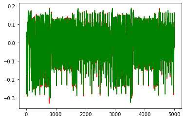
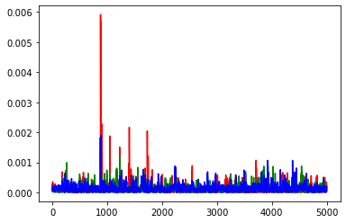
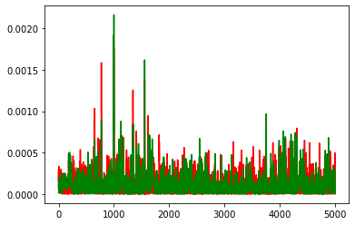
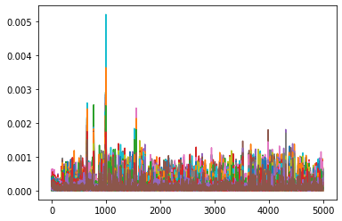
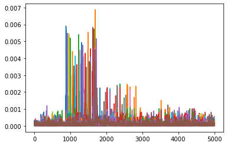

Part 3, Topic 3: DPA on Firmware Implementation of AES
======================================================

**SUMMARY:** *In the previous lab, you saw how a single bit of
information can be used to recover an entire byte of the AES key.
Remember, this works due to the S-Box being present in the data flow
that we are attacking.*

*Next, we’ll see how to use power analysis instead of an actual bit
value. With this technique, the goal is to separate the traces by a bit
in the result of the SBox output (it doesn’t matter which one): if that
bit is 1, its group of traces should, on average, have higher power
consumption during the SBox operation than the other set.*

*This is all based on the assumption we discussed in the slides and saw
in earlier labs: there is some consistent relationship between the value
of bits on the data bus and the power consumption in the device.*

**LEARNING OUTCOMES:**

-  Using a power measurement to ‘validate’ a possible device model.
-  Detecting the value of a single bit using power measurement.
-  Breaking AES using the classic DPA attack.

Prerequisites
-------------

Hold up! Before you continue, check you’ve done the following tutorials:

-  ☑ Jupyter Notebook Intro (you should be OK with plotting & running
   blocks).
-  ☑ SCA101 Intro (you should have an idea of how to get
   hardware-specific versions running).
-  ☑ Breaking AES Using a Single Bit (we’ll build on your previous
   work).

AES Model
---------

**In [1]:**

.. code:: ipython3

    SCOPETYPE = 'OPENADC'
    PLATFORM = 'CWLITEARM'
    CRYPTO_TARGET = 'TINYAES128C'
    VERSION = 'HARDWARE'

**In [2]:**

.. code:: ipython3

    if VERSION == 'HARDWARE':
        %run "Lab 3_3 - DPA on Firmware Implementation of AES (HARDWARE).ipynb"
    elif VERSION == 'SIMULATED':
        %run "Lab 3_3 - DPA on Firmware Implementation of AES (SIMULATED).ipynb"

**Out [2]:**

.. parsed-literal::

    Building for platform CWLITEARM with CRYPTO_TARGET=TINYAES128C
    SS_VER set to SS_VER_1_1
    Blank crypto options, building for AES128
    rm -f -- simpleserial-aes-CWLITEARM.hex
    rm -f -- simpleserial-aes-CWLITEARM.eep
    rm -f -- simpleserial-aes-CWLITEARM.cof
    rm -f -- simpleserial-aes-CWLITEARM.elf
    rm -f -- simpleserial-aes-CWLITEARM.map
    rm -f -- simpleserial-aes-CWLITEARM.sym
    rm -f -- simpleserial-aes-CWLITEARM.lss
    rm -f -- objdir/\*.o
    rm -f -- objdir/\*.lst
    rm -f -- simpleserial-aes.s simpleserial.s stm32f3_hal.s stm32f3_hal_lowlevel.s stm32f3_sysmem.s aes.s aes-independant.s
    rm -f -- simpleserial-aes.d simpleserial.d stm32f3_hal.d stm32f3_hal_lowlevel.d stm32f3_sysmem.d aes.d aes-independant.d
    rm -f -- simpleserial-aes.i simpleserial.i stm32f3_hal.i stm32f3_hal_lowlevel.i stm32f3_sysmem.i aes.i aes-independant.i
    .
    Welcome to another exciting ChipWhisperer target build!!
    arm-none-eabi-gcc.exe (GNU Arm Embedded Toolchain 9-2020-q2-update) 9.3.1 20200408 (release)
    Copyright (C) 2019 Free Software Foundation, Inc.
    This is free software; see the source for copying conditions.  There is NO
    warranty; not even for MERCHANTABILITY or FITNESS FOR A PARTICULAR PURPOSE.
    
    .
    Compiling C: simpleserial-aes.c
    arm-none-eabi-gcc -c -mcpu=cortex-m4 -I. -DNO_EXTRA_OPTS -mthumb -mfloat-abi=soft -fmessage-length=0 -ffunction-sections -gdwarf-2 -DSS_VER=SS_VER_1_1 -DSTM32F303xC -DSTM32F3 -DSTM32 -DDEBUG -DHAL_TYPE=HAL_stm32f3 -DPLATFORM=CWLITEARM -DTINYAES128C -DF_CPU=7372800UL -Os -funsigned-char -funsigned-bitfields -fshort-enums -Wall -Wstrict-prototypes -Wa,-adhlns=objdir/simpleserial-aes.lst -I.././simpleserial/ -I.././hal -I.././hal/stm32f3 -I.././hal/stm32f3/CMSIS -I.././hal/stm32f3/CMSIS/core -I.././hal/stm32f3/CMSIS/device -I.././hal/stm32f4/Legacy -I.././crypto/ -I.././crypto/tiny-AES128-C -std=gnu99  -MMD -MP -MF .dep/simpleserial-aes.o.d simpleserial-aes.c -o objdir/simpleserial-aes.o 
    .
    Compiling C: .././simpleserial/simpleserial.c
    arm-none-eabi-gcc -c -mcpu=cortex-m4 -I. -DNO_EXTRA_OPTS -mthumb -mfloat-abi=soft -fmessage-length=0 -ffunction-sections -gdwarf-2 -DSS_VER=SS_VER_1_1 -DSTM32F303xC -DSTM32F3 -DSTM32 -DDEBUG -DHAL_TYPE=HAL_stm32f3 -DPLATFORM=CWLITEARM -DTINYAES128C -DF_CPU=7372800UL -Os -funsigned-char -funsigned-bitfields -fshort-enums -Wall -Wstrict-prototypes -Wa,-adhlns=objdir/simpleserial.lst -I.././simpleserial/ -I.././hal -I.././hal/stm32f3 -I.././hal/stm32f3/CMSIS -I.././hal/stm32f3/CMSIS/core -I.././hal/stm32f3/CMSIS/device -I.././hal/stm32f4/Legacy -I.././crypto/ -I.././crypto/tiny-AES128-C -std=gnu99  -MMD -MP -MF .dep/simpleserial.o.d .././simpleserial/simpleserial.c -o objdir/simpleserial.o 
    .
    Compiling C: .././hal/stm32f3/stm32f3_hal.c
    arm-none-eabi-gcc -c -mcpu=cortex-m4 -I. -DNO_EXTRA_OPTS -mthumb -mfloat-abi=soft -fmessage-length=0 -ffunction-sections -gdwarf-2 -DSS_VER=SS_VER_1_1 -DSTM32F303xC -DSTM32F3 -DSTM32 -DDEBUG -DHAL_TYPE=HAL_stm32f3 -DPLATFORM=CWLITEARM -DTINYAES128C -DF_CPU=7372800UL -Os -funsigned-char -funsigned-bitfields -fshort-enums -Wall -Wstrict-prototypes -Wa,-adhlns=objdir/stm32f3_hal.lst -I.././simpleserial/ -I.././hal -I.././hal/stm32f3 -I.././hal/stm32f3/CMSIS -I.././hal/stm32f3/CMSIS/core -I.././hal/stm32f3/CMSIS/device -I.././hal/stm32f4/Legacy -I.././crypto/ -I.././crypto/tiny-AES128-C -std=gnu99  -MMD -MP -MF .dep/stm32f3_hal.o.d .././hal/stm32f3/stm32f3_hal.c -o objdir/stm32f3_hal.o 
    .
    Compiling C: .././hal/stm32f3/stm32f3_hal_lowlevel.c
    arm-none-eabi-gcc -c -mcpu=cortex-m4 -I. -DNO_EXTRA_OPTS -mthumb -mfloat-abi=soft -fmessage-length=0 -ffunction-sections -gdwarf-2 -DSS_VER=SS_VER_1_1 -DSTM32F303xC -DSTM32F3 -DSTM32 -DDEBUG -DHAL_TYPE=HAL_stm32f3 -DPLATFORM=CWLITEARM -DTINYAES128C -DF_CPU=7372800UL -Os -funsigned-char -funsigned-bitfields -fshort-enums -Wall -Wstrict-prototypes -Wa,-adhlns=objdir/stm32f3_hal_lowlevel.lst -I.././simpleserial/ -I.././hal -I.././hal/stm32f3 -I.././hal/stm32f3/CMSIS -I.././hal/stm32f3/CMSIS/core -I.././hal/stm32f3/CMSIS/device -I.././hal/stm32f4/Legacy -I.././crypto/ -I.././crypto/tiny-AES128-C -std=gnu99  -MMD -MP -MF .dep/stm32f3_hal_lowlevel.o.d .././hal/stm32f3/stm32f3_hal_lowlevel.c -o objdir/stm32f3_hal_lowlevel.o 
    .
    Compiling C: .././hal/stm32f3/stm32f3_sysmem.c
    arm-none-eabi-gcc -c -mcpu=cortex-m4 -I. -DNO_EXTRA_OPTS -mthumb -mfloat-abi=soft -fmessage-length=0 -ffunction-sections -gdwarf-2 -DSS_VER=SS_VER_1_1 -DSTM32F303xC -DSTM32F3 -DSTM32 -DDEBUG -DHAL_TYPE=HAL_stm32f3 -DPLATFORM=CWLITEARM -DTINYAES128C -DF_CPU=7372800UL -Os -funsigned-char -funsigned-bitfields -fshort-enums -Wall -Wstrict-prototypes -Wa,-adhlns=objdir/stm32f3_sysmem.lst -I.././simpleserial/ -I.././hal -I.././hal/stm32f3 -I.././hal/stm32f3/CMSIS -I.././hal/stm32f3/CMSIS/core -I.././hal/stm32f3/CMSIS/device -I.././hal/stm32f4/Legacy -I.././crypto/ -I.././crypto/tiny-AES128-C -std=gnu99  -MMD -MP -MF .dep/stm32f3_sysmem.o.d .././hal/stm32f3/stm32f3_sysmem.c -o objdir/stm32f3_sysmem.o 
    .
    Compiling C: .././crypto/tiny-AES128-C/aes.c
    arm-none-eabi-gcc -c -mcpu=cortex-m4 -I. -DNO_EXTRA_OPTS -mthumb -mfloat-abi=soft -fmessage-length=0 -ffunction-sections -gdwarf-2 -DSS_VER=SS_VER_1_1 -DSTM32F303xC -DSTM32F3 -DSTM32 -DDEBUG -DHAL_TYPE=HAL_stm32f3 -DPLATFORM=CWLITEARM -DTINYAES128C -DF_CPU=7372800UL -Os -funsigned-char -funsigned-bitfields -fshort-enums -Wall -Wstrict-prototypes -Wa,-adhlns=objdir/aes.lst -I.././simpleserial/ -I.././hal -I.././hal/stm32f3 -I.././hal/stm32f3/CMSIS -I.././hal/stm32f3/CMSIS/core -I.././hal/stm32f3/CMSIS/device -I.././hal/stm32f4/Legacy -I.././crypto/ -I.././crypto/tiny-AES128-C -std=gnu99  -MMD -MP -MF .dep/aes.o.d .././crypto/tiny-AES128-C/aes.c -o objdir/aes.o 
    .
    Compiling C: .././crypto/aes-independant.c
    arm-none-eabi-gcc -c -mcpu=cortex-m4 -I. -DNO_EXTRA_OPTS -mthumb -mfloat-abi=soft -fmessage-length=0 -ffunction-sections -gdwarf-2 -DSS_VER=SS_VER_1_1 -DSTM32F303xC -DSTM32F3 -DSTM32 -DDEBUG -DHAL_TYPE=HAL_stm32f3 -DPLATFORM=CWLITEARM -DTINYAES128C -DF_CPU=7372800UL -Os -funsigned-char -funsigned-bitfields -fshort-enums -Wall -Wstrict-prototypes -Wa,-adhlns=objdir/aes-independant.lst -I.././simpleserial/ -I.././hal -I.././hal/stm32f3 -I.././hal/stm32f3/CMSIS -I.././hal/stm32f3/CMSIS/core -I.././hal/stm32f3/CMSIS/device -I.././hal/stm32f4/Legacy -I.././crypto/ -I.././crypto/tiny-AES128-C -std=gnu99  -MMD -MP -MF .dep/aes-independant.o.d .././crypto/aes-independant.c -o objdir/aes-independant.o 
    .
    Assembling: .././hal/stm32f3/stm32f3_startup.S
    arm-none-eabi-gcc -c -mcpu=cortex-m4 -I. -x assembler-with-cpp -mthumb -mfloat-abi=soft -fmessage-length=0 -ffunction-sections -DF_CPU=7372800 -Wa,-gstabs,-adhlns=objdir/stm32f3_startup.lst -I.././simpleserial/ -I.././hal -I.././hal/stm32f3 -I.././hal/stm32f3/CMSIS -I.././hal/stm32f3/CMSIS/core -I.././hal/stm32f3/CMSIS/device -I.././hal/stm32f4/Legacy -I.././crypto/ -I.././crypto/tiny-AES128-C .././hal/stm32f3/stm32f3_startup.S -o objdir/stm32f3_startup.o
    .
    Linking: simpleserial-aes-CWLITEARM.elf
    arm-none-eabi-gcc -mcpu=cortex-m4 -I. -DNO_EXTRA_OPTS -mthumb -mfloat-abi=soft -fmessage-length=0 -ffunction-sections -gdwarf-2 -DSS_VER=SS_VER_1_1 -DSTM32F303xC -DSTM32F3 -DSTM32 -DDEBUG -DHAL_TYPE=HAL_stm32f3 -DPLATFORM=CWLITEARM -DTINYAES128C -DF_CPU=7372800UL -Os -funsigned-char -funsigned-bitfields -fshort-enums -Wall -Wstrict-prototypes -Wa,-adhlns=objdir/simpleserial-aes.o -I.././simpleserial/ -I.././hal -I.././hal/stm32f3 -I.././hal/stm32f3/CMSIS -I.././hal/stm32f3/CMSIS/core -I.././hal/stm32f3/CMSIS/device -I.././hal/stm32f4/Legacy -I.././crypto/ -I.././crypto/tiny-AES128-C -std=gnu99  -MMD -MP -MF .dep/simpleserial-aes-CWLITEARM.elf.d objdir/simpleserial-aes.o objdir/simpleserial.o objdir/stm32f3_hal.o objdir/stm32f3_hal_lowlevel.o objdir/stm32f3_sysmem.o objdir/aes.o objdir/aes-independant.o objdir/stm32f3_startup.o --output simpleserial-aes-CWLITEARM.elf --specs=nano.specs --specs=nosys.specs -T .././hal/stm32f3/LinkerScript.ld -Wl,--gc-sections -lm -Wl,-Map=simpleserial-aes-CWLITEARM.map,--cref   -lm  
    .
    Creating load file for Flash: simpleserial-aes-CWLITEARM.hex
    arm-none-eabi-objcopy -O ihex -R .eeprom -R .fuse -R .lock -R .signature simpleserial-aes-CWLITEARM.elf simpleserial-aes-CWLITEARM.hex
    .
    Creating load file for EEPROM: simpleserial-aes-CWLITEARM.eep
    arm-none-eabi-objcopy -j .eeprom --set-section-flags=.eeprom="alloc,load" \
    --change-section-lma .eeprom=0 --no-change-warnings -O ihex simpleserial-aes-CWLITEARM.elf simpleserial-aes-CWLITEARM.eep \|\| exit 0
    .
    Creating Extended Listing: simpleserial-aes-CWLITEARM.lss
    arm-none-eabi-objdump -h -S -z simpleserial-aes-CWLITEARM.elf > simpleserial-aes-CWLITEARM.lss
    .
    Creating Symbol Table: simpleserial-aes-CWLITEARM.sym
    arm-none-eabi-nm -n simpleserial-aes-CWLITEARM.elf > simpleserial-aes-CWLITEARM.sym
    Size after:
       text	   data	    bss	    dec	    hex	filename
       5388	    532	   1484	   7404	   1cec	simpleserial-aes-CWLITEARM.elf
    +--------------------------------------------------------
    + Default target does full rebuild each time.
    + Specify buildtarget == allquick == to avoid full rebuild
    +--------------------------------------------------------
    +--------------------------------------------------------
    + Built for platform CW-Lite Arm \(STM32F3\) with:
    + CRYPTO_TARGET = TINYAES128C
    + CRYPTO_OPTIONS = AES128C
    +--------------------------------------------------------
    Serial baud rate = 38400
    INFO: Found ChipWhisperer😍
    Serial baud rate = 115200
    Detected known STMF32: STM32F302xB(C)/303xB(C)
    Extended erase (0x44), this can take ten seconds or more
    Attempting to program 5919 bytes at 0x8000000
    STM32F Programming flash...
    STM32F Reading flash...
    Verified flash OK, 5919 bytes
    Serial baud rate = 38400
    

.. parsed-literal::

    Lab 3_3 - DPA on Firmware Implementation of AES (HARDWARE).ipynb:14: TqdmDeprecationWarning: Please use `tqdm.notebook.trange` instead of `tqdm.tnrange`
      "---\n",
    

No need to remember the complex model from before - we can instead just
jump right into the AES model! Copy your AES model you developed in the
previous lab below & run it:

**In [3]:**

.. code:: ipython3

    # ###################
    # Add your code here
    # ###################
    #raise NotImplementedError("Add your code here, and delete this.")
    
    # ###################
    # START SOLUTION
    # ###################
    sbox = [
        # 0    1    2    3    4    5    6    7    8    9    a    b    c    d    e    f 
        0x63,0x7c,0x77,0x7b,0xf2,0x6b,0x6f,0xc5,0x30,0x01,0x67,0x2b,0xfe,0xd7,0xab,0x76, # 0
        0xca,0x82,0xc9,0x7d,0xfa,0x59,0x47,0xf0,0xad,0xd4,0xa2,0xaf,0x9c,0xa4,0x72,0xc0, # 1
        0xb7,0xfd,0x93,0x26,0x36,0x3f,0xf7,0xcc,0x34,0xa5,0xe5,0xf1,0x71,0xd8,0x31,0x15, # 2
        0x04,0xc7,0x23,0xc3,0x18,0x96,0x05,0x9a,0x07,0x12,0x80,0xe2,0xeb,0x27,0xb2,0x75, # 3
        0x09,0x83,0x2c,0x1a,0x1b,0x6e,0x5a,0xa0,0x52,0x3b,0xd6,0xb3,0x29,0xe3,0x2f,0x84, # 4
        0x53,0xd1,0x00,0xed,0x20,0xfc,0xb1,0x5b,0x6a,0xcb,0xbe,0x39,0x4a,0x4c,0x58,0xcf, # 5
        0xd0,0xef,0xaa,0xfb,0x43,0x4d,0x33,0x85,0x45,0xf9,0x02,0x7f,0x50,0x3c,0x9f,0xa8, # 6
        0x51,0xa3,0x40,0x8f,0x92,0x9d,0x38,0xf5,0xbc,0xb6,0xda,0x21,0x10,0xff,0xf3,0xd2, # 7
        0xcd,0x0c,0x13,0xec,0x5f,0x97,0x44,0x17,0xc4,0xa7,0x7e,0x3d,0x64,0x5d,0x19,0x73, # 8
        0x60,0x81,0x4f,0xdc,0x22,0x2a,0x90,0x88,0x46,0xee,0xb8,0x14,0xde,0x5e,0x0b,0xdb, # 9
        0xe0,0x32,0x3a,0x0a,0x49,0x06,0x24,0x5c,0xc2,0xd3,0xac,0x62,0x91,0x95,0xe4,0x79, # a
        0xe7,0xc8,0x37,0x6d,0x8d,0xd5,0x4e,0xa9,0x6c,0x56,0xf4,0xea,0x65,0x7a,0xae,0x08, # b
        0xba,0x78,0x25,0x2e,0x1c,0xa6,0xb4,0xc6,0xe8,0xdd,0x74,0x1f,0x4b,0xbd,0x8b,0x8a, # c
        0x70,0x3e,0xb5,0x66,0x48,0x03,0xf6,0x0e,0x61,0x35,0x57,0xb9,0x86,0xc1,0x1d,0x9e, # d
        0xe1,0xf8,0x98,0x11,0x69,0xd9,0x8e,0x94,0x9b,0x1e,0x87,0xe9,0xce,0x55,0x28,0xdf, # e
        0x8c,0xa1,0x89,0x0d,0xbf,0xe6,0x42,0x68,0x41,0x99,0x2d,0x0f,0xb0,0x54,0xbb,0x16  # f
    ]
    
    def aes_internal(inputdata, key):
        return sbox[inputdata ^ key]
    # ###################
    # END SOLUTION
    # ###################

You can verify the model works by running the following blocks, just
like last time:

**In [4]:**

.. code:: ipython3

    #Simple test vectors - if you get the check-mark printed all OK.
    assert(aes_internal(0xAB, 0xEF) == 0x1B)
    assert(aes_internal(0x22, 0x01) == 0x26)
    print("✔️ OK to continue!")

**Out [4]:**

.. parsed-literal::

    ✔️ OK to continue!
    

AES Power Watcher
-----------------

The next step is to send random data to the device, and observe the
power consumption during the encryption.

The idea is that we will use a capture loop like this:

::

   print(scope)
   for i in trange(N, desc='Capturing traces'):
       key, text = ktp.next()  # manual creation of a key, text pair can be substituted here

       trace = cw.capture_trace(scope, target, text, key)
       if trace is None:
           continue
       traces.append(trace)
       plot.send(trace)

   #Convert traces to numpy arrays
   trace_array = np.asarray([trace.wave for trace in traces])
   textin_array = np.asarray([trace.textin for trace in traces])
   known_keys = np.asarray([trace.key for trace in traces])  # for fixed key, these keys are all the same

Depending what you are using, you can complete this either by:

-  Capturing new traces from a physical device.
-  Reading pre-recorded data from a file.

You get to choose your adventure - see the two notebooks with the same
name of this, but called ``(SIMULATED)`` or ``(HARDWARE)`` to continue.
Inside those notebooks you should get some code to copy into the
following section, which will define the capture function.

Be sure you get the ``"✔️ OK to continue!"`` print once you run the next
cell, otherwise things will fail later on!

**In [5]:**

.. code:: ipython3

    assert(len(trace_array) == 2500)
    print("✔️ OK to continue!")

**Out [5]:**

.. parsed-literal::

    ✔️ OK to continue!
    

What’s this data look like? Try plotting a trace or two here:

**In [6]:**

.. code:: ipython3

    %matplotlib inline
    import matplotlib.pylab as plt
    
    # ###################
    # START SOLUTION
    # ###################
    plt.figure()
    plt.plot(trace_array[0], 'r')
    plt.plot(trace_array[1], 'g')
    plt.show()
    # ###################
    # END SOLUTION
    # ###################

**Out [6]:**

OK interesting - so we’ve got data! And what about the format of the
input data?

**In [7]:**

.. code:: ipython3

    print(textin_array[0])
    print(textin_array[1])

**Out [7]:**

.. parsed-literal::

    CWbytearray(b'10 30 c2 a2 ed 64 c6 fe 0c a0 96 5a da 2b ec 41')
    CWbytearray(b'14 00 52 7b 77 29 c8 f3 99 46 a1 83 21 60 9d 0c')
    

AES Guesser - One Byte
----------------------

The attack now needs a way of splitting traces into two groups,
depending on the state of a bit in our “guessed” value. We’re going to
start easy by guessing a single byte of the AES key at a time.

To start with - define the number of traces & number of points in each
trace. You can use the following example code, just run this block:

**In [8]:**

.. code:: ipython3

    numtraces = np.shape(trace_array)[0] #total number of traces
    numpoints = np.shape(trace_array)[1] #samples per trace

If you remember from the slides - our algorithm looks like this:

::

   for key_byte_guess_value in [0, 1, 2, 3, ... 253, 254, 255]:
       
       one_list = empty list
       zero_list = empty list
       
       for trace_index in [0, 1, 2, 3, ..., numtraces]:
       
           input_byte = textin_array[trace_index][byte_to_attack]
           
           #Get a hypothetical leakage list - use aes_internal(guess, input_byte)          

           if hypothetical_leakage bit 0 is 1:
               append trace_array[trace_index] to one_list
           else:
               append trace_array[trace_index] to zero_list
               
       one_avg = average of one_list
       zero_avg = average of zero_list

       max_diff_value = maximum of ABS(one_avg - zero_avg)
       

To get the average of your ``one_list`` and ``zero_list`` you can use
numpy:

::

   import numpy as np
   avg_one_list = np.asarray(one_list).mean(axis=0)

The important thing here is the ``axis=0``, which does an average so the
resulting array is done across all traces (not just the average value of
one trace, but the average of each point index *across all traces*).

To help you do some testing - let me tell you that the correct value of
byte 0 is ``0x2B``. You can use this to validate that your solution is
working on the first byte. If you get stuck - see some hints below (but
give it a try first).

What you should see is an output of the maximum value between the two
average groups be higher for the ``0x2B`` value. For example, priting
the maximum SAD value from an example loop looks like this for me:

::

   Guessing 28: 0.001397
   Guessing 29: 0.000927
   Guessing 2a: 0.001953
   Guessing 2b: 0.005278
   Guessing 2c: 0.000919
   Guessing 2d: 0.002510
   Guessing 2e: 0.001241
   Guessing 2f: 0.001242

Note the value of ``0.005278`` for ``0x2B`` - this is higher than the
others which range from ``0.000927`` to ``0.002510``.

**In [9]:**

.. code:: ipython3

    # ###################
    # Add your code here
    # ###################
    #raise NotImplementedError("Add Your Code Here")
    
    # ###################
    # START SOLUTION
    # ###################
    import numpy as np
    mean_diffs = np.zeros(256)
    
    guessed_byte = 0
    
    for guess in range(0, 256):
        
        one_list = []
        zero_list = []
        
        for trace_index in range(numtraces):
            
            #Get a hypothetical leakage list - use aes_internal(guess, input_byte)
            hypothetical_leakage = aes_internal(guess, textin_array[trace_index][guessed_byte])
        
            #Mask off the lowest bit - is it 0 or 1? Depending on that add trace to array
            if hypothetical_leakage & 0x01:        
                one_list.append(trace_array[trace_index])
            else:
                zero_list.append(trace_array[trace_index])
                
        one_avg = np.asarray(one_list).mean(axis=0)
        zero_avg = np.asarray(zero_list).mean(axis=0)
        mean_diffs[guess] = np.max(abs(one_avg - zero_avg))
        
        print("Guessing %02x: %f"%(guess, mean_diffs[guess]))
        
    # ###################
    # END SOLUTION
    # ###################

**Out [9]:**

.. parsed-literal::

    Guessing 00: 0.002495
    Guessing 01: 0.002262
    Guessing 02: 0.002058
    Guessing 03: 0.002196
    Guessing 04: 0.001754
    Guessing 05: 0.001675
    Guessing 06: 0.001201
    Guessing 07: 0.001128
    Guessing 08: 0.001929
    Guessing 09: 0.001513
    Guessing 0a: 0.002588
    Guessing 0b: 0.001412
    Guessing 0c: 0.001602
    Guessing 0d: 0.000993
    Guessing 0e: 0.001962
    Guessing 0f: 0.001255
    Guessing 10: 0.002838
    Guessing 11: 0.001036
    Guessing 12: 0.001102
    Guessing 13: 0.001446
    Guessing 14: 0.002020
    Guessing 15: 0.001753
    Guessing 16: 0.001957
    Guessing 17: 0.000938
    Guessing 18: 0.001177
    Guessing 19: 0.001922
    Guessing 1a: 0.001210
    Guessing 1b: 0.001329
    Guessing 1c: 0.001175
    Guessing 1d: 0.001166
    Guessing 1e: 0.002028
    Guessing 1f: 0.000969
    Guessing 20: 0.001729
    Guessing 21: 0.001249
    Guessing 22: 0.001899
    Guessing 23: 0.001638
    Guessing 24: 0.001460
    Guessing 25: 0.001532
    Guessing 26: 0.001104
    Guessing 27: 0.001337
    Guessing 28: 0.001768
    Guessing 29: 0.001007
    Guessing 2a: 0.001718
    Guessing 2b: 0.005917
    Guessing 2c: 0.001187
    Guessing 2d: 0.001892
    Guessing 2e: 0.001084
    Guessing 2f: 0.001806
    Guessing 30: 0.002153
    Guessing 31: 0.001215
    Guessing 32: 0.001931
    Guessing 33: 0.001306
    Guessing 34: 0.002004
    Guessing 35: 0.001998
    Guessing 36: 0.001068
    Guessing 37: 0.000800
    Guessing 38: 0.000927
    Guessing 39: 0.001150
    Guessing 3a: 0.001903
    Guessing 3b: 0.001131
    Guessing 3c: 0.001257
    Guessing 3d: 0.001363
    Guessing 3e: 0.001666
    Guessing 3f: 0.001880
    Guessing 40: 0.002931
    Guessing 41: 0.001407
    Guessing 42: 0.002478
    Guessing 43: 0.003148
    Guessing 44: 0.001646
    Guessing 45: 0.001014
    Guessing 46: 0.001777
    Guessing 47: 0.001544
    Guessing 48: 0.002191
    Guessing 49: 0.002060
    Guessing 4a: 0.002027
    Guessing 4b: 0.001200
    Guessing 4c: 0.001552
    Guessing 4d: 0.001417
    Guessing 4e: 0.001781
    Guessing 4f: 0.001746
    Guessing 50: 0.002401
    Guessing 51: 0.000922
    Guessing 52: 0.002213
    Guessing 53: 0.001283
    Guessing 54: 0.002506
    Guessing 55: 0.001352
    Guessing 56: 0.002074
    Guessing 57: 0.001227
    Guessing 58: 0.001434
    Guessing 59: 0.001094
    Guessing 5a: 0.001028
    Guessing 5b: 0.001541
    Guessing 5c: 0.000920
    Guessing 5d: 0.001315
    Guessing 5e: 0.001698
    Guessing 5f: 0.001412
    Guessing 60: 0.002253
    Guessing 61: 0.002216
    Guessing 62: 0.002600
    Guessing 63: 0.002243
    Guessing 64: 0.001051
    Guessing 65: 0.001463
    Guessing 66: 0.002645
    Guessing 67: 0.000999
    Guessing 68: 0.001764
    Guessing 69: 0.002489
    Guessing 6a: 0.001627
    Guessing 6b: 0.002082
    Guessing 6c: 0.001617
    Guessing 6d: 0.001044
    Guessing 6e: 0.001042
    Guessing 6f: 0.000881
    Guessing 70: 0.001142
    Guessing 71: 0.000957
    Guessing 72: 0.002121
    Guessing 73: 0.001495
    Guessing 74: 0.001128
    Guessing 75: 0.001121
    Guessing 76: 0.001616
    Guessing 77: 0.001170
    Guessing 78: 0.001527
    Guessing 79: 0.001190
    Guessing 7a: 0.001118
    Guessing 7b: 0.001237
    Guessing 7c: 0.001427
    Guessing 7d: 0.001250
    Guessing 7e: 0.001295
    Guessing 7f: 0.001097
    Guessing 80: 0.001057
    Guessing 81: 0.001252
    Guessing 82: 0.001655
    Guessing 83: 0.001337
    Guessing 84: 0.001336
    Guessing 85: 0.001404
    Guessing 86: 0.001369
    Guessing 87: 0.001029
    Guessing 88: 0.001180
    Guessing 89: 0.001249
    Guessing 8a: 0.001864
    Guessing 8b: 0.001294
    Guessing 8c: 0.002908
    Guessing 8d: 0.001098
    Guessing 8e: 0.001111
    Guessing 8f: 0.001708
    Guessing 90: 0.001199
    Guessing 91: 0.001634
    Guessing 92: 0.001779
    Guessing 93: 0.002515
    Guessing 94: 0.001622
    Guessing 95: 0.001521
    Guessing 96: 0.002537
    Guessing 97: 0.001689
    Guessing 98: 0.000944
    Guessing 99: 0.001667
    Guessing 9a: 0.001531
    Guessing 9b: 0.001165
    Guessing 9c: 0.001545
    Guessing 9d: 0.002321
    Guessing 9e: 0.001518
    Guessing 9f: 0.001809
    Guessing a0: 0.001410
    Guessing a1: 0.001531
    Guessing a2: 0.001761
    Guessing a3: 0.001771
    Guessing a4: 0.000934
    Guessing a5: 0.001429
    Guessing a6: 0.001041
    Guessing a7: 0.001596
    Guessing a8: 0.001852
    Guessing a9: 0.001787
    Guessing aa: 0.001091
    Guessing ab: 0.002024
    Guessing ac: 0.001234
    Guessing ad: 0.001425
    Guessing ae: 0.001028
    Guessing af: 0.001247
    Guessing b0: 0.001053
    Guessing b1: 0.001242
    Guessing b2: 0.002298
    Guessing b3: 0.001842
    Guessing b4: 0.001533
    Guessing b5: 0.002265
    Guessing b6: 0.001893
    Guessing b7: 0.001896
    Guessing b8: 0.001024
    Guessing b9: 0.002705
    Guessing ba: 0.001462
    Guessing bb: 0.002163
    Guessing bc: 0.001278
    Guessing bd: 0.002124
    Guessing be: 0.001518
    Guessing bf: 0.002613
    Guessing c0: 0.001079
    Guessing c1: 0.001732
    Guessing c2: 0.001479
    Guessing c3: 0.001298
    Guessing c4: 0.001122
    Guessing c5: 0.001140
    Guessing c6: 0.000962
    Guessing c7: 0.002613
    Guessing c8: 0.001128
    Guessing c9: 0.001620
    Guessing ca: 0.001148
    Guessing cb: 0.001365
    Guessing cc: 0.001018
    Guessing cd: 0.001511
    Guessing ce: 0.001149
    Guessing cf: 0.001208
    Guessing d0: 0.002531
    Guessing d1: 0.001753
    Guessing d2: 0.001220
    Guessing d3: 0.001210
    Guessing d4: 0.001083
    Guessing d5: 0.002247
    Guessing d6: 0.001024
    Guessing d7: 0.001939
    Guessing d8: 0.000968
    Guessing d9: 0.002156
    Guessing da: 0.001221
    Guessing db: 0.000792
    Guessing dc: 0.001261
    Guessing dd: 0.001794
    Guessing de: 0.002205
    Guessing df: 0.002069
    Guessing e0: 0.001288
    Guessing e1: 0.001705
    Guessing e2: 0.001286
    Guessing e3: 0.001245
    Guessing e4: 0.001127
    Guessing e5: 0.001651
    Guessing e6: 0.001313
    Guessing e7: 0.000960
    Guessing e8: 0.001506
    Guessing e9: 0.001288
    Guessing ea: 0.001395
    Guessing eb: 0.001893
    Guessing ec: 0.001269
    Guessing ed: 0.001112
    Guessing ee: 0.001185
    Guessing ef: 0.001720
    Guessing f0: 0.000980
    Guessing f1: 0.001316
    Guessing f2: 0.001338
    Guessing f3: 0.002356
    Guessing f4: 0.001685
    Guessing f5: 0.001900
    Guessing f6: 0.001857
    Guessing f7: 0.002397
    Guessing f8: 0.001161
    Guessing f9: 0.001178
    Guessing fa: 0.001515
    Guessing fb: 0.001254
    Guessing fc: 0.000971
    Guessing fd: 0.001733
    Guessing fe: 0.001336
    Guessing ff: 0.003776
    

Hint 1: General Program Flow
~~~~~~~~~~~~~~~~~~~~~~~~~~~~

You can use the following general program flow to help you implement the
outer loop above:

**In [10]:**

.. code:: ipython3

    #Hint #1 - General Program Flow
    import numpy as np
    mean_diffs = np.zeros(256)
    
    guessed_byte = 0
    
    for guess in range(0, 256):
        
        one_list = []
        zero_list = []
        
        for trace_index in range(numtraces):
            #Inside here do the steps shown above
            pass
            
        #Do extra steps to average one_list and zero_list        

Hint 2: Example of Two Different Key Guesses
~~~~~~~~~~~~~~~~~~~~~~~~~~~~~~~~~~~~~~~~~~~~

We aren’t fully going to give it away (see ``SOLN`` notebook if you want
that), but here is how you can generate two differences, for ``0x2B``
and ``0xFF``. If you’re totally stuck you can use the following code to
base what should be inside the loops on.

**In [11]:**

.. code:: ipython3

    import numpy as np
    mean_diffs = np.zeros(256)
    
    ### Code to do guess of byte 0 set to 0x2B
    guessed_byte = 0
    guess = 0x2B
       
    one_list = []
    zero_list = []
        
    for trace_index in range(numtraces):
        hypothetical_leakage = aes_internal(guess, textin_array[trace_index][guessed_byte])
    
        #Mask off the lowest bit - is it 0 or 1? Depending on that add trace to array
        if hypothetical_leakage & 0x01:        
            one_list.append(trace_array[trace_index])
        else:
            zero_list.append(trace_array[trace_index])
                
    one_avg = np.asarray(one_list).mean(axis=0)
    zero_avg = np.asarray(zero_list).mean(axis=0)
    mean_diffs_2b = np.max(abs(one_avg - zero_avg))
    
    print("Max SAD for 0x2B: {:1}".format(mean_diffs_2b))
    
    ### Code to do guess of byte 0 set to 0xFF
    guessed_byte = 0
    guess = 0xFF
        
    one_list = []
    zero_list = []
        
    for trace_index in range(numtraces):
        hypothetical_leakage = aes_internal(guess, textin_array[trace_index][guessed_byte])
    
        #Mask off the lowest bit - is it 0 or 1? Depending on that add trace to array
        if hypothetical_leakage & 0x01:        
            one_list.append(trace_array[trace_index])
        else:
            zero_list.append(trace_array[trace_index])
                
    one_avg = np.asarray(one_list).mean(axis=0)
    zero_avg = np.asarray(zero_list).mean(axis=0)
    mean_diffs_ff = np.max(abs(one_avg - zero_avg))
    
    print("Max SAD for 0xFF: {:1}".format(mean_diffs_ff))

**Out [11]:**

.. parsed-literal::

    Max SAD for 0x2B: 0.005917423582540091
    Max SAD for 0xFF: 0.003775699803086577
    

Ranking Guesses
---------------

You’ll also want to rank some of your guesses (we assume). This will
help you identify the most likely value. The best way to do this is
build a list of the maximum difference values for each key:

::

   mean_diffs = [0]*256

   for key_byte_guess_value in [0, 1, 2, 3, ... 253, 254, 255]:

       *** CODE FROM BEFORE***
       max_diff_value = maximum of ABS(one_avg - zero_avg)
       mean_diffs[key_byte_guess_value] = max_diff_value
       

If you modify your previous code, it will generate a list of maximum
differences in a list. This list will look like:

::

   [0.002921, 0.001923, 0.005131, ..., 0.000984]

Where the *index* of the list is the value of the key guess. We can use
``np.argsort`` which generates a new list showing the *indicies* that
would sort an original list (you should have learned about ``argsort``
in the previous lab too):

So for example, run the following to see it in action on the list
``[1.0, 0.2, 3.4, 0.01]``:

**In [12]:**

.. code:: ipython3

    np.argsort([1.0, 0.2, 3.4, 0.01])

**Out [12]:**

.. parsed-literal::

    array([3, 1, 0, 2], dtype=int64)

This should return ``[3, 1, 0, 2``] - that is the order of lowest to
highest. To change from highest to lowest, remember you just add
``[::-1]`` at the end of it like
``np.argsort([1.0, 0.2, 3.4, 0.01])[::-1]``.

Try using the ``np.argsort`` function to output the most likely key
values from your attack.

Plotting Differences
--------------------

Before we move on - you should take a look at various plots of these
differences. They will play in something called the *ghost peak*
problem.

We’re going to now define a function called ``calculate_diffs()`` that
implements our attacks (you can replace this with your own function or
keep this one for now):

**In [13]:**

.. code:: ipython3

    def calculate_diffs(guess, byteindex=0, bitnum=0):
        """Perform a simple DPA on two traces, uses global `textin_array` and `trace_array` """
        
        one_list = []
        zero_list = []
    
        for trace_index in range(numtraces):
            hypothetical_leakage = aes_internal(guess, textin_array[trace_index][byteindex])
    
            #Mask off the requested bit
            if hypothetical_leakage & (1<<bitnum):
                one_list.append(trace_array[trace_index])
            else:
                zero_list.append(trace_array[trace_index])
    
        one_avg = np.asarray(one_list).mean(axis=0)
        zero_avg = np.asarray(zero_list).mean(axis=0)
        return abs(one_avg - zero_avg)

Try plotting the difference between various bytes. For byte 0, remember
``0x2B`` is the correct value. Zoom in on the plots and see how the
correct key should have a much larger difference.

Sometimes we get *ghost peaks* which are incorrect peaks. So far we’re
assuming there is a single “best” solution for the key - we may need to
get fancy and put a threshold whereby we have several candidates for the
correct key. For now let’s just plot a handful of examples:

**In [14]:**

.. code:: ipython3

    %matplotlib inline
    import matplotlib.pylab as plt
    
    plt.plot(calculate_diffs(0x2B), 'r')
    plt.plot(calculate_diffs(0x2C), 'g')
    plt.plot(calculate_diffs(0x2D), 'b')

**Out [14]:**

.. parsed-literal::

    [<matplotlib.lines.Line2D at 0x1ff4e841ec8>]

Here is what it should look like:

You’ll notice when we rank the bytes we just use the maximum value of
any peak. There’s lots more you could learn from these graphs, such as
the location of the peak, or if there are multiple peaks in the graph.
But for now we’re just going to keep with the

AES Guesser - All Bytes
-----------------------

Alright - good job! You’ve got a single byte and some DPA plots up. Now
let’s move onward and guess *all* of the bytes.

Doing this requires a little more effort than before. Taking your
existing guessing function, you’re going to wrap a larger loop around
the outside of it like this:

::

   for subkey in range(0,16):
       #Rest of code from before!
       

**In [15]:**

.. code:: ipython3

    from tqdm import tnrange
    import numpy as np
    
    #Store your key_guess here, compare to known_key
    key_guess = []
    known_key = [0x2b, 0x7e, 0x15, 0x16, 0x28, 0xae, 0xd2, 0xa6, 0xab, 0xf7, 0x15, 0x88, 0x09, 0xcf, 0x4f, 0x3c]
    
    for subkey in tnrange(0, 16, desc="Attacking Subkey"):
        # ###################
        # Add your code here
        # ###################
        #raise NotImplementedError("Add Your Code Here")
        
        # ###################
        # START SOLUTION
        # ###################
        max_diffs = [0]*256
        full_diffs = [0]*256
        for guess in range(0, 256):
            full_diff_trace = calculate_diffs(guess, subkey)
            max_diffs[guess] = np.max(full_diff_trace)
            full_diffs[guess] = full_diff_trace
            
        #Get argument sort, as each index is the actual key guess.
        sorted_args = np.argsort(max_diffs)[::-1]
        
        #Keep most likely
        key_guess.append(sorted_args[0])
        
        #Print results
        print("Subkey %2d - most likely %02X (actual %02X)"%(subkey, key_guess[subkey], known_key[subkey]))
        
        #Print other top guesses
        print(" Top 5 guesses: ")
        for i in range(0, 5):
            g = sorted_args[i]
            print("   %02X - Diff = %f"%(g, max_diffs[g]))
        
        print("\n")
        
        # ###################
        # END SOLUTION
        # ###################

**Out [15]:**

.. parsed-literal::

    C:\Users\adewa\Downloads\WPy64-3771\python-3.7.7.amd64\lib\site-packages\ipykernel_launcher.py:8: TqdmDeprecationWarning: Please use `tqdm.notebook.trange` instead of `tqdm.tnrange`
      
    

.. parsed-literal::

    Subkey  0 - most likely 2B (actual 2B)
     Top 5 guesses: 
       2B - Diff = 0.005917
       FF - Diff = 0.003776
       43 - Diff = 0.003148
       40 - Diff = 0.002931
       8C - Diff = 0.002908
    
    
    Subkey  1 - most likely 7E (actual 7E)
     Top 5 guesses: 
       7E - Diff = 0.004412
       15 - Diff = 0.003164
       FF - Diff = 0.003071
       0A - Diff = 0.002999
       B7 - Diff = 0.002964
    
    
    Subkey  2 - most likely 15 (actual 15)
     Top 5 guesses: 
       15 - Diff = 0.005734
       A8 - Diff = 0.004077
       87 - Diff = 0.003796
       0A - Diff = 0.003116
       F9 - Diff = 0.003047
    
    
    Subkey  3 - most likely 16 (actual 16)
     Top 5 guesses: 
       16 - Diff = 0.004295
       5C - Diff = 0.003127
       D7 - Diff = 0.002890
       94 - Diff = 0.002646
       78 - Diff = 0.002623
    
    
    Subkey  4 - most likely 28 (actual 28)
     Top 5 guesses: 
       28 - Diff = 0.005491
       FC - Diff = 0.003824
       09 - Diff = 0.003580
       95 - Diff = 0.003479
       31 - Diff = 0.003130
    
    
    Subkey  5 - most likely AE (actual AE)
     Top 5 guesses: 
       AE - Diff = 0.003551
       C5 - Diff = 0.003157
       CB - Diff = 0.003045
       D6 - Diff = 0.002942
       3C - Diff = 0.002908
    
    
    Subkey  6 - most likely D2 (actual D2)
     Top 5 guesses: 
       D2 - Diff = 0.004476
       EC - Diff = 0.003858
       6F - Diff = 0.003714
       E0 - Diff = 0.003252
       27 - Diff = 0.003175
    
    
    Subkey  7 - most likely A6 (actual A6)
     Top 5 guesses: 
       A6 - Diff = 0.005443
       EC - Diff = 0.003737
       4A - Diff = 0.003123
       B9 - Diff = 0.003000
       CD - Diff = 0.002895
    
    
    Subkey  8 - most likely AB (actual AB)
     Top 5 guesses: 
       AB - Diff = 0.005467
       16 - Diff = 0.003606
       39 - Diff = 0.003213
       7F - Diff = 0.003158
       8A - Diff = 0.002983
    
    
    Subkey  9 - most likely F7 (actual F7)
     Top 5 guesses: 
       F7 - Diff = 0.005848
       C9 - Diff = 0.003402
       05 - Diff = 0.003120
       C5 - Diff = 0.003009
       BD - Diff = 0.002999
    
    
    Subkey 10 - most likely 15 (actual 15)
     Top 5 guesses: 
       15 - Diff = 0.004935
       A8 - Diff = 0.004068
       87 - Diff = 0.003583
       55 - Diff = 0.003304
       C1 - Diff = 0.003269
    
    
    Subkey 11 - most likely 88 (actual 88)
     Top 5 guesses: 
       88 - Diff = 0.006885
       35 - Diff = 0.003684
       E3 - Diff = 0.003086
       E0 - Diff = 0.002848
       1A - Diff = 0.002748
    
    
    Subkey 12 - most likely 09 (actual 09)
     Top 5 guesses: 
       09 - Diff = 0.005198
       DD - Diff = 0.003629
       7A - Diff = 0.002907
       86 - Diff = 0.002859
       5A - Diff = 0.002832
    
    
    Subkey 13 - most likely CF (actual CF)
     Top 5 guesses: 
       CF - Diff = 0.005804
       1F - Diff = 0.003200
       72 - Diff = 0.003186
       40 - Diff = 0.003061
       31 - Diff = 0.003016
    
    
    Subkey 14 - most likely 4F (actual 4F)
     Top 5 guesses: 
       4F - Diff = 0.005169
       F2 - Diff = 0.004093
       71 - Diff = 0.003968
       DD - Diff = 0.003553
       3D - Diff = 0.003269
    
    
    Subkey 15 - most likely 3C (actual 3C)
     Top 5 guesses: 
       3C - Diff = 0.004495
       76 - Diff = 0.003038
       D0 - Diff = 0.002873
       81 - Diff = 0.002783
       57 - Diff = 0.002705
    
    
    
    

🥳🥳🥳🥳🥳🥳🥳🥳🥳🥳🥳🥳🥳 Congrats - you did it!!!!

Hopefully the above worked - but we’re going to go a little further to
understand how to apply this in case it didn’t work right away (or it
almost worked).

Ghost Peaks
-----------

Maybe the previous didn’t actually recover the full key? No need to
worry - there are a few reasons for this. One artifact of a DPA attack
is you get another strong peak that isn’t the correct key (which can be
a ghost peak).

We’re going to get into more efficient attacks later, but for now, let’s
look at some solutions:

-  Increase the number of traces recorded.
-  Change the targetted bit (& combine solutions from multiple bits).
-  Window the input data.

The first one is the brute-force option: go from 2500 to 5000 or even
10000 power traces. As you add more data, you may find the problem is
reduced. But real ghost peaks may not disappear, so we need to move onto
other solutions.

Before we begin - we’re going to give you a “known good” DPA attack
script we’re going to build on. This uses the ``calculate_diffs()``
function defined earlier.

Run the following block (will take a bit of time):

**In [16]:**

.. code:: ipython3

    from tqdm import tnrange
    import numpy as np
    
    #Store your key_guess here, compare to known_key
    key_guess = []
    known_key = [0x2b, 0x7e, 0x15, 0x16, 0x28, 0xae, 0xd2, 0xa6, 0xab, 0xf7, 0x15, 0x88, 0x09, 0xcf, 0x4f, 0x3c]
    
    #Which bit to target
    bitnum = 0
    
    full_diffs_list = []
    
    for subkey in tnrange(0, 16, desc="Attacking Subkey"):
        
        max_diffs = [0]*256
        full_diffs = [0]*256
    
        for guess in range(0, 256):
            full_diff_trace = calculate_diffs(guess, subkey, bitnum)
            max_diffs[guess] = np.max(full_diff_trace)
            full_diffs[guess] = full_diff_trace
        
        #Make copy of the list
        full_diffs_list.append(full_diffs[:])
        
        #Get argument sort, as each index is the actual key guess.
        sorted_args = np.argsort(max_diffs)[::-1]
        
        #Keep most likely
        key_guess.append(sorted_args[0])
        
        #Print results
        print("Subkey %2d - most likely %02X (actual %02X)"%(subkey, sorted_args[0], known_key[subkey]))
        
        #Print other top guesses
        print(" Top 5 guesses: ")
        for i in range(0, 5):
            g = sorted_args[i]
            print("   %02X - Diff = %f"%(g, max_diffs[g]))
        
        print("\n")

**Out [16]:**

.. parsed-literal::

    C:\Users\adewa\Downloads\WPy64-3771\python-3.7.7.amd64\lib\site-packages\ipykernel_launcher.py:13: TqdmDeprecationWarning: Please use `tqdm.notebook.trange` instead of `tqdm.tnrange`
      del sys.path[0]
    

.. parsed-literal::

    Subkey  0 - most likely 2B (actual 2B)
     Top 5 guesses: 
       2B - Diff = 0.005917
       FF - Diff = 0.003776
       43 - Diff = 0.003148
       40 - Diff = 0.002931
       8C - Diff = 0.002908
    
    
    Subkey  1 - most likely 7E (actual 7E)
     Top 5 guesses: 
       7E - Diff = 0.004412
       15 - Diff = 0.003164
       FF - Diff = 0.003071
       0A - Diff = 0.002999
       B7 - Diff = 0.002964
    
    
    Subkey  2 - most likely 15 (actual 15)
     Top 5 guesses: 
       15 - Diff = 0.005734
       A8 - Diff = 0.004077
       87 - Diff = 0.003796
       0A - Diff = 0.003116
       F9 - Diff = 0.003047
    
    
    Subkey  3 - most likely 16 (actual 16)
     Top 5 guesses: 
       16 - Diff = 0.004295
       5C - Diff = 0.003127
       D7 - Diff = 0.002890
       94 - Diff = 0.002646
       78 - Diff = 0.002623
    
    
    Subkey  4 - most likely 28 (actual 28)
     Top 5 guesses: 
       28 - Diff = 0.005491
       FC - Diff = 0.003824
       09 - Diff = 0.003580
       95 - Diff = 0.003479
       31 - Diff = 0.003130
    
    
    Subkey  5 - most likely AE (actual AE)
     Top 5 guesses: 
       AE - Diff = 0.003551
       C5 - Diff = 0.003157
       CB - Diff = 0.003045
       D6 - Diff = 0.002942
       3C - Diff = 0.002908
    
    
    Subkey  6 - most likely D2 (actual D2)
     Top 5 guesses: 
       D2 - Diff = 0.004476
       EC - Diff = 0.003858
       6F - Diff = 0.003714
       E0 - Diff = 0.003252
       27 - Diff = 0.003175
    
    
    Subkey  7 - most likely A6 (actual A6)
     Top 5 guesses: 
       A6 - Diff = 0.005443
       EC - Diff = 0.003737
       4A - Diff = 0.003123
       B9 - Diff = 0.003000
       CD - Diff = 0.002895
    
    
    Subkey  8 - most likely AB (actual AB)
     Top 5 guesses: 
       AB - Diff = 0.005467
       16 - Diff = 0.003606
       39 - Diff = 0.003213
       7F - Diff = 0.003158
       8A - Diff = 0.002983
    
    
    Subkey  9 - most likely F7 (actual F7)
     Top 5 guesses: 
       F7 - Diff = 0.005848
       C9 - Diff = 0.003402
       05 - Diff = 0.003120
       C5 - Diff = 0.003009
       BD - Diff = 0.002999
    
    
    Subkey 10 - most likely 15 (actual 15)
     Top 5 guesses: 
       15 - Diff = 0.004935
       A8 - Diff = 0.004068
       87 - Diff = 0.003583
       55 - Diff = 0.003304
       C1 - Diff = 0.003269
    
    
    Subkey 11 - most likely 88 (actual 88)
     Top 5 guesses: 
       88 - Diff = 0.006885
       35 - Diff = 0.003684
       E3 - Diff = 0.003086
       E0 - Diff = 0.002848
       1A - Diff = 0.002748
    
    
    Subkey 12 - most likely 09 (actual 09)
     Top 5 guesses: 
       09 - Diff = 0.005198
       DD - Diff = 0.003629
       7A - Diff = 0.002907
       86 - Diff = 0.002859
       5A - Diff = 0.002832
    
    
    Subkey 13 - most likely CF (actual CF)
     Top 5 guesses: 
       CF - Diff = 0.005804
       1F - Diff = 0.003200
       72 - Diff = 0.003186
       40 - Diff = 0.003061
       31 - Diff = 0.003016
    
    
    Subkey 14 - most likely 4F (actual 4F)
     Top 5 guesses: 
       4F - Diff = 0.005169
       F2 - Diff = 0.004093
       71 - Diff = 0.003968
       DD - Diff = 0.003553
       3D - Diff = 0.003269
    
    
    Subkey 15 - most likely 3C (actual 3C)
     Top 5 guesses: 
       3C - Diff = 0.004495
       76 - Diff = 0.003038
       D0 - Diff = 0.002873
       81 - Diff = 0.002783
       57 - Diff = 0.002705
    
    
    
    

This block should now print some *next top guesses* - in this case just
the next top 5 guesses, but you can extend this if you wish. It’s also
keeping a copy of all the *difference* traces (unlike before where it
threw them away).

Plotting Peaks
~~~~~~~~~~~~~~

After it runs, select a subkey that is either wrong or has very close
“next best guesses”. For example, the following shows the output for
Subkey 5 is actually wrong - the correct guess (``0xAE``) has been
ranked as option 5.

::

   Subkey  5 - most likely CB (actual AE)
    Top 5 guesses: 
      CB - Diff = 0.003006
      C5 - Diff = 0.002984
      AE - Diff = 0.002739
      3C - Diff = 0.002674
      2F - Diff = 0.002511

You can find the full diff in the ``full_diffs_list`` array. If you
index this array it will give you every guess for a given subkey (for
example ``full_diffs_list[5]`` is the 5th subkey guess outputs).

Using ``full_diffs_list[N]`` to get your selected subkey, plot the
correct key by plotting ``full_diffs_list[N][0xCORRECT]`` in green as
the *last* (so it appears on top). Plot a few other highly ranked
guesses before that. In my example, this would look like:

::

   %matplotlib notebook
   import matplotlib.pylab as plt

   plt.plot(full_diffs_list[5][0xC5], 'r')
   plt.plot(full_diffs_list[5][0xCB], 'r')
   plt.plot(full_diffs_list[5][0xAE], 'g')

**In [17]:**

.. code:: ipython3

    %matplotlib inline
    import matplotlib.pylab as plt
    
    plt.plot(full_diffs_list[12][0xC5], 'r')
    plt.plot(full_diffs_list[12][0xCB], 'r')
    plt.plot(full_diffs_list[12][0xAE], 'g')

**Out [17]:**

.. parsed-literal::

    [<matplotlib.lines.Line2D at 0x1ff51898b88>]

Zoom in on the window, and you should notice there is a location where
the correct peak is *higher* than the incorrect peaks. If you want to
plot all the traces (this will get slow!) for a given trace, we can do
so as the following:

**In [18]:**

.. code:: ipython3

    plt.figure()
    subkey = 12
    for guess in range(0, 256):
        plt.plot(full_diffs_list[subkey][guess])
    plt.show()

**Out [18]:**

Depending on your hardware, the previous may show a single nice large
spike, or multiple large spikes. If we have the ghost peak problem
you’ve probably got multiple spikes. The incorrect peaks may trail
behind the correct locations – we can first plot the correct locations
by looking at the known key. The following will do that:

**In [19]:**

.. code:: ipython3

    plt.figure()
    for subkey in range(0, 16):
        plt.plot(full_diffs_list[subkey][known_key[subkey]])
    plt.show()

**Out [19]:**

Windowing Peaks
~~~~~~~~~~~~~~~

The final trick here - see if there is some way to “window” the data
that could be useful. For example, looking at the peaks you might notice
that the correct peaks are always coming at 60 cycle offsets, with the
first peak around sample 1100 (these will be different for your
hardware).

So we could modify the loop to only look at differences after this
point:

::

   for guess in range(0, 256):
       full_diff_trace = calculate_diffs(guess, subkey, bitnum)
       full_diff_trace = full_diff_trace[(1010 + subkey*60):]
       max_diffs[guess] = np.max(full_diff_trace)
       full_diffs[guess] = full_diff_trace
       

Copy the full DPA attack here - and try it out! See if you can get the
correct key to come out for every byte.

**In [20]:**

.. code:: ipython3

    # ###################
    # Add your code here
    # ###################
    #raise NotImplementedError("Add Your Code Here")
        
    # ###################
    # START SOLUTION
    # ###################
    from tqdm import tnrange
    import numpy as np
    
    #Store your key_guess here, compare to known_key
    key_guess = []
    known_key = [0x2b, 0x7e, 0x15, 0x16, 0x28, 0xae, 0xd2, 0xa6, 0xab, 0xf7, 0x15, 0x88, 0x09, 0xcf, 0x4f, 0x3c]
    
    #Which bit to target
    bitnum = 0
    
    full_diffs_list = []
    
    for subkey in tnrange(0, 16, desc="Attacking Subkey"):
        
        max_diffs = [0]*256
        full_diffs = [0]*256
    
        for guess in range(0, 256):
            full_diff_trace = calculate_diffs(guess, subkey, bitnum)
            full_diff_trace = full_diff_trace[(0 + subkey*0):]
            max_diffs[guess] = np.max(full_diff_trace)
            full_diffs[guess] = full_diff_trace
        
        #Make copy of the list
        full_diffs_list.append(full_diffs[:])
        
        #Get argument sort, as each index is the actual key guess.
        sorted_args = np.argsort(max_diffs)[::-1]
        
        #Keep most likely
        key_guess.append(sorted_args[0])
        
        #Print results
        print("Subkey %2d - most likely %02X (actual %02X)"%(subkey, key_guess[subkey], known_key[subkey]))
        
        #Print other top guesses
        print(" Top 5 guesses: ")
        for i in range(0, 5):
            g = sorted_args[i]
            print("   %02X - Diff = %f"%(g, max_diffs[g]))
        
        print("\n")
        
    # ###################
    # END SOLUTION
    # ###################

**Out [20]:**

.. parsed-literal::

    C:\Users\adewa\Downloads\WPy64-3771\python-3.7.7.amd64\lib\site-packages\ipykernel_launcher.py:21: TqdmDeprecationWarning: Please use `tqdm.notebook.trange` instead of `tqdm.tnrange`
    

.. parsed-literal::

    Subkey  0 - most likely 2B (actual 2B)
     Top 5 guesses: 
       2B - Diff = 0.005917
       FF - Diff = 0.003776
       43 - Diff = 0.003148
       40 - Diff = 0.002931
       8C - Diff = 0.002908
    
    
    Subkey  1 - most likely 7E (actual 7E)
     Top 5 guesses: 
       7E - Diff = 0.004412
       15 - Diff = 0.003164
       FF - Diff = 0.003071
       0A - Diff = 0.002999
       B7 - Diff = 0.002964
    
    
    Subkey  2 - most likely 15 (actual 15)
     Top 5 guesses: 
       15 - Diff = 0.005734
       A8 - Diff = 0.004077
       87 - Diff = 0.003796
       0A - Diff = 0.003116
       F9 - Diff = 0.003047
    
    
    Subkey  3 - most likely 16 (actual 16)
     Top 5 guesses: 
       16 - Diff = 0.004295
       5C - Diff = 0.003127
       D7 - Diff = 0.002890
       94 - Diff = 0.002646
       78 - Diff = 0.002623
    
    
    Subkey  4 - most likely 28 (actual 28)
     Top 5 guesses: 
       28 - Diff = 0.005491
       FC - Diff = 0.003824
       09 - Diff = 0.003580
       95 - Diff = 0.003479
       31 - Diff = 0.003130
    
    
    Subkey  5 - most likely AE (actual AE)
     Top 5 guesses: 
       AE - Diff = 0.003551
       C5 - Diff = 0.003157
       CB - Diff = 0.003045
       D6 - Diff = 0.002942
       3C - Diff = 0.002908
    
    
    Subkey  6 - most likely D2 (actual D2)
     Top 5 guesses: 
       D2 - Diff = 0.004476
       EC - Diff = 0.003858
       6F - Diff = 0.003714
       E0 - Diff = 0.003252
       27 - Diff = 0.003175
    
    
    Subkey  7 - most likely A6 (actual A6)
     Top 5 guesses: 
       A6 - Diff = 0.005443
       EC - Diff = 0.003737
       4A - Diff = 0.003123
       B9 - Diff = 0.003000
       CD - Diff = 0.002895
    
    
    Subkey  8 - most likely AB (actual AB)
     Top 5 guesses: 
       AB - Diff = 0.005467
       16 - Diff = 0.003606
       39 - Diff = 0.003213
       7F - Diff = 0.003158
       8A - Diff = 0.002983
    
    
    Subkey  9 - most likely F7 (actual F7)
     Top 5 guesses: 
       F7 - Diff = 0.005848
       C9 - Diff = 0.003402
       05 - Diff = 0.003120
       C5 - Diff = 0.003009
       BD - Diff = 0.002999
    
    
    Subkey 10 - most likely 15 (actual 15)
     Top 5 guesses: 
       15 - Diff = 0.004935
       A8 - Diff = 0.004068
       87 - Diff = 0.003583
       55 - Diff = 0.003304
       C1 - Diff = 0.003269
    
    
    Subkey 11 - most likely 88 (actual 88)
     Top 5 guesses: 
       88 - Diff = 0.006885
       35 - Diff = 0.003684
       E3 - Diff = 0.003086
       E0 - Diff = 0.002848
       1A - Diff = 0.002748
    
    
    Subkey 12 - most likely 09 (actual 09)
     Top 5 guesses: 
       09 - Diff = 0.005198
       DD - Diff = 0.003629
       7A - Diff = 0.002907
       86 - Diff = 0.002859
       5A - Diff = 0.002832
    
    
    Subkey 13 - most likely CF (actual CF)
     Top 5 guesses: 
       CF - Diff = 0.005804
       1F - Diff = 0.003200
       72 - Diff = 0.003186
       40 - Diff = 0.003061
       31 - Diff = 0.003016
    
    
    Subkey 14 - most likely 4F (actual 4F)
     Top 5 guesses: 
       4F - Diff = 0.005169
       F2 - Diff = 0.004093
       71 - Diff = 0.003968
       DD - Diff = 0.003553
       3D - Diff = 0.003269
    
    
    Subkey 15 - most likely 3C (actual 3C)
     Top 5 guesses: 
       3C - Diff = 0.004495
       76 - Diff = 0.003038
       D0 - Diff = 0.002873
       81 - Diff = 0.002783
       57 - Diff = 0.002705
    
    
    
    

Attacking Other Bits
~~~~~~~~~~~~~~~~~~~~

So far we only looked at bit 0 :math:`-` but there are more bits
involved here! You can first just try another bit that might be present,
maybe they simply work better?

But you can also combine multiple bits by creating a most likely
solution that applies across *all* bits.

The first one is easy to try out, as we defined the bit to attack in the
previous script

The second option is a little more advanced. You can give it a try
:math:`-` but in practice, if you are trying to combine multiple bits, a
more effective method called the CPA attack will be used.

Conclusions & Next Steps
------------------------

You’ve now seen how a DPA attack be be performed using a basic Python
script. We’ll experience much more effective attacks once we look at the
CPA attack.

If you want to perform these attacks in practice, the Python code here
isn’t the most efficient! We’ll look at faster options in later courses.

--------------

NO-FUN DISCLAIMER: This material is Copyright (C) NewAE Technology Inc.,
2015-2020. ChipWhisperer is a trademark of NewAE Technology Inc.,
claimed in all jurisdictions, and registered in at least the United
States of America, European Union, and Peoples Republic of China.

Tutorials derived from our open-source work must be released under the
associated open-source license, and notice of the source must be
*clearly displayed*. Only original copyright holders may license or
authorize other distribution - while NewAE Technology Inc. holds the
copyright for many tutorials, the github repository includes community
contributions which we cannot license under special terms and **must**
be maintained as an open-source release. Please contact us for special
permissions (where possible).

THE SOFTWARE IS PROVIDED “AS IS”, WITHOUT WARRANTY OF ANY KIND, EXPRESS
OR IMPLIED, INCLUDING BUT NOT LIMITED TO THE WARRANTIES OF
MERCHANTABILITY, FITNESS FOR A PARTICULAR PURPOSE AND NONINFRINGEMENT.
IN NO EVENT SHALL THE AUTHORS OR COPYRIGHT HOLDERS BE LIABLE FOR ANY
CLAIM, DAMAGES OR OTHER LIABILITY, WHETHER IN AN ACTION OF CONTRACT,
TORT OR OTHERWISE, ARISING FROM, OUT OF OR IN CONNECTION WITH THE
SOFTWARE OR THE USE OR OTHER DEALINGS IN THE SOFTWARE.

**In [21]:**

.. code:: ipython3

    assert key_guess == known_key, "Failed to break key, expected vs got:\n{}\n{}".format(known_key, key_guess)
